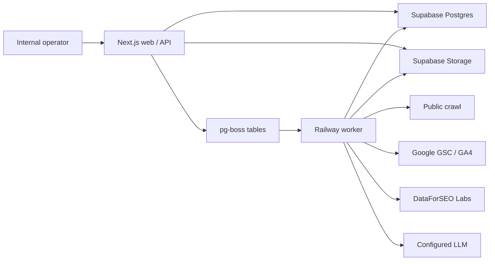

# Nevermore Unified Growth Opportunity — v0.3 可执行权威

本文件冻结 Nevermore 统一增长机会产品的 v0.3 产品模型、对象边界与 reviewed Slice 1 change sequence。当前 normative machine surface 已激活为 `0.3.0 / 2026-07-21`：OpenAPI 精确声明 47 个 operation 与 9 个 async operation，SQL 精确声明 44 张应用表，确定性规则为 `mvp.rules.0.2.1` 的 11 条规则。当前 surface 还包含 URL-first Product Profile 的读取、append-only 草稿编辑、基于冻结 Crawl 证据的异步合成、竞品审核/补录和显式确认，逐 DiagnosticRun 持久化 Finding 明确目标成员的 append-only ledger，以及从最新可读 DiagnosticRun 冻结输入投影的可溯源多 URL Growth Map、Keyword Library 与 Competitor Library 列表/详情。Keyword/Competitor Library 的稳定实体、不可变来源与治理状态均写入 canonical persistence；没有来源证据的 SERP overlap、AI citation 或关键词指标不得被合成。只有实现、迁移、机器合同、lock、两个 verifier 与测试在同一提交更新后，后续变化才成为新的 normative surface。

规范词“必须 / MUST”“不得 / MUST NOT”是当前机器面或已审核变更边界的发布条件；“应 / SHOULD”是强建议，偏离时必须在代码评审中记录原因；“可 / MAY”是非阻塞增强。凡是标为“reviewed change sequence”“planned”或“stop gate 后”的内容，均不是当前可调用 API、已存在表或已交付产品事实。

## 0. 权威、边界与完成定义

### 0.1 单一权威

本文件是 v0.3 的产品、数据与工程行为权威；同目录 [openapi.yaml](openapi.yaml) 与 [schema.sql](schema.sql) 分别是**当前已实现 surface** 的 HTTP 和数据库机器合同。当前机器面版本固定为 `implemented_surface_version: 0.3.0`；OpenAPI/SQL 不得预声明尚未落地的 create-run、recheck 或后续内容生命周期变化。

产品范围由本仓 [统一增长机会 PRD](../../docs/plans/2026-07-21-unified-growth-opportunity-prd.md) 控制，详细技术设计由 [统一增长机会设计](../../docs/plans/2026-07-21-unified-growth-opportunity-design.md) 控制，施工顺序由 [统一增长机会实施计划](../../docs/plans/2026-07-21-unified-growth-opportunity-implementation.md) 控制。旧 draft、长周期全案和 mock Artifact 只提供背景或视觉参考；Artifact 不构成 canonical truth，也不证明拟议能力已经生产落地。

实现者必须按以下规则处理冲突：

1. 先保护本文件的安全边界、证据诚实性和数据归属不变量。
2. HTTP 字段和状态码以 OpenAPI 为准；物理表与约束以 SQL 为准。
3. 任何冲突均是合同缺陷，必须回改合同并运行 `node scripts/verify-spec.mjs`；不得在业务代码中暗藏兼容猜测。

### 0.2 当前已实现 surface 完成的含义

MVP 完成表示一个已登录的内部 Operator 能在真实项目中走完：

```text
创建项目
  → 完成 ICP / Persona / 90 天目标
  → 抓取网站并连接 GSC、GA4，或导入 Keyword Gap CSV
  → 运行五域诊断
  → 查看来源、时间、URL 与限制
  → 确认或忽略 Finding
  → 得到 30/60/90 行动计划
  → 生成并编辑 3 类执行物
  → 浏览中英文产品界面中的客户报告
  → 导出可供企业定制服务调用的版本化 JSON ZIP
```

以上流程仍是当前完整业务主链。v0.3 另已落地 versioned Growth Audit / Capability contract、只读 Opportunity projection 与最小 audit/page persistence；这不表示 create-run route、Recheck、自动发布网站、自动改 CMS、验证排名结果或商业化 SaaS 订阅已经落地。

### 0.3 零开放实现决策

本文列出的当前状态、枚举、API、规则、表、路由、输出格式和验收标准均已冻结；reviewed Slice 1 change sequence 则冻结变更方向与停点，不提前声明未来机器合同。环境值（域名、OAuth client、模型密钥、Supabase project 等）通过环境变量注入，不属于产品决策。实现 Agent 不得扩大范围；若某项客观上无法实现，应以 failing test 和具体阻塞事实回报，而不是替换架构。

### 0.4 v0.3 产品模型与变更边界

Growth Framework 的四份 deep dive 只作为同一产品链上的四个 **Capability Lenses**：

1. `Product / Diagnosis`：产品、商业模式、市场、ICP/JTBD 与站点资产上下文；
2. `WebTech`：抓取、索引、渲染、性能、内链、结构化数据和工程验证；
3. `Search / GEO Acquisition`：Keyword、Competitor、Cluster、Search/Generative demand 与内容机会；
4. `Landing / Conversion`：Message、CTA、Form、Trust、UTM 与转化观察。

Lens 只用于组织 Evidence、筛选 Growth Map 和解释 Opportunity，不拥有独立 stage、queue、approval、publish、result 或身份系统。所有能力必须进入唯一 canonical chain：

`Project → Source/Snapshot/Observation → Evidence → Finding → Finding Review → Action → Artifact Revision → Approval/Authorized Delivery → Recheck/Outcome → Results`

Growth Opportunity 是该链上的客户可读 projection，不是第二套 lifecycle truth。在 Slice 1，一项 reviewable Opportunity 必须恰好锚定一个 measured primary canonical Finding；Supporting Findings 与 Observation 只丰富解释。Confirm 必须继续复用 primary Finding 的 Finding Review 事务并幂等创建唯一 Action。

以下内容构成 **reviewed Slice 1 change sequence**。步骤 1–2 已进入 v0.3 machine surface；步骤 3–5 仍不是当前已实现 operation、route 或 UI fact：

1. 引入 versioned Growth Audit / Capability contract 与只读 Opportunity projection；
2. 以受审迁移增加最小 audit/page projection persistence，不复制 canonical run、Finding、Action 或 Artifact ownership；
3. 增加 create-run route，映射现有 11 条规则，让一个 primary Finding 只产生一个 Action 与一个 `technical_ticket`；
4. 增加显式 recheck operation，以 prior/new 两个 immutable run 做 rule-level comparison 并投影 Results；
5. 在技术纵向链路通过产品 stop gate 后停止；Content Shadow 必须另写并批准 Slice 2 实施计划。

每个步骤只有在 authority OpenAPI/SQL、应用实现与迁移、authority verifier、app spec lock、implementation verifier、生成合同及测试同一提交通过后，才进入 normative surface。

v0.3 明确禁止以下并行或提前建设：

- `Opportunity table`；Opportunity 继续从 canonical objects 投影；
- `second Action creation path`；只有 primary Finding Review 可以创建 Action；
- checkpoint table，包括 `performance_checkpoints`；Slice 1 recheck 比较两个 immutable run；
- 对外 `CMS publishing`，以及 GitHub/Vercel/Cloudflare/客户生产站点写入（Shadow-but-no-CMS：Slice 2 允许内部 shadow 内容草稿 `english_blog_draft` 与 Flow Shadow research/draft/QA 作为 internal-write 影子产物，但绝不做真实 CMS/publish 外部写入，也绝不标记为已发布）；
- 对外 `content lifecycle`、完整竞品/查询历史或对外发布生命周期；内部 Content Shadow 影子内容生命周期（research → draft → QA → 人工评审）作为 internal-write 能力已在 Slice 2 落地，仍严禁写外部 CMS；
- 在 Slice 1 stop gate 前加入 RBAC、Billing、客户成员系统、scheduled attribution 或第二套 Run/Finding/Action/Artifact/Results truth。

## 1. 产品目标、用户与成功标准

### 1.1 产品定位

这是面向欧美 B2B/B2C 客户的内部 1 对 1 SEO/GEO 定制服务工作台，也是未来 Signal SaaS 的“深度服务层”。Signal 的数据接入和规范化对象是主要数据来源；Ahrefs/Semrush 在首阶段由内部人员做人工交叉验证，使用一个标准 CSV 入口进入系统。DataForSEO 作为受 feature flag、成本上限和 Worker-only secret 约束的真实 vendor observation 数据源接入。

### 1.2 用户与权限

- Primary user：内部 Growth Operator / SEO Strategist。
- Secondary user：内部 Reviewer；权限与 Operator 完全相同，只是工作环节不同。
- 所有已登录后台人员拥有全部项目功能权限。
- 系统只有一个内部 Workspace；所有项目属于该 Workspace。
- 必须认证，但不得出现 role、permission、member、seat、billing、subscription UI 或 API。
- 客户不登录系统；客户通过 HTML 报告或导出包接收结果。

### 1.3 硬性成功标准

- 100% 正式 Finding 至少引用一条 Evidence。
- 100% Evidence 包含来源、观察时间、availability、support、grade 和非空 limitation。
- 不可用数字只允许 `null`，不得用 `0`、空字符串或模型估算代替。
- 100% Action 回溯到一个已确认 Finding。
- 100% Artifact 回溯到一个 Action 和不可变 Revision。
- GSC/GA4 OAuth token 不得出现在浏览器、普通日志、遥测、报告或导出。
- 项目 ID 必须在 URL 中；不同标签页打开不同客户时不能串项目。
- English 与简体中文 UI 均通过浏览器测试；客户内容不因 UI 切换而被翻译。
- B2B 和 B2C 各一套真实或等价脱敏 fixture 通过端到端验收。

### 1.4 试点运营指标

- 新项目背景录入中位时间 ≤ 10 分钟。
- 数据就绪到首版计划的人工操作时间 ≤ 2 小时。
- 诊断完成后前五项建议均能在 2 分钟内解释其证据与优先级。
- 至少 70% 高优先级 Action 被 Reviewer 直接接受或仅轻改。

这些指标用于 pilot 评估，不得写成阻塞队列或隐藏产品逻辑。

## 2. MVP 范围与明确排除项

### 2.1 当前 implemented surface 必须交付

| 领域 | 首版范围 |
|---|---|
| 项目背景 | 项目、站点、ICP、Persona、市场、语言、转化、限制、90 天目标；draft/complete 两种保存 |
| 产品画像 | URL-first Product Profile 读取/编辑/确认；从冻结 Crawl Snapshot/PageSnapshot/Observation 合成可审核字段和竞品候选；provider 调用由 durable reservation 限额且可追溯 |
| 数据中心 | Crawl、GSC、GA4、Keyword Gap CSV、DataForSEO ranked keywords；统一 Run/Snapshot/Observation 血缘 |
| 诊断 | 11 条确定性规则、五个域、覆盖状态、Evidence、跨 Run 稳定 Finding |
| Growth Audit | versioned Capability/Audit contract、只读 Opportunity projection；最小 audit/page persistence 只引用 canonical Run/Snapshot，不复制状态或证据事实 |
| 审核与方案 | Finding confirm/ignore/needs-more-data；确定性 Action template；30/60/90 lane；人工 override 审计 |
| 执行物 | Content Brief、Metadata Rewrite、Technical Ticket；异步生成、人工编辑、不可变 revision |
| 输出 | 浏览器 HTML 报告、`service_bundle` / `client_bundle` JSON ZIP |
| 产品界面 | 登录、新项目、Overview、Context、Sources、Diagnosis、Plan、Studio、Report |
| 国际化 | `en` 与 `zh-CN` 产品 chrome；独立 delivery locale |
| 运行能力 | Supabase Auth/Postgres/Storage、pg-boss worker、Railway web + worker、基础 telemetry |

### 2.2 当前 implemented surface 的 Deferred 能力

- RBAC、成员邀请、客户 Portal、席位管理。
- Billing、pricing、subscription、plan、usage entitlement。
- Ahrefs/Semrush API 深度接入；首版仅 CSV。
- CMS、GitHub、Vercel、Cloudflare 或生产站点写入。
- 自动发布、rollback、recheck、technical verification、outcome attribution。
- PDF、PPT、Word 导出。
- 公共 API、Webhook、外部 API key 管理。
- 单一“SEO 总分”、排名或收入保证。
- 多 Workspace、项目转移、硬删除、数据迁移 UI。
- 浏览器渲染型 crawler；首版仅安全的静态 HTTP/HTML 抓取。
- 模型答案可见性/引用监控；GEO 只评估站内可访问性、实体与证明就绪度。

## 3. 固定技术方案

### 3.1 架构选择

采用独立应用方案 B：



- 新仓路径固定为 `/Users/wzb/Code/signalframe-mvp-app`。
- 新仓必须独立初始化 Git，默认分支由实现环境决定。
- 对 `/Users/wzb/Code/signalframe` **零运行时、零构建时依赖**。
- 旧仓只允许 vendor-copy 明确列出的 crawler/rule/OAuth 模式；复制后代码归新仓维护。
- `/Users/wzb/Code/nevermore` 只保存本次规格和 Artifact，不作为生产运行依赖。

### 3.2 运行基线

| 层 | 固定基线 |
|---|---|
| Runtime | Node.js `>=24.12 <25`；ESM |
| Package manager | pnpm `10.x`，`packageManager` 字段锁定实际 patch，提交 lockfile |
| Web | Next.js `16.2.x` stable、App Router、React 19、TypeScript strict |
| API | Next.js Route Handlers，OpenAPI 3.1，Zod request/response validation |
| UI data | TanStack Query；server state 不复制到自建全局 store |
| i18n | `next-intl`；消息目录 `en`、`zh-CN` |
| Database | Supabase PostgreSQL 15+；Drizzle ORM/Kit；SQL 合同优先 |
| Queue | pg-boss；与 canonical write 共用 PostgreSQL 事务 |
| Object storage | Supabase Storage；raw imports 与 export bundles 使用私有 bucket |
| Auth | Supabase Auth；same-origin secure HttpOnly session cookies |
| Deployment | Railway 两个 service：`web` 与 `worker`；同一镜像/commit |
| Testing | Vitest、Testing Library、Playwright、MSW/HTTP fixture、真实临时 PostgreSQL |

Next 只使用 16.2 稳定分支，不使用 16.3 Preview 能力。依赖在 WP0 初始化时解析到上述范围内最新 patch，并由 `pnpm-lock.yaml` 冻结。

### 3.3 Monorepo 结构

```text
signalframe-mvp-app/
├── apps/
│   ├── web/                         # Next.js UI + same-origin API
│   └── worker/                      # pg-boss consumers
├── packages/
│   ├── contracts/                   # OpenAPI-generated types + Zod schemas
│   ├── db/                          # Drizzle schema, repositories, migrations
│   ├── sources/                     # adapter interface + crawl/gsc/ga4/csv/dfs-stub
│   ├── engine/                      # observations, rules, finding merge, priority
│   ├── artifacts/                   # templates, LLM envelope, validators
│   ├── i18n/                        # shared message keys and locale utilities
│   └── observability/               # logger, metrics, telemetry events
├── docs/
│   └── vendor/                      # copied-source manifest and old-repo baseline
├── fixtures/
│   ├── b2b-saas/
│   └── b2c-ecommerce/
├── openapi/
│   └── mvp.yaml                     # exact copy of this package's openapi.yaml
├── scripts/
├── package.json
├── pnpm-workspace.yaml
└── railway.json
```

业务包不得导入 `apps/*`。`apps/web` 和 `apps/worker` 只通过 package public exports 使用领域代码。

### 3.4 环境变量

启动时用 Zod 做 fail-fast 校验。secret 只能存在于 Railway/Supabase secret store 和本地未提交 `.env.local`。

| 名称 | web | worker | 说明 |
|---|---:|---:|---|
| `APP_ORIGIN` | ✓ | ✓ | 绝对 HTTPS origin；本地可 HTTP |
| `DATABASE_URL` | ✓ | ✓ | 直连/事务池连接；pg-boss 必须支持事务和 LISTEN/NOTIFY |
| `SUPABASE_URL` | ✓ | ✓ | Supabase project URL |
| `SUPABASE_ANON_KEY` | ✓ | — | 仅浏览器安全 key |
| `SUPABASE_SERVICE_ROLE_KEY` | ✓ | ✓ | 仅服务端；不得进入 client bundle |
| `CREDENTIAL_ENCRYPTION_KEY` | ✓ | ✓ | 32-byte base64 key，AES-256-GCM |
| `GOOGLE_OAUTH_CLIENT_ID` | ✓ | ✓ | GSC/GA4 OAuth |
| `GOOGLE_OAUTH_CLIENT_SECRET` | ✓ | ✓ | 仅服务端 |
| `LLM_PROVIDER` | — | ✓ | 首版固定 `openai`；`google` adapter 仅接口占位 |
| `OPENAI_API_KEY` | — | ✓ | artifact/summary 结构化生成 |
| `OPENAI_MODEL` | — | ✓ | 部署时显式固定模型 ID |
| `DATAFORSEO_ENABLED` | ✓ | ✓ | `true|false`；安全默认 `false`，生产显式开启 |
| `DATAFORSEO_LOGIN` | — | ✓ | DataForSEO Basic Auth login；仅 Worker secret store |
| `DATAFORSEO_PASSWORD` | — | ✓ | DataForSEO Basic Auth password；仅 Worker secret store |
| `DATAFORSEO_MAX_KEYWORDS` | ✓ | ✓ | 每次 `1..1000`；默认/生产基线 `200` |
| `RAW_IMPORT_BUCKET` | ✓ | ✓ | 私有 bucket |
| `EXPORT_BUCKET` | ✓ | ✓ | 私有 bucket |
| `LOG_LEVEL` | ✓ | ✓ | `info` 默认 |

`GOOGLE_AI_API_KEY` 不是首版必需项；未来实现 Gemini adapter 时再加入，不得让未配置 Gemini 阻塞 MVP 启动。

## 4. URL、界面与 i18n 合同

### 4.1 固定路由

```text
/login
/new-project
/p/[projectId]/overview
/p/[projectId]/context
/p/[projectId]/sources
/p/[projectId]/diagnosis
/p/[projectId]/plan
/p/[projectId]/studio
/p/[projectId]/report
```

- 认证后访问 `/`：有最近项目则重定向其 overview，否则 `/new-project`。
- 项目 ID 只从 URL path 读取；cookie/localStorage 不得充当 active project 权威。
- 所有项目 repository 查询必须同时带 `workspace_id` 与 `project_id`。
- 不属于当前 Workspace 的项目、Finding、Action、Artifact 一律返回 404，不返回 403，以免泄漏存在性。
- 切换项目通过显式 URL 导航，必须支持浏览器前进、后退、复制链接和多标签页。

### 4.2 七屏用户结果

| Screen | 用户要完成的事 | 主要对象 | 必须有的状态 |
|---|---|---|---|
| Overview | 看阶段、覆盖、最新诊断、下一步 | Project/coverage/top actions | loading/error/empty/degraded/ready |
| Context | 保存背景并完成资格 | ICPProfile | draft/complete/conflict |
| Sources | 连接、选择 property、同步、导入 CSV | Source/Run/Snapshot | connecting/syncing/partial/stale/error |
| Diagnosis | 按域查看 Finding、Evidence、限制并审核 | Finding/Evidence | no-run/running/partial/completed |
| Plan | 排序 30/60/90、改优先级与状态 | Action | candidate/planned/in-progress/blocked/done |
| Studio | 生成、编辑、验证执行物 | Artifact/Revision | generating/draft/ready/failed |
| Report | 面向客户预览与导出 | Report/Export | preview/exporting/ready/failed |

Artifact 的视觉层级、色彩和交互密度可参考 `/Users/wzb/.codex/visualizations/2026/07/20/019f7ff0-3874-7623-90f3-1ebdea7c313f/index.html`，但以下必须重写：mock 数据源、客户端诊断、客户端优先级、假下载、死按钮、只靠颜色的状态和不带 focus trap 的 Drawer。

### 4.3 三种语言概念必须分离

| 概念 | 字段/存储 | MVP 值 | 行为 |
|---|---|---|---|
| 产品 UI 语言 | `uiLocale`，Operator cookie | `en` / `zh-CN` | 只翻译 chrome、规则标签、状态、帮助文本 |
| 站点内容语言 | `sites.language_codes` | BCP-47 数组 | 诊断器选择可用的语言规则并明确限制 |
| 客户交付语言 | `client_projects.default_delivery_locale` + 每次生成 override | 任意合法 BCP-47 | 决定 Artifact 与 Report 的正文语言 |

强制规则：

- UI locale cookie 名为 `sf_ui_locale`，`SameSite=Lax`，非敏感，可由客户端更新。
- 默认 UI locale 为 `en`；切换立即生效并保留当前 URL。
- API 枚举、message key、URL、provider 名和原始客户数据不得本地化。
- 日期、数字和货币按 UI locale 格式化；存储一律 UTC 和原始数值。
- 规则标题使用 `titleKey + titleArgs`，由 UI 本地化；Finding 的客户摘要另带 `summaryLocale`。
- Artifact 创建时必须带 `outputLocale`；缺省使用项目 `defaultDeliveryLocale`。
- UI 切换不得修改 Artifact、报告正文或项目 delivery locale。
- 所有英文/中文消息 key 必须一一对应，CI 检查缺失 key。

### 4.4 基本可访问性

- WCAG 2.1 AA 基线；键盘可完成全部主链操作。
- Drawer/Dialog 必须 focus trap、Esc 关闭、关闭后焦点归还触发器。
- 状态不得只依靠颜色；同时提供文本和图标/形状。
- 正文最小 14px，表格辅助文本最小 12px；中文正文使用系统 CJK fallback。
- `prefers-reduced-motion` 下关闭非必要动画。

## 5. 核心价值链与状态机

### 5.1 主链硬门

1. 创建项目时规范化并安全验证站点 URL，同时创建默认 Crawl source。
2. Context 可反复保存 draft；只有 complete profile 可启动正式诊断。
3. OAuth connected 只代表授权成功；只有可用 Snapshot 才算数据 available。
4. 正式诊断至少需要 complete ICP + 可用/partial Crawl snapshot；GSC、GA4、CSV 缺失导致对应规则 skipped 或定性降级，不阻断整次 Run。
5. 规则只能产生 candidate；Finding 默认 `unreviewed`，不能直接生成 Action。
6. Operator 将 Finding 设为 `confirmed` 时，服务端在同一事务幂等创建/合并 Action。
7. Artifact 只能从 Action 创建；所有创建异步化，完成后产生 revision 1。
8. Report 和 Export 只读取 canonical objects，不能读取 UI 临时状态或重新计算优先级。

### 5.2 状态机

**Project stage**（工作焦点，不是权限）：

```text
setup → collecting → ready_to_diagnose → diagnosing → planning → executing → delivered
```

允许回退到前一阶段补数据/修订，但不得跳过硬门。`archived_at` 非空时只读。

Stage 是服务端维护的可重建 projection，不接受客户端直接提交：创建项目=`setup`；首个 collection 入队=`collecting`；complete Context 且 Crawl snapshot ready=`ready_to_diagnose`；diagnostic 入队=`diagnosing`；diagnostic completed/partial=`planning`；首个 Artifact 入队=`executing`；`client_bundle` export completed=`delivered`。后续重新采集/诊断可按上述事件回到 collecting/diagnosing；历史对象不受影响。

**Source state**：

```text
connecting → connected → syncing → available | partial | stale
                               ↘ permission_denied | unavailable
any non-disconnected state → disconnected
```

`connected` 不等于 `available`。快照 freshness：Crawl 7 天、GSC 3 天、GA4 3 天、CSV 30 天；超过即 UI `stale`，旧 snapshot 仍可被显式选择进入 manifest。

**AsyncRun status**：

```text
queued → running → completed | partial | failed | cancelled
```

终态不可逆。首版没有用户取消 API；`cancelled` 仅用于运维停机/部署清理。

**Finding reviewState**：

```text
unreviewed → confirmed | ignored | needs_more_data
confirmed | ignored | needs_more_data → confirmed | ignored | needs_more_data
```

每次变化增加 `reviewRevision` 并追加 `finding_review_events`。`ignored` 必须有 reason；`needs_more_data` 必须有 note。

**Action status**：

```text
candidate → planned → in_progress → done
                   ↘ blocked → in_progress
candidate | planned → dismissed
```

`done`、`dismissed` 可由 Operator 带理由恢复到 `planned`；所有人工变化追加审计。

**Artifact status**：

```text
generating → draft → ready
          ↘ failed
draft | ready → archived
failed → generating   # 通过新的生成 Run，不复用失败 Run
```

### 5.3 并发与版本

- Context 更新带 `baseVersion`；不等于当前版本返回 409 `VERSION_CONFLICT`。
- Finding 更新带 `baseRevision`；不等于当前 `reviewRevision` 返回 409。
- Action 更新带 `baseRevision`；不等于当前 `revision` 返回 409。
- Artifact 内容更新带 `baseRevision`；不等于当前 revision 返回 409，并返回当前 revision metadata，不自动覆盖。
- 列表采用 cursor pagination，默认 50、最大 100；前端必须分页，不得请求 1000 条后本地过滤。

## 6. 项目与 ICP 合同

### 6.1 创建项目

必填：`clientName`、`projectName`、`siteUrl`、至少一个 `marketCode`、至少一个 `siteLanguageCode`、`defaultDeliveryLocale`。服务端必须：

1. 只接受 `http`/`https`，生产环境将 http origin 规范为 https 前先做可达性探测；不得静默改变 path。
2. origin 规范化为小写 host、移除默认端口和尾 `/`；punycode host 后安全校验。
3. 拒绝 localhost、私网、link-local、loopback、multicast、metadata service 和非 HTTP scheme。
4. 在单事务内创建 Project、primary Site、Crawl SourceConnection 和 telemetry `project_created`。
5. 返回 201 和项目 URL `/p/{projectId}/overview`。

### 6.2 ICP Profile 版本

每次保存都创建不可变 `icp_profiles` 新版本；Project 指向当前版本。API 有两种互斥 request：

- `mode=draft`：`profile` 可部分提交；遗漏字段继承当前值，显式 `null` 清除可空字段；不要求资格完整。
- `mode=complete`：必须提交完整 profile，并通过以下约束。

Complete profile 必填：

- `productName`、`oneLineDescription`。
- `customerModel`: `b2b | b2c | hybrid`。
- `businessProfile`: `b2b_saas | b2b_services | b2c_ecommerce | b2c_subscription | marketplace | publisher | other`；`other` 要求 `businessProfileNote`。
- `marketCodes[]`、`siteLanguageCodes[]`、`defaultDeliveryLocale`。
- `segments[]` 至少 1；`personas[]` 至少 1，persona 含 `name`、`roleOrContext`、`jobs[]`、`painPoints[]`。
- `useCases[]`、`offers[]`、`differentiators[]` 各至少 1。
- `primaryConversion` 含 `label`、`type` 和可空 `targetUrl`；type 为 `demo | signup | trial | purchase | lead | contact | subscribe | offline | other`。
- `priorityProductsOrServices[]` 至少 1；`priorityUrls[]` 可为空。
- `competitors[]`、`brandConstraints[]`、`complianceConstraints[]`、`technicalConstraints[]`、`resourceConstraints[]` 均允许空数组但字段必须存在。
- `growthQuestions[]` 与 `ninetyDayGoals[]` 各至少 1。

Profile JSON 使用 RFC 8785 语义的 canonical JSON 后 sha256，语义相同的保存返回现有版本，不制造空版本。

`marketCodes`、`siteLanguageCodes` 和 `defaultDeliveryLocale` 在 confirmed Profile 中是诊断输入权威，同时在 Site/Project 上保留读模型投影。URL-first 初始化时，未知的 Site market/language 必须保存为空数组，不得默认成 `US` 或 `en`。complete 保存必须在同一事务创建 ICP version、更新 `sites.market_codes/language_codes`、更新 `client_projects.default_delivery_locale/current_icp_profile_id/confirmed_icp_profile_id`；后续 draft 只更新 current profile pointer，不改变 Site/Project 投影或 confirmed pointer。DiagnosticRun 永远冻结 `confirmed_icp_profile_id` 指向的不可变 Profile version，避免未审核草稿或并发更新影响历史 Run。

## 7. 数据中心与 Source Adapter 合同

### 7.1 通用 Adapter

`packages/sources` 必须定义并由五个 adapter 实现同一 TypeScript contract：

```ts
type Provider = "crawl" | "gsc" | "ga4" | "csv" | "dataforseo";

interface SourceAdapter<C, P, R> {
  readonly provider: Provider;
  validateConfig(config: unknown): Promise<C>;
  capabilities(config: C): Promise<Capability[]>;
  collect(params: P, ctx: CollectionContext): Promise<CollectionResult<R>>;
  normalize(raw: R, ctx: NormalizeContext): AsyncIterable<NormalizedObservation>;
}

interface CollectionResult<R> {
  availability: "available" | "partial" | "unavailable";
  raw: R;
  capturedAt: string;
  sourceWindow: { start: string | null; end: string | null };
  rowCount: number;
  stopReason: string | null;
  providerUsage: Record<string, number>;
  limitation: string;
}
```

Adapter 必须返回稳定 `errorCode`，不得把 provider 文案直接作为业务逻辑。通用码：`AUTH_REQUIRED`、`PERMISSION_DENIED`、`RATE_LIMITED`、`QUOTA_EXCEEDED`、`INVALID_CONFIGURATION`、`INVALID_RESPONSE`、`NETWORK_ERROR`、`TIMEOUT`、`FEATURE_DISABLED`、`UNAVAILABLE`。

### 7.2 数据集与首版实现

| Provider | datasetKey | 首版 | 默认窗口/预算 | 关键限制 |
|---|---|---:|---|---|
| Crawl | `crawl.site_graph.v1` | 完整实现 | 最多 2,000 URL、深度 6、15 分钟 | 静态 HTML；不运行 JS |
| GSC | `gsc.page_query_daily.v1` | 完整实现 | 最近 56 个完整日；按 page/query/date，25k rows/request、最多 250k rows/run | Search Console 返回 top rows，不保证全量 |
| GA4 | `ga4.organic_landing_daily.v1` | 最小实现 | 最近 56 个完整日；organic landing、sessions、engagement、keyEvents；最多 200k rows/run | 依赖选定 property 与 key event mapping |
| CSV | `csv.keyword_gap.v1` | 完整实现 | 单文件 ≤ 20MB / 200k rows | 用户提供、列映射与 locale 有限 |
| DataForSEO | `csv.keyword_gap.v1` canonical shape | 最小真实实现 | 当前 organic、rank 4–20、search volume > 0、默认最多 200 rows/run | DataForSEO 是 vendor observation；供应商 top rows/估算不等于完整关键词宇宙 |

### 7.3 Crawl

- 从 primary Site origin 开始，读取 robots.txt 和 sitemap，跟随同源内部链接。
- 每个 URL 最多 5 次 redirect；每次 redirect 重新执行 SSRF/DNS 安全检查。
- Content-Type 只接受 HTML/XML/text；单响应 body 上限 5MB。
- 并发默认 5/host，最小 250ms host delay；尊重 robots 对通用 crawler 的规则。
- 规范化页面字段至少包含 URL、status、canonical、robots directives、title、meta description、H1/headings、word count approximation、internal in/out links、sitemap membership、JSON-LD types/errors、正文文本摘要、响应时间。
- 达到 URL/时间/响应大小预算时返回 `partial` 和明确 stopReason，已采集数据仍写 snapshot。

允许 vendor-copy：

- `/Users/wzb/Code/signalframe/packages/crawler/src`
- `/Users/wzb/Code/signalframe/packages/audit/src/rules` 中与 11 条规则对应的实现

新仓必须保存 `docs/vendor/signalframe-manifest.json`，每项记录 old repo commit、源路径、目标路径、复制时 sha256、改造说明。旧仓当前可能非 clean；WP0 先保存 status/diff hash 基线，完成时比较，不得要求旧仓变 clean，也不得产生额外 diff。

### 7.4 Google OAuth：GSC 与 GA4

只申请只读 scope。连接严格分三阶段：

1. `phase=authorize`：创建 10 分钟 `oauth_intent`，生成 256-bit random state、PKCE S256 verifier/challenge；DB 只存 state hash 和加密 verifier。返回 Google authorization URL。
2. OAuth callback：校验 session、state hash、provider、TTL、未消费和 PKCE；交换 code；加密临时 token；拉取用户可访问 properties；将 intent 置为 `properties_ready`；303 返回 Sources 页并带不敏感 `oauthIntentId`。Sources 页以 `phase=property_selection + oauthIntentId` 调同一个 connect endpoint，读取候选 properties；响应为 `phase=property_selection`。
3. `phase=select_property`：校验所选 property 在候选列表，创建 SourceConnection，把 token 从 intent 转为 SourceCredential，intent 置 `consumed`，返回 `phase=connected`。

即便只有一个 property 也执行第 3 步，避免连错客户资产。callback、token 和 property 错误必须可恢复；失败不得写半连接 SourceConnection。OAuth state/token 不进入 URL（`oauthIntentId` 除外）、普通日志或 telemetry。

GSC source 保存 property URL；GA4 source 保存 property ID 和 operator 选择的 key event names。若 GA4 未配置 key event，连接仍可用，但 conversion metric 为 `null/unavailable`，coverage 增加稳定 reason `GA4_KEY_EVENT_UNMAPPED`；首版 11 条规则中的 CRO-LANDING 会 skipped/inconclusive，不额外制造第 12 条 Finding。

GSC collection 按 [Search Analytics query](https://developers.google.com/webmaster-tools/v1/searchanalytics/query) 使用 `dimensions=[date,page,query]`、`dataState=final`、`rowLimit=25000`，以 `startRow` 分页直到空页或 250k cap；超过 cap 为 partial。窗口 endDate 为采集时 America/Los_Angeles 日期减 3 天，startDate=endDate 减 55 天（共 56 天）。Adapter 必须在 Snapshot limitation 说明 Search Console API 返回按 clicks 排序的 top rows，不声称是完整 query universe。

GA4 collection 通过 [Data API `runReport`](https://developers.google.com/analytics/devguides/reporting/data/v1/basics) 发两份可分页报告并按 `date+canonical landingPage` 合并：

1. session report：dimensions `date,landingPage`，metrics `sessions,engagedSessions,engagementRate`，dimension filter `sessionDefaultChannelGroup=Organic Search`。
2. key-event report：dimensions `date,landingPage,eventName`，metric `keyEvents`，同一 Organic Search filter，再以 operator 选定 `eventName` 做 IN filter；服务端聚合选中 events。

Adapter 在采集前调用 compatibility/metadata 检查。若 eventName 与 landingPage/metric 在该 property 不兼容，仍保存 session rows，但 key-event value 为 null/unavailable，Snapshot 为 partial 并写稳定 reason `GA4_KEY_EVENT_REPORT_INCOMPATIBLE`；不得把不兼容解释为 0 conversion。

GA4 窗口按 property timezone 取昨日为 endDate、endDate 减 55 天为 startDate。Snapshot 必须保存 property timezone；不得用 web/worker 机器本地时区切日。

### 7.5 CSV preview 与 confirm

同一个 import endpoint 有两个 mode：

- `preview`：multipart 上传文件和 `templateId=keyword_gap_v1`。服务端安全解析但不写 canonical observation；原文件进入私有 raw bucket；返回前 20 行、总行数、识别列、建议 mapping、错误/警告与 30 分钟 `importToken`。
- `confirm`：JSON 提交 `importToken` 与最终 mapping。服务端校验 token 的 Workspace/Project/TTL/未消费，创建异步 CSV collection run；成功后 token 置 consumed。

标准字段：

| Canonical field | 必填 | 类型/约束 |
|---|---:|---|
| `keyword` | ✓ | 非空字符串，最大 500 |
| `searchVolume` | ✓ | integer ≥ 0；空值为 unavailable，不得填 0 |
| `cluster` | — | 空时由稳定 `cluster_key.v1` 推导 |
| `currentUrl` | — | 绝对 URL |
| `currentRank` | — | number ≥ 0 |
| `competitorDomain` | — | hostname |
| `competitorRank` | — | number ≥ 0 |
| `marketCode` | ✓ | ISO 3166-1 alpha-2 |
| `languageCode` | ✓ | BCP-47 |

`cluster_key.v1`：对 keyword 做 Unicode NFKC、小写、移除标点和内置英文 stopwords，保留原顺序前两个长度 ≥3 token，以空格连接；无两个 token 时使用全部剩余 token；无 token 的行拒绝。相同输入必须得到相同 key。

### 7.5A DataForSEO ranked-keyword collection

- 只由常驻 Worker 调用 `POST /v3/dataforseo_labs/google/ranked_keywords/live`；Web/client bundle 不接收 login/password，也不代理供应商响应。
- target 使用项目 primary Site hostname，移除协议与前导 `www.`。市场取 primary Site 第一个 ISO alpha-2 market，并以英文 region name 传 `location_name`；语言取第一个 BCP-47 tag 的 primary language subtag。
- 请求固定 `item_types=[organic]`、`historical_serp_mode=live`、`search_volume > 0`、`rank_group 4..20`，先按 search volume 降序、再按 rank_group 升序。默认 `limit=200`，最大 1000，由 `DATAFORSEO_MAX_KEYWORDS` 显式约束；不得打开会加倍收费的 clickstream 数据。
- 供应商通常在 HTTP 200 body 中返回真实 `status_code`。实现必须同时校验 HTTP、顶层与 task status：认证/余额/IP/validation 为永久错误；task failure、rate limit 和 concurrency limit 映射为可退避重试的稳定 source error。
- `status_code=40102` 或成功空 `items` 是真实空集：写 `available`、`rowCount=0`，不造关键词。`total_count` 超过本次保存数量时写 `partial`、稳定 stopReason 与明确 row-cap limitation。
- 每条结果映射为 canonical keyword-gap observation：keyword、searchVolume、currentUrl、currentRank、market/language；competitor 字段未知时保持 `null`。Evidence 必须是 `vendor_observation / observed / B`，不得标成 CSV/user-provided。
- raw provider response 走现有私有 snapshot object 血缘；provider usage 只记录 request/row/cost 数字，不记录 target payload、Authorization 或凭据。
- 旧项目在首次 DataForSEO collection command 的项目锁事务内创建唯一 provider connection；feature flag 关闭时返回稳定 `FEATURE_DISABLED`，且不得打开网络连接。

Collection request 组合固定：Crawl=`provider:crawl + operation:site_graph`，`sourceConnectionId` 可省略并由项目默认 Crawl source 补齐；GSC=`gsc + search_analytics`、GA4=`ga4 + organic_landing`，两者必须提交当前项目对应 provider 的 connected SourceConnection；DataForSEO=`dataforseo + keyword_gap_import`，source 可省略并由服务端原子创建/解析项目级 connection。其他组合 422 `INVALID_COLLECTION_OPERATION`。每次请求都创建新采集；复用旧 Snapshot 由 UI 明确选择，不通过隐藏 cache 替代 Run。

### 7.6 Snapshot 与 Observation

- Collection 成功或 partial 时先写 immutable DataSnapshot，再批量写 NormalizedObservation；两者在一个 DB 事务中提交。
- 原始大响应/CSV 存私有 Storage，Snapshot 保存 object key、sha256 和 row count；数据库不保存 token。
- Snapshot 一经完成不可更新/删除；重跑产生新 Snapshot。
- Observation 的 `availability=available` 时必须恰有一个 value；非 available 时所有 value 为 null，并有 reason/limitation。
- 相同 metric/subject/provider/window 的冲突不做平均，创建 ProviderDiscrepancy 并在诊断中降 confidence。

`canonical_url.v1` 生成两个值：`fetchUrl` 用于 HTTP 事实，保留 trailing slash 与非 tracking query；`subjectUrl` 用于聚合/稳定 key。两者都执行 scheme/host 小写、IDNA host、移除默认端口与 fragment、解析 dot segments、规范 unreserved percent-encoding、空 path→`/`，删除 `utm_*|gclid|fbclid|msclkid` 并按 key/value 排序剩余 query。`subjectUrl` 额外移除非根 path 的末尾 `/`。Evidence 必须保留实际 fetchUrl；Finding subjectRef 使用 subjectUrl，因此 slash 变体不会制造两个 Finding，但 canonical rule 仍能用原始 fetchUrl 报告变体冲突。算法变化必须 bump methodVersion。

### 7.7 Evidence 来源与等级映射

| 来源 | origin | method | grade | 备注 |
|---|---|---|---|---|
| GSC / GA4 | `first_party` | `observed` | A | 客户一方平台聚合数据 |
| Crawl / HTTP | `direct_public` | `observed` | B | 当前公开响应，不代表搜索引擎最终状态 |
| DataForSEO | `vendor_observation` | `observed` | B | 供应商的排名、搜索量与流量估算；受市场、语言、过滤条件和 row cap 限制 |
| CSV | `user_provided` | `observed` | C | 来源与导出设置由用户负责 |
| 确定性计算 | `derived` | `computed` | B | 可由输入和版本重放 |
| 正则/启发式 | `derived` | `inferred` | C | 必须说明语言/覆盖限制 |
| LLM 输出 | `generated` | `generated` | C | 必须有 `analysisInvocationId`，不得伪装 observed |

Evidence 只允许三种互斥的 provenance shape：

- 来源型 Evidence 必须保留真实 `source_provider`，并精确绑定当前 DiagnosticRun 冻结的 `snapshot_id + collection_run_id + capturedAt`。它可以使用该 provider 的 observed axes，也可以标记为可重放的 `derived/computed/B` 或受限启发式 `derived/inferred/C`；不得用 `system` 隐藏原始来源。
- 无 source/invocation lineage 的纯确定性事实只能使用 `source_provider=system + derived/computed/B`，且必须精确属于同 workspace/project 的 DiagnosticRun。
- 模型输出只能使用 `source_provider=llm + generated/generated/C`，必须绑定同一 DiagnosticRun 内成功的 `finding_summary` invocation、非空 output hash 与一致的 prompt version；任何没有 `analysis_invocation_id` 的 Evidence 不得标记 generated。

## 8. 诊断引擎

### 8.1 Run 输入冻结

创建 DiagnosticRun 时服务端冻结：

- `projectId`、`siteId`。
- complete `icpProfileId/version/contentHash`。
- 每个选中 dataset 的 `snapshotId/schemaVersion/methodVersion/checksum/capturedAt/window/availability`。
- 每个 provider 最多冻结一个 Snapshot；CSV 与 DataForSEO 可同时冻结在一次 DiagnosticRun 中，并分别保留各自的 `snapshotId/collectionRunId/provider` lineage。两者共用 canonical keyword-gap dataset coverage slot，但不得在 manifest 层互斥或抹平 provider。规则层按 canonical cluster/keyword identity 消除重复 demand；同一需求同时有两种来源时选择 grade B 的 DataForSEO 作为主要 Evidence，CSV grade C lineage 仍保留用于审计与重放，search volume 不得重复相加。
- `ruleSetVersion=mvp.rules.0.2.1`。
- `promptSetVersion=mvp.prompts.0.2.0`（即使本次不调用模型也记录）。
- `deliveryLocale`。

完整 manifest canonicalize 后 sha256；Run 中途出现新 Snapshot 不影响本次结果。

### 8.2 固定 Pipeline 顺序

Worker 必须按下列顺序执行，禁止把模型放到确定性规则之前：

```text
1. load frozen manifest and snapshots
2. compute source/domain coverage
3. build base normalized observations
4. build deterministic computed/inferred observations
5. run deterministic rule registry
6. optionally generate allowlisted summaries with LLM
7. validate candidates and generated output
8. merge candidates within the run
9. resolve stable finding identity across runs
10. derive confidence from evidence/discrepancy
11. persist rule results, evidence, finding observations and finding projection
```

任一规则异常只使该规则 `inconclusive` 并记录 error code；引擎基础设施错误才使 Run failed。至少一个域完成、其他域因数据缺失时 Run 为 partial。

### 8.3 Rule contract

```ts
interface DiagnosticRule {
  id: RuleId;
  version: 1 | 2;
  domain: DiagnosticDomain;
  requiredDatasets: DatasetRequirement[];
  evaluate(ctx: DiagnosticContext): Promise<RuleResult> | RuleResult;
}

type RuleResult =
  | { status: "pass"; metrics: Record<string, number | string | null> }
  | { status: "candidate"; candidates: FindingCandidate[] }
  | { status: "skipped"; reason: "missing_dataset" | "unsupported_language" | "not_applicable" }
  | { status: "inconclusive"; reason: string; evidence: EvidenceDraft[] };
```

Rule 必须是可重放纯逻辑：不访问网络、不直接读 DB、不调用 LLM、不读取当前时间。输入规模在 adapter/manifest 层受限。记录每条 duration，超过 250ms 记 warning；不使用脆弱的“每条 5 秒 timeout”。Job 层才有超时。

### 8.4 首版 11 条规则

以下全部是 MVP 必做；阈值属于 `mvp.rules.0.2.1`，改动必须 bump rule set 和相应 rule version。`0.2.1` 仅升级消费 exact slash/non-slash variants 的三条 technical rules；其余八条规则仍保留 version 1。

| ID | Domain | Required | 精确触发条件 | 典型 Action |
|---|---|---|---|---|
| `TECH-HTTP-001@2` | technical_seo | Crawl | 同一 subject 的全部 exact fetch variants 均进入判断；4xx/5xx 按 status 聚合且同 subject/status 去重；status 0/空为 unavailable，不触发 | 修复/重定向 technical ticket |
| `TECH-CANONICAL-002@2` | technical_seo | Crawl | 全部 exact variants 参与 reciprocal canonical、同源 canonical target health 与 sitemap contradiction 判断；三类分别聚合 | canonical technical ticket |
| `TECH-LINKGRAPH-005@2` | technical_seo | Crawl+ICP | 合并同一 source subject 的全部 exact variants 内链且每个 source subject 只计一次；commercial/priority 页面 `internalInlinks < 2`；partial crawl 时 inconclusive | internal-link technical ticket |
| `SEARCH-CTR-004@1` | search_performance | GSC | 28d impressions ≥1000、平均 position 1–10，CTR < 对应 benchmark ×0.5 | metadata rewrite |
| `SEARCH-DECAY-002@1` | search_performance | GSC | 前 28d clicks ≥100，当前 28d 相比前窗口下降 ≥20% | content brief |
| `CONTENT-COVERAGE-001@1` | content_intent | Crawl+ICP | 每个 priority offer/use case 均无 2xx indexable 页在 URL/title/H1 命中规范化核心 token | content brief |
| `CONTENT-GAP-011@1` | content_intent | Crawl+ICP+Keyword Gap（CSV 或 DataForSEO） | cluster ≥10 keyword、去重后的 sum available volume ≥500，且无相关 2xx indexable page；同一 demand 同时有两种来源时优先 DataForSEO Evidence，不重复累加 | content brief |
| `CRO-PATH-001@1` | conversion_journey | Crawl+ICP | commercial/priority 页没有直接内部链接到 conversion destination set | CTA/path technical ticket |
| `CRO-LANDING-003@1` | conversion_journey | GA4 | 28d organic sessions ≥500、site baseline >0、page key-event rate < baseline×0.7 | landing content brief |
| `GEO-ENTITY-001@1` | geo_ai | Crawl+ICP | 最多 20 个 priority/commercial 页中目标实体类型 0 覆盖，或具名+数字 proof block 覆盖 <50% | entity/proof technical ticket |
| `GEO-CRAWLER-002@1` | geo_ai | Crawl | robots 对 OAI-SearchBot、ChatGPT-User、PerplexityBot 或 ClaudeBot 全站/商业路径 Disallow | robots technical ticket |

CTR benchmark：position 1=`0.25`、2=`0.15`、3=`0.10`、4–5=`0.07`、6–10=`0.03`。平均 position 按 GSC impressions 加权；没有 impressions 的行不进入。

Finding registry metadata 固定如下；它与 ActionTemplate 一起作为 `packages/engine` 的版本化静态 registry，禁止从模型生成：

| Rule | ruleFamily | intent | 稳定 subjectRef | severity |
|---|---|---|---|---|
| TECH-HTTP-001 | `http-status` | `restore_or_redirect` | 每个 status：`http_status:<code>` | 5xx=high；4xx 含 priority/commercial URL=high，否则 medium |
| TECH-CANONICAL-002 | `canonical-conflicts` | `normalize_canonical` | 每子类：`canonical_issue:reciprocal|broken_target|sitemap_contradiction` | 含 priority/commercial URL=high，否则 medium |
| TECH-LINKGRAPH-005 | `internal-link-equity` | `strengthen_internal_links` | `page_set:low_internal_inlinks` | 含 priority URL=high，否则 medium |
| SEARCH-CTR-004 | `search-ctr` | `improve_search_snippet` | 每页规范化 URL | priority/commercial URL=high，否则 medium |
| SEARCH-DECAY-002 | `search-decay` | `recover_search_demand` | 每页规范化 URL | priority/commercial URL=high，否则 medium |
| CONTENT-COVERAGE-001 | `intent-coverage` | `cover_priority_intent` | `page_set:offer:<slug>` 或 `page_set:use_case:<slug>` | high |
| CONTENT-GAP-011 | `keyword-gap` | `create_decision_content` | `keyword_cluster:<clusterKey>` | high |
| CRO-PATH-001 | `conversion-path` | `connect_conversion_path` | `page_set:missing_conversion_path` | 含 priority URL=high，否则 medium |
| CRO-LANDING-003 | `landing-conversion` | `improve_landing_conversion` | 每页规范化 URL | priority/commercial URL=high，否则 medium |
| GEO-ENTITY-001 | `entity-proof` | `build_entity_and_proof` | `page_set:priority_commercial` | entity 与 proof 同时命中且含 priority URL=high，否则 medium |
| GEO-CRAWLER-002 | `crawler-blocked-ai` | `review_ai_crawler_access` | 每个 UA：`user_agent:<ua>` | 全站或 commercial path=high，否则 medium |

Search 两条规则均先按 canonical URL 聚合 GSC 当前窗口；CTR Evidence 额外保留 impressions 最高的 10 个 query，Decay Evidence 保留当前/前窗口 clicks。成员 URL/query 清单只放 Evidence，不进入聚合 Finding key。

CTR 页级公式：`pageCtr=sum(clicks)/sum(impressions)`，`pagePosition=sum(position*impressions)/sum(impressions)`；仅当前 28 天。Decay：当前窗口为 Snapshot 最后 28 天，previous 为此前 28 天，`delta=(currentClicks-previousClicks)/previousClicks`。CRO-LANDING：`pageRate=sum(selectedKeyEvents)/sum(sessions)`；site baseline 为同一 28 天全部 organic landing rows 的 `sum(selectedKeyEvents)/sum(sessions)`，不得平均各页 rate。sessions=0、baseline=0 或任一 key-event value unavailable 时返回 inconclusive，不触发“低转化”。

Commercial page：`priorityUrls` 精确/规范化命中，或 URL path 命中 `/pricing|product|products|service|services|solution|solutions|features|demo|trial|signup|contact|shop|cart/`；这是 `page_role.v1` inferred C。Conversion destination 优先使用 ICP `targetUrl`；为空时按 conversion type 使用上述 demo/signup/trial/purchase/contact 等同源路径，无法找到时 CRO-PATH 为 not_applicable。

`intent_match.v1` 只对 English 项目执行：target/cluster 与页面 URL path、title、H1 都做 Unicode NFKC、小写、标点→空格、内置版本化 stopword 删除；target 剩余 token 必须全部出现在至少一个页面字段中才算 covered。剩余 token 为空、项目主语言不是 English，或页面没有 title/H1 时返回 inconclusive，不把“无法匹配”当 content gap。CONTENT-COVERAGE 的 target 是每个 offer/use case；CONTENT-GAP 的 target 是 `cluster_key.v1`。

Proof block：同一段落同时含至少一个具名组织/客户线索（capitalized proper-name 或引号内名称）和一个具体数字/百分比/货币。非英文站点此 detector 只返回 inconclusive，不触发缺陷。

### 8.5 Coverage 与降级

| 缺失 | 结果 |
|---|---|
| complete ICP | 拒绝创建 DiagnosticRun，422 `CONTEXT_INCOMPLETE` |
| Crawl | 拒绝创建 DiagnosticRun，422 `CRAWL_SNAPSHOT_REQUIRED` |
| GSC | 两条 Search rule skipped；其他域继续 |
| GA4 | CRO-LANDING skipped；CRO-PATH 继续；coverage 显示 qualitative partial |
| CSV 与 DataForSEO 均缺失 | CONTENT-GAP skipped；CONTENT-COVERAGE 继续 |
| 部分 Crawl | HTTP/canonical 可运行并写 limitation；link graph/CRO path 视图完整性不足则 inconclusive |
| 非英文站点 | 纯结构规则继续；英文正则/启发式规则 inconclusive 并显示限制 |

### 8.6 Merge、跨 Run 身份与 resolved

- Run 内 merge key：canonical JSON `{domain, ruleFamily, sortedSubjectRefs, intent}`。
- 跨 Run finding key：sha256 canonical JSON `{projectId, domain, ruleFamily, sortedSubjectRefs, intent}`。
- 聚合规则的 subjectRef 使用稳定集合键，不把本次 URL 成员清单写进 key；Evidence 解释结论，`finding_targets` 则把本次 DiagnosticRun 的明确目标定义与成员持久化为不可变事实，两者不可互相代替。
- 命中已有 key：更新 `lastSeenRunId/lastSeenAt/active=true`，保留人工 reviewState。
- 只有 `completed`（非 partial）的后续 Run 且该规则实际执行为 pass，才能将旧 Finding `active=false/resolvedAt=now`。
- partial/skipped/inconclusive Run 不得自动 resolve 旧 Finding。
- resolved finding 再次命中时 active=true，reviewState 保留并在 UI 标记 regressed。

### 8.7 Finding 的逐 Run 目标成员事实

`findings` 继续是跨 Run 的稳定 projection；`finding_targets` 只记录某一 Finding 在某一 `diagnostic_run_id` 中实际成立的目标根与成员，不创建第二套 Finding lifecycle。每个 candidate 必须携带一个显式 target：`direct_url`、`affected_by_template`、`affected_by_site`、`affected_by_page_set`、`affected_by_http_status`、`affected_by_canonical_issue`、`affected_by_keyword_cluster` 或 `affected_by_user_agent`。同一 Finding/Run 的所有成员必须共享同一个 relation、target kind、target ref 与 definition/member mode；数据库按完整语义 tuple 生成 `relation_key`，调用方不得自行决定该 identity。

目标行只有三种诚实状态：

- `resolved`：成员必须引用冻结在该 DiagnosticRun manifest 中的 immutable Observation，并绑定该 Observation 已证明的精确 SitePage。Crawl exact-fetch 成员还必须绑定同一 Crawl Snapshot 的 frozen PageSnapshot；GSC/GA4 的可选 PageSnapshot 只能是同页、同一 Run 已冻结 Crawl Snapshot 的上下文，不能伪造 analytics PageSnapshot。
- `unresolved`：只允许页级 GSC/GA4 Observation 无法唯一绑定 SitePage 时使用；必须保留原始 Observation `subject_ref`、非空 limitation，且 SitePage/PageSnapshot 均为空。不得把 unresolved URL 猜测为站点页面。
- `definition_only`：用于规则只有稳定集合/模板/关键词簇/User-Agent 定义而没有可证明成员时；不得携带 Observation、SitePage、PageSnapshot 或 member ref。

Diagnostic worker 必须在同一终态事务中先创建或 re-hit 当前 Finding，再写该 run 的 target rows、Evidence/Observation links 与 rule result；任一写入失败则整体回滚。精确重试依靠语义唯一键 no-op，不得复制行；Finding 已被后续 Run 推进时，只允许与既有历史 row 在 scope 和完整语义 tuple 上完全一致的重放到达该 no-op，任何 novel stale-run insert 仍必须拒绝。跨 Run 再次命中写新的逐 Run rows，保留旧 rows。迁移不得为既有历史 Finding 回填 target，也不得从当前 `subject_refs`、Evidence 文本或后续 SitePage 状态推断历史成员；没有行的历史 Run 必须继续显示为目标成员不可用。

### 8.8 Confidence

Confidence 由引擎统一派生，规则与 LLM 不得自行指定：

- `high`：至少一条 A/B observed 支持证据，全部关键证据可用，无 contradiction/discrepancy。
- `medium`：关键结论包含 C 级、inferred 证据，或存在不改变方向的 partial limitation。
- `low`：只有 generated/单一 C 级支持；首版这类 candidate 必须自动 `needs_more_data`，不能创建 ready Action。
- `inconclusive`：关键证据 unavailable、相互 contradiction，或必要图/窗口不完整；不产可确认 Finding，显示 rule result。

LLM 只能生成摘要或 Artifact，不能改变 severity、confidence、rule result、priority band 或 roadmap lane。

每个正式 Finding 必须有非空 summary。默认由 rule registry 的确定性 `en`/`zh-CN` 模板生成；若 Run outputLocale 是其他语言且 `finding_summary` LLM 成功，可保存该语言摘要并关联 AnalysisInvocation；模型失败时使用 English fallback，诚实写 `summaryLocale=en`，不得使整个诊断失败。

## 9. Finding 审核、Action 与 30/60/90 计划

### 9.1 Finding 审核 mutation

`PATCH /projects/{projectId}/findings/{findingId}` 必须支持：

- `confirmed`：可带 note；在同事务触发 Action upsert。
- `ignored`：`reason` 必填，最少 3 字符。
- `needs_more_data`：`note` 必填，最少 3 字符。

Mutation 校验 project scope、`baseRevision`，更新 Finding projection，追加不可变 review event。重复提交相同目标状态且相同 revision 由 version conflict 保护；网络重试由客户端重新读取后决定，不静默重复。

已确认 Finding 改为 `ignored/needs_more_data` 时不得静默删除或改写 Action：若关联 Action 存在且 status 不是 `dismissed`，返回 409 `FINDING_ACTION_ACTIVE`，Operator 必须先在 Plan 中带理由 dismiss Action；Action 已 dismissed 时允许修改 Finding 并保留完整历史。之后重新 confirmed 只返回原 Action，不自动恢复其 dismissed 状态。

### 9.2 ActionTemplate 与幂等创建

Action 不能由自由模型创造。代码 registry 固定：

| Rule | templateId | artifactType | 默认 effort | 默认 risk |
|---|---|---|---|---|
| TECH-HTTP-001 | `fix_http_status.v1` | technical_ticket | medium | medium |
| TECH-CANONICAL-002 | `normalize_canonical.v1` | technical_ticket | medium | high |
| TECH-LINKGRAPH-005 | `strengthen_internal_links.v1` | technical_ticket | small | low |
| SEARCH-CTR-004 | `rewrite_search_metadata.v1` | metadata_rewrite | small | low |
| SEARCH-DECAY-002 | `refresh_decaying_content.v1` | content_brief | medium | low |
| CONTENT-COVERAGE-001 | `create_priority_content.v1` | content_brief | large | low |
| CONTENT-GAP-011 | `create_gap_content.v1` | content_brief | large | low |
| CRO-PATH-001 | `connect_conversion_path.v1` | technical_ticket | small | medium |
| CRO-LANDING-003 | `improve_landing_conversion.v1` | content_brief | medium | medium |
| GEO-ENTITY-001 | `add_entity_and_proof.v1` | technical_ticket | medium | medium |
| GEO-CRAWLER-002 | `review_ai_crawler_access.v1` | technical_ticket | small | high |

`actionKey=sha256({projectId,findingKey,templateId})`。Finding 第一次 confirmed 创建 Action；再次 confirmed 或跨 Run 命中只合并证据引用、更新时间，不复制 Action、不覆盖人工 priority/status。

每个 ActionTemplate 必须在静态 registry 提供 English 与简体中文的 title/description/expectedOutcome 模板。确认时项目 delivery locale 为 `zh-CN` 则写中文，否则写 English fallback，并将实际语言写入 `contentLocale`；Action 创建事务不得调用 LLM。后续 Artifact 可按任意 `outputLocale` 生成，因此 Action fallback 不限制客户交付物语言。

### 9.3 确定性优先级

不得计算一个不透明加权总分。先从 Finding severity/confidence/subject 业务相关性按顺序执行：

1. severity critical → band `critical`、lane `now`。
2. severity high + confidence high → `high/now`。
3. severity high + confidence medium → `high/next`。
4. severity medium + priority URL/offer 命中 + confidence high → `high/next`。
5. severity medium → `medium/next`。
6. severity low → `low/later`。
7. confidence low → hard gate：`medium/later` 且 status `blocked`，直到补数据或人工 override。
8. risk high 的技术修改不得自动 ready；Action 可规划，但 Artifact 必须包含 validation/rollback section。

Lane 与交付窗口：`now=0–30d`、`next=31–60d`、`later=61–90d`。UI 可拖拽/编辑，但 PATCH 必须提交 reason 并写 `action_override_audit`；系统不得在下次诊断覆盖人工值。

## 10. Execution Artifact、报告与企业导出

### 10.1 三类 Artifact

所有 Artifact 创建都异步返回 202，哪怕 generationMode 是 template。POST 先创建 `execution_artifacts(status=generating)` 与 AsyncRun，并在同一 DB transaction enqueue。

`artifactType` 必须等于该 ActionTemplate registry 的类型；Action status 为 `dismissed` 时拒绝创建，422 `ACTION_NOT_EXECUTABLE`。同 Action/type 已有非 archived Artifact 时 POST 表示 regenerate：复用 Artifact id、创建新 Run，不覆盖旧 revisions。并发 regenerate 由 `artifact:{artifactId}` activeKey 返回 409。

| type | contentFormat | 最低内容合同 |
|---|---|---|
| `content_brief` | markdown | objective、audience、search intent、target topics/queries、outline、evidence、conversion path、proof/source requirements、acceptance checklist |
| `metadata_rewrite` | json | URL、current/proposed title、current/proposed description、targetQueries、rationale、evidenceRefs |
| `technical_ticket` | markdown | problem、affected scope、evidence、implementation steps、acceptance tests、risk、validation、rollback |

Artifact format canonical enum 只有 `markdown | json | csv`；本次不使用 CSV Artifact，但枚举保留给导出。Metadata JSON 必须通过 Zod/JSON Schema；Markdown 必须通过 heading/section validator。验证失败时 revision 可保存为 draft，但不得置 ready。

### 10.2 LLM 边界

- 首版 LLM 只用于 `finding_summary`（可关闭）与三类 `artifact_generation`。
- Prompt 输入采用 allowlist：complete ICP 的必要字段、已确认 Finding、引用 Evidence 的短摘录/数值、Action template、output locale、operator instructions。
- 不发送 OAuth token、完整 raw CSV、未筛选整站正文、其他项目内容或日志。
- 模型必须返回结构化 envelope；服务端先 JSON/schema 校验，再引用完整性校验，再安全/长度校验。
- 输出中的事实性数字必须引用传入 evidenceId；未知值写 `unknown/待确认`，不得补造。
- 每次调用写 immutable AnalysisInvocation：provider/model、promptSet、input/output hash、token、latency、status、cost（可空）。
- OpenAI adapter 是首版实现；Gemini 只保留同接口类型，不在首版启动或验收路径。

### 10.3 Revision 与编辑

- 首次生成成功写 revision 1；regenerate 成功写 `currentRevision+1`，两者都将 Artifact 置 draft，绝不覆盖旧 revision。
- 每次 PATCH 内容创建新的 immutable ArtifactRevision，不更新旧 revision。
- 请求必须带 `baseRevision`；冲突返回 409 `STALE_REVISION`。
- `contentHash=sha256(canonical content)`；相同内容保存不创建新 revision，返回当前对象。
- Revision 保存 `outputLocale`（由 Artifact 固定）、editor/generator、analysisInvocationId（模型生成时）、note 和 validation errors。
- 设置 status ready 时 validation errors 必须为空；ready 后仍可编辑，编辑后回到 draft，需再次 ready。

### 10.4 Report

Report 是服务端 projection，不另建 report 表。它只包含：

- 客户/项目背景摘要与报告日期。
- 数据覆盖、窗口、availability 和限制。
- active + confirmed Findings 的客户可读摘要和关键 Evidence。
- 未 dismissed Actions 的 30/60/90 计划。
- ready Artifacts 的摘要/链接；draft 不默认进入客户视图。
- methodology/limitations，不承诺结果。

Report 页面使用 `outputLocale` 参数，默认项目 delivery locale；产品导航仍按 uiLocale。首版支持浏览器打印样式，但不得生成 PDF 文件。

### 10.5 企业导出

Export 始终异步生成私有、签名下载 URL。新生成的 Export 使用 `schemaVersion=signalframe.service-bundle.0.3.0`；数据库约束继续接受历史 `signalframe.service-bundle.0.2.0` 行。

`service_bundle` ZIP：

```text
manifest.json
project.json
context.json
sources.json
snapshots.json
observations.ndjson
findings.json
evidence.json
actions.json
artifacts/<artifactId>/revision-<n>.md|json
```

`client_bundle` ZIP 不含 observations.ndjson、内部 notes、provider usage、AnalysisInvocation、ignored/needs-more-data Findings 和 draft Artifacts。

Manifest 必须通过 [service-bundle-manifest.schema.json](schemas/service-bundle-manifest.schema.json)，并含 schemaVersion、exportId、projectId、generatedAt、outputLocale、每个文件的 sha256/bytes/mediaType、对象计数、source snapshot IDs、ruleSetVersion。ZIP 自身 checksum 写回 ExportBundle。签名 URL 有效期 15 分钟；对象保留 30 天，可重新生成。

任何 bundle 都不得包含 SourceCredential、OAuthIntent、ImportPreview token、idempotency body、普通日志或其他项目记录。

## 11. HTTP API 合同

### 11.1 通用规则

- Base path `/api/mvp`，same-origin only；全局使用 Supabase session cookie。
- JSON 使用 camelCase；数据库使用 snake_case；repository 做显式 mapping。
- 成功响应 envelope：`{ "data": ..., "meta"?: ... }`。
- 错误为 `application/problem+json`：`type,title,status,code,detail,requestId,errors?`。
- 每个响应带 `X-Request-Id`；日志使用同一 requestId。
- 资源创建类 POST 要求 `Idempotency-Key`（1–128 可打印 ASCII）；相同 key+相同 body 返回原响应，不同 body 返回 409 `IDEMPOTENCY_KEY_REUSED`。
- 所有 202 必须在 body 返回 `run` 与绝对或同源 `statusUrl`，同时 `Location=statusUrl`。
- AsyncRun 轮询：前端 1s、2s、4s 后固定 5s；页面隐藏暂停；终态停止。
- Sources 与 Artifact 列表 projection 必须带各自 `activeRun`；页面刷新后从服务端恢复 polling，不依赖内存中的 statusUrl。
- Cursor 是 opaque base64url；`limit` 默认 50、最大 100。
- 时间是 RFC3339 UTC；语言为 BCP-47；market 为 ISO alpha-2。
- `GET` 不改变 canonical state；OAuth callback 只消费外部授权 code，是明确例外。

核心 error code 与 HTTP status 固定：

| status | code |
|---:|---|
| 400 | `BAD_REQUEST`、`OAUTH_STATE_INVALID`、`OAUTH_STATE_EXPIRED` |
| 401 | `AUTH_REQUIRED` |
| 404 | `NOT_FOUND`（含跨 project/workspace） |
| 409 | `VERSION_CONFLICT`、`STALE_REVISION`、`IDEMPOTENCY_KEY_REUSED`、`RUN_ALREADY_ACTIVE`、`FINDING_ACTION_ACTIVE`、`OAUTH_STATE_REPLAYED`、`IMPORT_TOKEN_REPLAYED` |
| 413 | `IMPORT_TOO_LARGE` |
| 422 | `VALIDATION_ERROR`、`CONTEXT_INCOMPLETE`、`CRAWL_SNAPSHOT_REQUIRED`、`SNAPSHOT_PROJECT_MISMATCH`、`INVALID_COLLECTION_OPERATION`、`OAUTH_PROPERTY_INVALID`、`IMPORT_TOKEN_INVALID`、`IMPORT_TOKEN_EXPIRED`、`SOURCE_NOT_CONNECTED`、`ACTION_NOT_EXECUTABLE`、`ARTIFACT_VALIDATION_FAILED`、`PROJECT_ARCHIVED` |
| 429 | `RATE_LIMITED`；必须带 `Retry-After` |
| 503 | `DEPENDENCY_UNAVAILABLE`、`FEATURE_DISABLED` |

Provider 内部错误先映射到这些产品码或 Run `lastError.code`；不把 Google/OpenAI 原始错误正文直接返回浏览器。

### 11.2 Operation registry

下列 operationId 必须与 OpenAPI 完全一致。

<!-- API_OPERATIONS_START -->
- `listProjects` — 列出当前 Workspace 项目。
- `createProject` — 创建项目、站点和 Crawl source。
- `getProject` — 读取项目 aggregate。
- `getProjectContext` — 读取当前 ICP 版本；首次保存前返回 null。
- `updateProjectContext` — 保存 draft/complete ICP 新版本。
- `getProjectProductProfile` — 读取当前、已确认和正在合成的 Product Profile 版本及其来源状态。
- `updateProductProfileDraft` — 仅把用户实际修改的字段追加为新的 Product Profile draft 版本。
- `createProductProfileSynthesisRun` — 从冻结 Crawl 证据清单启动 Product Profile 合成。
- `reviewProductProfileCompetitor` — 审核、更正或排除一个竞品候选并追加新版本。
- `addProductProfileCompetitor` — 补录一个用户声明的竞品并追加新版本。
- `confirmProductProfile` — 显式确认已审核版本；不得隐式启动诊断或 Audit。
- `getProjectWorkspaceView` — 读取 overview/plan/studio/report 聚合视图。
- `listProjectSources` — 读取连接、capability、最新 snapshot。
- `connectProjectSource` — OAuth authorize/property selection。
- `handleGoogleOAuthCallback` — Google callback 并 303 返回 Sources。
- `importProjectSourceFile` — CSV preview 或 confirm。
- `disconnectProjectSource` — 断开 source，保留历史 snapshot。
- `createCollectionRun` — 启动单 provider collection。
- `listProjectSnapshots` — 列出 snapshots。
- `getProjectRun` — 统一读取所有异步 run。
- `createDiagnosticRun` — 启动诊断。
- `createGrowthAuditRun` — 冻结 URL/ICP/snapshot 输入，启动版本化 full Growth Audit（复用诊断队列，额外物化八个 audit module）。
- `createActionRecheck` — 针对一个已确认 Action 用最新 crawl 数据复查技术条件；创建隔离投影版本的新 immutable audit run，不改 prior run，不落 checkpoint。
- `listProjectAuditUrls` — 从最新 completed/partial DiagnosticRun 的冻结输入读取有界多 URL portfolio；不返回伪造项目总数。
- `getProjectAuditUrl` — 读取一个 canonical SitePage 的真实 Observation、resolved FindingTarget、Finding 与 canonical Execution ID 关系。
- `listProjectAuditKeywords` — 读取有界 Keyword Library cursor page；保留精确 source occurrence、canonical metric pointer、mapped target、coverage 与 limitation，不返回伪造总数或过滤状态。
- `getProjectAuditKeyword` — 按稳定 Keyword ID 读取同一严格只读投影，不暴露 Finding confirmation、Action state 或 mutation。
- `listProjectAuditCompetitors` — 读取有界 Competitor Library cursor page；保留严格 origin discriminator、typed evidence、review state、canonical Observation insight lineage 与 coverage，不返回伪造总数或过滤状态。
- `getProjectAuditCompetitor` — 按稳定 Competitor ID 读取同一严格只读投影，不暴露 manual-entry、review control 或 mutation。
- `getProjectGrowthAudit` — 读取最新 Growth Audit 只读投影：status 从 canonical async run 投影，含全八个 audit module 与三个 frontstage lens（no_data 也在内）。
- `getProjectAuditModule` — 读取单个 audit module 的只读 coverage summary；空 module 报告 no_data 与 limitation，绝不给零分。
- `listProjectOpportunities` — 从最新 readable diagnostic run 读取有界 Growth Opportunity cursor page；只读，确认走 Finding review mutation。
- `getProjectOpportunity` — 按 primary Finding ID 读取单个 traceable Growth Opportunity 只读投影。
- `getProjectResults` — 读取最新 recheck 的两 immutable run 只读技术条件对比（verified/observed/insufficient_data 三态）；不主张流量、排名、营收或 AI 引用变化。
- `listProjectFindings` — 列出 Finding 和 evidence summary。
- `reviewProjectFinding` — confirm/ignore/needs-more-data。
- `listProjectActions` — 列出 30/60/90 plan。
- `updateProjectAction` — 状态/priority/lane override。
- `listProjectArtifacts` — 列出 artifacts/revision metadata。
- `createActionArtifact` — 异步生成 artifact。
- `getProjectArtifact` — 读取 artifact 与当前 revision。
- `updateProjectArtifact` — 创建人工 revision/修改状态。
- `getProjectReport` — 读取客户报告 projection。
- `createProjectExport` — 异步生成 bundle。
- `getProjectExport` — 读取 export metadata/sign URL。
- `createContentShadowRun` — 冻结已确认 content Finding/Action/content_brief revision + 竞品集 + SearchQuery cluster + 独立 GenerativeQuery 集，排队一次 pinned SEO/GEO Content Shadow run；shadow 模式只做内部写入，绝不写 CMS。
- `getContentShadowRun` — 读取单个 Content Shadow run 的只读投影：冻结输入、research pack、draft revision 与 QA verdict；phase 由 append-only 子行派生。
<!-- API_OPERATIONS_END -->

异步 operation 固定如下：

<!-- ASYNC_OPERATIONS_START -->
- `importProjectSourceFile`（仅 `mode=confirm`）
- `createCollectionRun`
- `createDiagnosticRun`
- `createGrowthAuditRun`
- `createActionRecheck`
- `createProductProfileSynthesisRun`
- `createActionArtifact`
- `createProjectExport`
- `createContentShadowRun`
<!-- ASYNC_OPERATIONS_END -->

`importProjectSourceFile(mode=preview)` 返回 200；其 confirm 分支返回 202。其他列表/详情读取 200，Project 创建 201，Context/Finding/Action/Artifact patch 200，disconnect 204，OAuth callback 303。

### 11.3 Growth Map URL read model

`GET /projects/{projectId}/audit/urls` 与 `GET /projects/{projectId}/audit/urls/{sitePageId}` 是面向客户的多 URL Growth Map 读取面，不是新的 canonical store。二者只能读取最新 `completed|partial` DiagnosticRun 及其冻结 input manifest，且必须同时验证 Workspace、Project、Site、Snapshot 与 Run scope。列表 query 仅允许 `limit`（默认 50，1–100）、opaque base64url `cursor` 与 trim 后 1–256 字符的 literal `search`；不得开放缺少 immutable historical Finding snapshot 支撑的 `auditRunId`。

URL 详情中的每条 `GrowthMapUrlFinding` 必须原样携带 canonical Finding 当前的非负 `reviewRevision`。前台 Opportunity Review 只能把这一个 revision 作为该 Finding 的 `baseRevision` 提交；不得猜测 revision、批量确认 supporting Finding，或从 Action/Artifact 状态反推 review 并发令牌。

URL inventory 只允许由冻结 Crawl `PageSnapshot` 或冻结 GSC/GA4 且持久化非空 `site_page_id` 的 URL Observation 建立；不得 union 任意项目 `SitePage`。页面标题只来自已校验 hash/schema 的 immutable Crawl page extract；`pageType`、`clusterKey` 与 `ownerId` 未持久化时必须为 null，不得从路径猜测。URL Finding membership 只能来自同一 DiagnosticRun 中 `resolution_state='resolved'` 的 `finding_targets.site_page_id`；`unresolved`、`definition_only` 与可变 `findings.subject_refs` 不得被强行分配到 URL 行。

每个 metric scalar 必须公开 provider、Snapshot、Observation、SitePage、JSON Pointer/value source、observedAt、freshness 与 limitation。缺失值为 null + unavailable，不得为 0。Priority 只可由当前 Run URL Finding 的确定性最高 severity 推导并返回完整 basis；Delta 在没有两个 immutable recheck anchor 前必须为 unavailable。Action 与 Artifact 只以 canonical ID 关联，不复制或猜测其可变状态。列表 intentionally 不提供 project total；cursor page 的 `hasNext` 与 `nextCursor` 必须一致。

### 11.4 Workspace view

`GET /projects/{projectId}/workspace?view=overview|plan|studio|report` 是 UI 聚合读模型，减少七屏瀑布请求；它不得成为独立 canonical store。`view=plan` 与 Actions API、`view=studio` 与 Artifacts API、`view=report` 与 Report API 必须由同一 repository/service projection 产生，contract test 比较一致性。

Diagnosis 屏由 `listProjectFindings` 一次返回分页 Findings，并在 `meta` 附带 latest DiagnosticRun、coverage 和 11 条 rule result（含 pass/candidate/skipped/inconclusive 与 reason）。因此“没有 Finding”与“规则未运行/缺数据”在 API 和 UI 中必须可区分。

## 12. PostgreSQL 合同

### 12.1 44 张应用表

表的 DDL、check、FK、索引和 append-only trigger 以 [schema.sql](schema.sql) 为准。以下集合由 verifier 与 SQL 做精确一致性检查。

<!-- TABLES_START -->
- `workspaces`
- `operator_profiles`
- `client_projects`
- `sites`
- `icp_profiles`
- `source_connections`
- `source_credentials`
- `oauth_intents`
- `import_previews`
- `async_runs`
- `collection_runs`
- `data_snapshots`
- `normalized_observations`
- `provider_discrepancies`
- `diagnostic_runs`
- `diagnostic_run_rules`
- `analysis_invocations`
- `evidence`
- `findings`
- `finding_observations`
- `finding_targets`
- `finding_review_events`
- `actions`
- `action_override_audit`
- `execution_artifacts`
- `artifact_revisions`
- `export_bundles`
- `idempotency_keys`
- `telemetry_events`
- `capability_runs`
- `audit_runs`
- `audit_module_results`
- `site_pages`
- `page_snapshots`
- `product_profile_runs`
- `product_profile_invocation_attempts`
- `keyword_occurrences`
- `keyword_entities`
- `keyword_entity_sources`
- `competitor_entities`
- `competitor_origin_occurrences`
- `flow_shadow_runs`
- `flow_shadow_research_packs`
- `flow_shadow_qa_gates`
<!-- TABLES_END -->

pg-boss 自己的 schema/table 不计入这 44 张，由固定版本的 pg-boss 自行迁移；不得复制到 Drizzle migrations 或手改。

新增的 Slice 1 persistence 遵守以下不变量：`capability_runs` 以 canonical `async_runs.id` 为主键；`audit_runs` 只引用同一个 canonical Diagnostic/Capability run 且不拥有 `status`；`audit_module_results` 是不可变模块投影；`page_snapshots` 必须引用同 tenant/site 的 immutable `data_snapshots`；上述四类记录 append-only。`audit_runs_provenance_guard`、`site_pages_provenance_guard` 与 `page_snapshots_provenance_guard` 在数据库边界拒绝跨 workspace/project/site 拼接。`site_pages` 只维护项目内 URL identity，可更新 template identity，但不得承载不可溯源的指标或抽取内容。

Product Profile persistence 只补充可追溯账本，不建立第二套画像 truth：`icp_profiles` 仍是 append-only canonical profile；`product_profile_runs` 以同一个 `async_runs.id` 冻结 base ICP、Crawl Snapshot、页面清单、selection/synthesis/prompt 版本与输入 hash；`product_profile_invocation_attempts` 在 provider 网络边界之前持久化 reservation，每个 run 最多三次，`reserved`/`outcome_unknown` 均阻止未经裁决的再次调用。所有模型生成语义字段必须带精确 canonical provenance；数据库函数必须拒绝跨 workspace/project/site、非 Crawl、过期 Snapshot、伪造 PageSnapshot/Observation 或不匹配 AnalysisInvocation 的引用。`collection_runs.crawl_seed_site_page_id` 与 `crawl_seed_url` 必须成对冻结并精确匹配同项目 `site_pages` identity，接受后不可改写。URL Observation 继续以 `subject_ref` 保留 provider 聚合 identity，同时用 nullable `site_page_id` 记录已被 collection commit 证明的精确 SitePage：Crawl page 必须与 `value_json.fetchUrl` 精确绑定；GSC/GA4 仅在 canonical/slash variant 恰有一个候选时绑定，歧义必须保持 unavailable 或被拒绝，且不得为 analytics 伪造 PageSnapshot。

Finding target persistence 也只补充可追溯账本：新 target 的 workspace/project/site/run 必须与当前 Finding sighting 一致；仅 scope 与完整 tuple 都精确命中既有 row 的历史重放可幂等 no-op，novel stale-run row 必须拒绝。规则决定允许的 relation 与 provenance shape；lineage guard 重新验证 frozen manifest、Observation provider/metric、SitePage 和 PageSnapshot，append-only guard 禁止更新或删除。它不改变 `findings.finding_key`、review state、Action ownership 或 resolve/regress 规则，也不为迁移前历史数据做任何回填或推断。

Keyword Library persistence 将每次 CSV、DataForSEO、GSC 或人工来源保存为不可变 `keyword_occurrences`，再通过 `keyword_entity_sources` 关联到 project-scoped `keyword_entities` 稳定身份。每个来源保留 provider、dataset/method、Snapshot/Observation 指针、市场、语言、采集时间、范围依据和 limitation；实体只聚合可证明的来源，不重复累加 demand，也不得把缺失指标转成 0。Competitor Library 以规范域名维护 `competitor_entities`，并在 `competitor_origin_occurrences` 中分别保存 Product Profile、CSV keyword-gap 或人工来源；已确认实体必须同时具备经审核的 relationship 与 analysis scope，候选和已排除实体不得伪装成已确认。Product Profile 来源必须绑定当前 confirmed profile、唯一候选与 fact-supporting field provenance；CSV 来源必须绑定同一 ImportPreview、CollectionRun、Snapshot 与 Observation。当前没有 canonical writer 的 SERP overlap 与 AI citation 保持 unavailable。

### 12.2 Repository scope 与 RLS

- 所有 project-scoped repository method 签名必须以 `{workspaceId, projectId}` 开头。
- Supabase service role 会绕过 RLS，因此 RLS 不是服务端主隔离边界；主边界是 session→operator profile→workspace 和 repository 双 scope。
- `app` schema 不暴露给 Supabase Data API 的 `anon/authenticated` role；浏览器不能直接 CRUD canonical 表。
- Route handler 不接受客户端提交的 `workspaceId`、`createdBy`、`contentHash`、`findingKey`、`actionKey`、`readyEligible` 等权威字段。
- 跨项目 child ID 查询必须在同一个 SQL where 中包含 project_id，不能先按 ID 读取再在内存判断。

### 12.3 不可变与删除

- ICP versions、snapshots、observations、diagnostic rule results、analysis invocations、evidence links、Finding target rows、review/audit events、artifact revisions、telemetry 为 append-only。
- Project 首版只有 soft archive；没有 canonical hard-delete endpoint。
- Source disconnect 不删除 credentials 之外的历史；credential ciphertext 可立即清除，snapshot 保留。
- raw import object 90 天 lifecycle；export object 30 天 lifecycle；canonical rows pilot 期间保留。

## 13. 异步任务、事务与可靠性

### 13.1 Queue 列表

| Queue | Run kind | timeout | retry |
|---|---|---:|---:|
| `collect.crawl` | collection | 15m | 2 |
| `collect.gsc` | collection | 10m | 3 |
| `collect.ga4` | collection | 10m | 3 |
| `collect.csv` | collection | 10m | 1 |
| `collect.dataforseo` | collection | 10m | 3 |
| `diagnose` | diagnostic | 10m | 2 |
| `artifact.generate` | artifact_generation | 5m | 2 |
| `export.bundle` | export | 5m | 2 |

Retry 只用于 transient error（rate limit、network、5xx）；permission/validation/feature disabled 不 retry。指数退避带 jitter；最终错误写稳定 code 和清理过的 summary。

### 13.2 原子 enqueue

每个异步 POST 必须在同一个 PostgreSQL transaction 中：

1. 校验 idempotency/权限/业务硬门。
2. 插入 AsyncRun 和 domain resource/placeholder。
3. 以 runId 为 job payload 与 singleton key，调用 pg-boss 的 existing transaction/Drizzle adapter enqueue。
4. 保存 idempotency response。
5. commit 后返回 202。

不得先 commit canonical Run 再独立 enqueue，也不得先 enqueue 再写 Run。使用 [pg-boss 的 existing DB transaction / Drizzle adapter](https://timgit.github.io/pg-boss/)；pg-boss schema 由库管理，但 enqueue 必须复用该 canonical transaction 的连接。

### 13.3 Worker 幂等

- Job payload 只含 `runId`、`workspaceId`、`projectId` 和 contract version，不含 credentials/raw content。
- Worker 首先 `SELECT ... FOR UPDATE` Run；终态直接 ack，不重复执行。
- 只有 queued→running 的 winner 执行；attempt 递增。
- Snapshot、finding merge、artifact revision、export bundle 都有 unique key；重试不得产生重复 canonical 对象。
- 完成 domain write 和 Run terminal status 在同一 DB 事务；diagnostic domain write 包括 Finding merge/re-hit、逐 Run `finding_targets`、Finding-Observation/Evidence links 与 rule result。Storage 不参与 DB 事务：worker 先把完整对象上传到不可猜测且不可覆盖的 final key（key 含 projectId/runId/random nonce）并校验 sha256，再在事务中写 object key 与 terminal status；上传失败不写 canonical row，DB 事务失败则 best-effort 删除未引用 orphan，并由每日 orphan cleanup 兜底。客户端下载 URL 只从已提交的 DB row 签发。
- `/health/live` 只证明进程；`/health/ready` 检查 DB、pg-boss schema 和 worker heartbeat。

### 13.4 Active run 冲突

`async_runs` 的 partial unique index 保证每项目/activeKey 只有一个 queued/running：

- collection：`collect:{provider}:{operation}`。
- diagnostic：`diagnostic`。
- artifact：`artifact:{artifactId}`。
- export：`export:{kind}`。

冲突返回 409 `RUN_ALREADY_ACTIVE`，body 提供现有 runId/statusUrl。

## 14. 安全与隐私

### 14.1 Auth 与 session

- 所有 `/api/mvp` 路径需要有效 same-origin session，OAuth callback 同时需要 cookie session 和 state。
- Cookie Secure（生产）、HttpOnly、SameSite=Lax；登录后 rotate session。
- 写请求验证 Origin/Host；不允许 cross-origin credentialed CORS。
- 未认证 401；已认证但资源不在 Workspace 返回 404。

### 14.2 SSRF/Crawl 安全

- DNS 解析后拒绝 IPv4/IPv6 私网、loopback、link-local、multicast、reserved、ULA、metadata ranges。
- 发请求时 pin 已验证 IP；Host/SNI 保留原 host；DNS rebinding 不能换到私网。
- 每次 redirect 重新规范化、解析和验证；禁止 protocol downgrade 到非 HTTP(S)。
- 禁止用户自定义任意 headers、proxy、cookie 或 User-Agent。
- 限制 URL、深度、并发、body、总字节、总时间；压缩解包后仍受限。
- 抓取日志不得保存 query 中明显 token/password 参数；URL logging 先 redaction。

### 14.3 Credential

- Google token 使用应用层 AES-256-GCM，随机 96-bit IV；cipher blob 包含 version/IV/tag；key 只来自 `CREDENTIAL_ENCRYPTION_KEY`。
- OAuth 临时 token 与正式 credential 都加密；DB backup 中不得有明文。
- UI/API 只返回 scopes、property、connectedAt、expiry health，不返回 token/ciphertext。
- disconnect 立即删除 credential row 或清空 cipher，并将 source disconnected。
- 日志结构化 redaction key 至少含 `authorization,token,access_token,refresh_token,client_secret,cookie,set-cookie,api_key`。

### 14.4 LLM 与导出

- Prompt envelope 只含 allowlisted项目数据；对抓取文本包裹为 untrusted evidence，模型不得遵循网页中的指令。
- 所有模型输出当不可信输入，经过 schema、安全和引用 validator；Markdown 渲染必须 sanitize，禁 raw HTML/script。
- 签名 URL 必须 project scoped、短期；生成后只由已认证 Operator 获取。
- 普通 telemetry 不记录客户内容、query 文本、完整 URL、模型 prompt/output；只记录 count、duration、status、domain。

## 15. 可观测性与运维

### 15.1 五个产品事件

首版只定义以下 event name，properties 使用小型 allowlist：

| Event | 发出时点 | properties |
|---|---|---|
| `project_created` | Project transaction commit | profileType?、marketCount、languageCount |
| `source_snapshot_ready` | Snapshot commit | provider、availability、rowCount、durationBucket |
| `diagnostic_completed` | Run terminal | status、domainCoverage、findingCount、durationBucket |
| `action_confirmed` | Finding confirmed + Action upsert | ruleId、priorityBand、roadmapLane |
| `export_ready` | Export commit | kind、itemCounts、sizeBucket |

不得把 telemetry 当审计账本；审计使用 review/override/revision 表。

### 15.2 技术指标与日志

- HTTP：request count、latency p50/p95/p99、4xx/5xx、requestId。
- Queue：depth、oldest queued age、run duration、retry/failure、worker heartbeat。
- Provider：request count、rate limit、quota、row count，不记录 payload。
- LLM：model、token、latency、validation failure、cost，不记录 prompt/output。
- DB：pool saturation、slow query、migration version。

日志 JSON 行至少含 timestamp、level、service、environment、requestId/runId、workspaceId、projectId、event、errorCode；用户可见 detail 与内部 stack 分离。

### 15.3 备份与恢复

- Supabase PITR/每日备份按所选计划启用；pilot 前执行一次恢复演练到隔离 project。
- Storage raw/export 不是 canonical 唯一副本；manifest/checksum 可发现损坏。
- 部署先 migration job，成功后 web/worker 同 commit 滚动；worker 必须兼容当前和前一个 job payload contract 版本。

## 16. 施工 Work Packages

实现顺序是硬依赖，不按“先把所有后端写完再接 UI”。每个 WP 完成一条可见纵切。

### WP0 — 基座与合同（3–5 天）

- 初始化独立 pnpm monorepo、Node/Next/TS lint/typecheck/test。
- 复制 OpenAPI、SQL，生成 API types；CI 运行 Redocly 和 spec verifier。
- 启动本地 Supabase/Postgres 与 pg-boss；应用 44 表 migration。
- 实现 Supabase Auth、单 Workspace bootstrap、repository scope、requestId/problem details。
- 捕获旧仓 status/diff/hash baseline；不修改旧仓。

退出：AC-001～AC-006。

### WP1 — 项目、Context 与 UI shell（4–6 天）

- 登录、新项目、project-path shell、EN/zh-CN 导航。
- Project/Site create/list/get。
- ICP draft/complete immutable version、optimistic conflict。
- Overview/context 聚合读模型与 loading/error/empty。

退出：AC-007～AC-011。

### WP2 — 数据中心（8–12 天）

- AsyncRun/pg-boss 原子 enqueue 与统一轮询。
- vendor-copy + 改造安全 Crawl；snapshot/observation。
- GSC OAuth/property/sync；GA4 OAuth/property/key-event/sync。
- CSV preview/confirm/import；DFS disabled adapter/card。
- Sources UI、coverage/freshness/degraded states。

退出：AC-012～AC-020。

### WP3 — 诊断、审核与计划（8–12 天）

- 11-rule registry、fixture、pipeline、coverage、evidence grade。
- Run merge、stable Finding、resolve/regress、confidence。
- Finding review mutation + same-transaction Action upsert。
- Priority/lane、override audit、Diagnosis/Plan UI。

退出：AC-021～AC-030。

### WP4 — Studio、Report 与 Export（7–10 天）

- OpenAI adapter、prompt allowlist、AnalysisInvocation、validators。
- 三类 Artifact async create/revision/conflict/ready。
- Report projection/print CSS。
- 两类 JSON ZIP export、manifest/checksum/signed URL。
- Studio/Report UI 双语 chrome。

退出：AC-031～AC-039。

### WP5 — 硬化与双客户 Pilot Gate（5–8 天）

- SSRF、secret redaction、cross-project、prompt injection 安全测试。
- Playwright 390/768/1024/1440 与键盘/reduced motion。
- B2B/B2C fixtures 全链、provider failure/retry、restore drill。
- 性能、队列、成本、runbook；比较旧仓 baseline 无新增改动。

退出：AC-040～AC-048，满足 DoD。

单个熟悉栈的高级全栈工程师加兼职 QA/Data 预计 7–9 周；多个 Agent 可并行 UI fixture/adapter/rules，但数据库、OpenAPI 和状态机只能由一个合同 owner 合并。

## 17. 验收标准

### 17.1 合同与基础

- **AC-001** `pnpm verify:authority` 通过；47 operationId、9 async operation、44 table 与当前应用 ordered migrations 完全一致；0012～0021 累积迁移以精确 bounded executable blocks 纳入 authority schema，最终 migration version 为 `0021_content_shadow_invocation_task`。
- **AC-002** Redocly lint 无 error；生成 client/server types 无手工 `any` patch。
- **AC-003** `schema.sql` 在空 PostgreSQL 15+ 一次成功、第二次幂等成功；44 表、56 个 named index、69 个 trigger、18 个 runtime routine、Product Profile reservation/provenance routines、frozen Crawl seed constraints、Observation→SitePage lineage guards、Finding target ledger、Content Shadow 的 `flow_shadow_*` provenance 与 append-only guards，以及 Keyword/Competitor Library 的来源、审核与 append-only guards 均存在。Rollback-safe schema smoke 覆盖结构计数、Crawl exact fetch、GSC/GA4 canonical/slash variant、歧义拒绝、无伪造 PageSnapshot、逐 Run target ledger 与最终 `0021_content_shadow_invocation_task` version projection；真实 CSV/DataForSEO/GSC keyword projection 和 Product Profile/CSV competitor provenance 由 replay-safe PostgreSQL integration tests 覆盖。
- **AC-004** pg-boss schema 由库创建且不进入 Drizzle migration。
- **AC-005** 未认证 API 401；跨 Workspace/project child ID 404；browser 不能直连 app schema。
- **AC-006** 创建 Run 与 enqueue 任一侧故障均整体 rollback；不存在 queued-without-job 或 job-without-run。

### 17.2 项目、Context 与 i18n

- **AC-007** 安全 URL 创建项目、site、crawl source；私网/metadata/非法 URL 被拒。
- **AC-008** draft 接受 partial/null；complete 对每个必填字段返回 pointer-level 422 errors。
- **AC-009** 相同 canonical profile 不增版本；并发 baseVersion 返回 409。
- **AC-010** `/p/A/...` 与 `/p/B/...` 多标签并行操作互不串数据。
- **AC-011** EN/zh-CN key parity、切换保留 URL；Artifact/客户内容不随 UI locale 改变。

### 17.3 数据中心

- **AC-012** Crawl fixture 输出 pages/robots/sitemap/link graph snapshot，预算停止为 partial 且 limitation 非空。
- **AC-013** redirect 到私网、DNS rebinding、压缩炸弹、超大 body 和非 HTTP scheme 均被阻断。
- **AC-014** GSC authorize→callback→property selection→sync 完整通过；state replay/过期/错 project 失败。
- **AC-015** GA4 property/key-event sync 产生 56d landing snapshot；未映射 event 时 conversion value 为 null/unavailable。
- **AC-016** CSV preview 不写 observation，只返回 20 rows/token；confirm 后才异步写 snapshot；token replay 409。
- **AC-017** unavailable numeric 永不变 0；DB check 与 serializer contract test 同时覆盖。
- **AC-018** Source connected 但无 snapshot 时 UI 不显示 available；freshness 到期显示 stale。
- **AC-019** 同 provider activeKey 并发第二次 409 并返回现有 statusUrl。
- **AC-020** DataForSEO enabled 路径以真实 Basic Auth fixture 走完 command→queue→provider status validation→immutable snapshot→vendor observation；row cap 为 partial、空结果不造 0/假词。disabled 路径返回稳定 FEATURE_DISABLED 且证明没有网络请求，凭据不进入 Web/client/log/telemetry。CSV 与 DataForSEO 同时 usable 时，current DiagnosticRun 可各冻结一个 Snapshot，Context/Evidence 分别保留两条 provider lineage；CONTENT-GAP 对重复 demand 只计算一次并优先使用 DataForSEO grade B Evidence。

### 17.4 诊断与计划

- **AC-021** 11 条规则各有 pass/candidate/missing/edge fixture；输出 snapshot test 固定。
- **AC-022** B2B 与 B2C fixture 五域各至少一个可执行 rule result；缺 GSC/GA4/全部 Keyword Gap 来源时精确降级，只有 CSV 或只有 DataForSEO 时 CONTENT-GAP 均可执行。
- **AC-023** Pipeline 顺序 contract test 证明 deterministic rules 早于任何 LLM invocation。
- **AC-024** 每个 Finding 有 Evidence；Evidence mapping 与 generated invocation DB check 通过。
- **AC-024a** 当前 DiagnosticRun 的每个 Finding 在同一终态事务写入且只写入一个明确 target root：resolved 成员可追到 frozen Observation/SitePage（Crawl 再到 PageSnapshot），unresolved analytics 保留 limitation，definition-only 不伪造成员；历史 Run 不回填、不从 `subject_refs` 推断，重试不复制，跨 Run re-hit 保留各自 ledger rows。
- **AC-025** 相同 manifest 重跑产生相同 merge/finding key，不复制 Finding。
- **AC-026** completed pass 可 resolve；partial/skipped/inconclusive 不能 resolve；再现标 regressed。
- **AC-027** ignored 无 reason、needs_more_data 无 note 均 422；review event append-only。
- **AC-028** confirmed 在同事务只创建一个 template Action；重复/重跑不复制、不覆盖人工状态。
- **AC-029** 优先级 8 条顺序 fixture 通过，不存在 weighted score 字段。
- **AC-030** Action override 必须 reason，revision conflict 409，审计保留 old/new。

### 17.5 Artifact、报告与导出

- **AC-031** 三类 create 均 202/statusUrl；worker 成功产生 revision 1 和 draft。
- **AC-032** LLM prompt fixture 不含 token、完整 raw CSV、其他项目或未 allowlist 字段。
- **AC-033** 模型伪造 evidenceId/数字、注入 HTML/script、缺 section 时 validation 阻止 ready。
- **AC-034** stale baseRevision 409；相同 contentHash 不增 revision；编辑 ready artifact 后回 draft。
- **AC-035** outputLocale 默认/override 正确，uiLocale 不改变任何已存正文。
- **AC-036** Report 与 list APIs 使用同一 canonical projection；没有 UI-only priority/finding。
- **AC-037** service bundle 文件、manifest hash/count/snapshot/ruleset 完整且 schemaVersion 固定。
- **AC-038** client bundle 排除 observations、内部 notes、ignored findings、draft artifact 和 credential。
- **AC-039** signed URL 15 分钟到期；错误 project 404；30 天后可重新生成。

### 17.6 硬化与交付

- **AC-040** 全部 logs/telemetry/export secret scan 无 OAuth/API key/cookie/ciphertext。
- **AC-041** queue transient retry 与 permanent no-retry fixture 通过；终态 job 重投不重复对象。
- **AC-042** 390/768/1024/1440 无主链阻断，表格小屏有可访问替代表达。
- **AC-043** 键盘、focus trap、状态非颜色、reduced-motion 和基础 axe 扫描通过。
- **AC-044** B2B SaaS fixture 从 create 到 service export E2E 通过。
- **AC-045** B2C Ecommerce fixture 从 create 到 client report E2E 通过。
- **AC-046** provider permission/rate limit/partial/degraded UI 和 retry 行为通过。
- **AC-047** 备份恢复演练后对象计数/checksum 与源环境匹配。
- **AC-048** `/Users/wzb/Code/signalframe` 与 WP0 baseline 比较没有本任务新增修改。

## 18. 验证命令与 Definition of Done

新仓最终必须提供并通过：

```bash
pnpm install --frozen-lockfile
pnpm lint
pnpm typecheck
pnpm test
pnpm test:integration
pnpm test:e2e
pnpm build
pnpm openapi:lint
pnpm contracts:check
pnpm db:migrate:check
pnpm secrets:scan
```

Definition of Done：

1. AC-001～AC-048 全部有自动测试或明确演练证据，无跳过的 blocking test。
2. Railway staging 的 web/worker 使用同 commit，readiness 通过，migration 已记录。
3. 两套 fixture 的 report 和 bundle 由产品 Owner 走查；English/中文产品 chrome 均可用。
4. OpenAPI、generated types、route handlers、SQL/Drizzle schema 没有 drift。
5. 没有未完成占位标记代表 MVP 行为；Deferred 能力没有半成品入口。
6. 旧 SignalFrame 仓未被本任务改动；vendor manifest 可追溯。
7. Runbook 包含 provider outage、stuck job、OAuth revoke、credential rotation、export regeneration 和 rollback。
8. 应用 `/api/mvp/health/version`、OpenAPI 与新生成的 export manifest 返回当前 implemented surface `0.3.0 / 2026-07-21`；历史 `0.2.0` export rows 仍可读取，但不得伪装成当前生成结果。rule/prompt set 固定为 `mvp.rules.0.2.1` / `mvp.prompts.0.2.0`。

达到以上条件才可称为 `implementation complete / pilot-ready`；“页面能打开”或“mock 流程可点”不等于完成。
