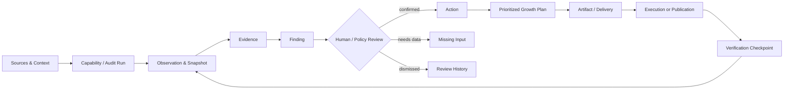

# Nevermore Connected Growth Audit & Optimization Platform 设计

**日期：** 2026-07-20

**状态：** 已确认，可进入实施规划

**产品方案：** B — 在 Nevermore 内建立完整审计与优化领域，Content Growth 作为其中一条持续执行链

**设计依据：** Nevermore 当前代码、`gengrowth-agents` 完整诊断能力、`gengrowth-flow-mvp` 内容生产发布流水线、`gengrowth-wiki` SEO/GEO 知识与治理资料

**配套 Artifact：** `/Users/wzb/.codex/visualizations/2026/07/20/019f7ff0-3874-7623-90f3-1ebdea7c313f/index.html`

## 1. 执行摘要

Nevermore 不能只补一个关键词、竞品与 Blog 工作区。那会把产品做成一条较深但较窄的 SEO/GEO 内容流水线，无法承接现有 Nevermore 已完成的技术 SEO、搜索表现、内容意图、转化路径、GEO 诊断，也会遗漏 `gengrowth-agents` 已具备的性能、可访问性、安全、索引控制、链接、合规和 Measurement Readiness 等诊断能力。

正确产品边界是：

> **Nevermore 是从数据连接、全站审计和证据诊断，到统一优化计划、多类型交付、发布与效果验证的 Connected Growth Platform。Content Growth 是其中一条重要且持续运转的执行支线。**

产品由两个互相连接的循环组成：

1. **Audit & Optimization Loop**：Sources → Audit Run → Observation/Evidence → Finding Review → Growth Plan → Delivery → Verification；
2. **Content Growth Loop**：Market/Competitor → SEO/GEO Demand → Content Opportunity → Research/Brief/Draft → Review/Publish → Performance。

两个循环共享 `SitePage`、`Evidence`、`Finding`、`Action`、`Artifact`、`CapabilityRun` 与 `PerformanceCheckpoint`，不建立平行的内容证据链或第二套任务系统。

## 2. 方案比较与结论

### 2.1 方案 A：在 Nevermore 增加独立 Content Growth 模块

优点是短期开发快，Flow 映射直接。缺点是技术审计和其他诊断被降为内容选题输入，用户仍然看不到从全站问题到整改、验证的闭环；这正是第一版 Artifact 暴露的问题。

### 2.2 方案 B：Nevermore 统一审计与优化领域（采用）

Nevermore 保持唯一产品壳、权限边界、System of Record 和执行治理；`gengrowth-agents` 提供成熟诊断能力来源，Flow 提供成熟内容执行能力来源，Wiki 提供治理知识。所有能力统一投影为 Nevermore 的 Run、Evidence、Finding、Action 和 Artifact。

这是唯一能同时满足内部团队代运营、客户自助、技术整改、SEO/GEO 内容和长期效果验证的方案。

### 2.3 方案 C：保留 `gengrowth-agents` 与 Flow 为独立应用并嵌入

短期可保留最多现有 UI，但会产生三套身份、项目、运行状态、任务、审批和审计日志。数据归属与失败恢复不清晰，不适合作为目标架构，只能在迁移期通过受控 Adapter 使用底层能力。

## 3. 已确认设计基线

| # | 决策 | 方案 |
|---|---|---|
| 1 | 产品主干 | 完整审计与优化闭环，不以 Blog 流水线代表全部产品 |
| 2 | 产品壳与 SoR | Nevermore 是唯一产品界面、权限边界、长期领域模型与 System of Record |
| 3 | 诊断能力来源 | `gengrowth-agents` 的 Website Audit、17 模块 Analysis、技术健康 A0–A14 作为能力库与迁移基线 |
| 4 | 内容能力来源 | `gengrowth-flow-mvp` 的关键词、聚类、Research、Draft、QA、Publish、Index、Recap 作为能力库与 Shadow 基线 |
| 5 | 知识层 | Wiki 四级治理：A Canonical、B Approved Playbook、C Client/Site Facts、D Raw Research |
| 6 | SEO/GEO 需求 | 同一 Demand 工作区、共享 Topic；`SearchQuery` 与 `GenerativeQuery` 保持独立对象、来源与指标 |
| 7 | 审计与整改边界 | Audit 只表达事实、范围、分数、证据与影响 URL；确认 Finding 后才创建 Action，不在报告中混入整改步骤 |
| 8 | 审批 | 项目级预授权 + Tier 0–3；批准绑定不可变 Revision；事实与治理红线不可绕过 |
| 9 | 双使用模式 | Managed、Co-managed、Self-service 使用同一项目数据与对象，由 Membership 与 Automation Policy 控制 |
| 10 | 迁移 | Capability Inventory → Shadow → Parity → Canary → Authority Cutover；不整仓复制、不直接合并活跃脏分支 |

## 4. 产品原则

1. **先测量，再判断，再行动。** 数据缺失是 `No Data`，不是通过默认值生成的失败项。
2. **审计事实与优化决策分层。** 报告不伪装成待办清单，行动必须来自经过确认的 Finding。
3. **Evidence 是共同货币。** 技术工单、Metadata Rewrite、CRO Brief 和 Blog Draft 都引用同一证据模型。
4. **分数用于导航，不替代证据。** 每个分数必须能回到 Module、Rule、Source、Scope、Freshness 和受影响 URL。
5. **预测与实测分离。** 第三方估算、模型推断、站点观察和发布后真实结果不得混为一列。
6. **批准绑定版本。** Artifact 改动生成新 Revision，旧 Review Decision 自动失效。
7. **外部写入默认失败关闭。** 授权、预检、质量闸或回执不明确时进入 Parked/Reconcile，不盲目重试。
8. **能力可替换，领域对象稳定。** Nevermore 不把产品模型绑定到某个脚本、Crawler、LLM、CMS 或供应商。

## 5. 能力归属

| 层 | 长期责任 | 现有资产 |
|---|---|---|
| Product & Governance | 身份、项目、角色、页面、审批、Run、Evidence、Finding、Action、Artifact、Telemetry、审计日志 | Nevermore |
| Full Audit & Analysis | Website Audit、技术健康、搜索可见性、内容、链接、竞品、合规、AI/GEO、GSC/GA4 等分析器 | `gengrowth-agents`，逐项抽取或适配 |
| Content Operations | Keyword → Cluster → Brief → Research → Draft → Redline/Fact QA → Preview/Publish → Index/Recap | `gengrowth-flow-mvp`，Shadow-first 迁移 |
| Governed Knowledge | Canonical Policy、Playbook、客户事实、Verified Claim、原始研究清单 | `gengrowth-wiki` Manifest Sync |
| External Systems | Crawl、GSC、GA4、DataForSEO、PageSpeed、AI Answer、CMS | Nevermore Connector/Capability Runtime |

`gengrowth-agents` 当前是活跃开发且工作树包含未提交改动。它是能力与验收基线，不是可以直接 `git merge` 的供应包。每个迁移能力必须先确定输入、输出、数据诚实规则、版本和副作用，再决定：复用包、抽取纯逻辑、调用受控 Adapter，或在 Nevermore 中重新实现。

## 6. 统一产品主链

### 6.1 核心不变量

- Observation、Evidence、Review Event、Artifact Revision、Publication 和 Checkpoint 追加保存；
- Finding 只引用实际存在的 Evidence，不从 Rule Catalog 本身制造事实；
- `pass` 与 `no_data` 不升级为 Finding；
- Action 不能绕过 Finding Review，自动生成候选也必须带来源和置信度；
- Artifact 必须引用 Action 和当前 Evidence Snapshot；
- Verification 同时支持技术复测、搜索/转化观测和内容发布后表现；
- 用户看到的是来源摘要和判断，不暴露提示词、模型路由、完整规则库或其他租户数据。

## 7. 全站审计模型

### 7.1 用户侧综合审计八面

| Module | 主要问题 | 典型来源 |
|---|---|---|
| Performance | LCP、INP/TBT、CLS、TTFB、资源体积、CrUX 覆盖 | PageSpeed/Lighthouse/CrUX |
| Accessibility | 可访问名称、Alt、Label、对比度、键盘/语义 | Lighthouse、Accessibility Tree、Rendered DOM |
| Best Practices & Security | HTTPS、Mixed Content、CSP、Console Error、安全 Header | SSL、HTTP Header、Rendered DOM |
| Technical SEO & Search | Crawl/Index、Canonical、Robots、Sitemap、Meta、Hreflang、GSC 表现 | Crawler、GSC、SERP、Sitemap |
| Content & Intent | 薄内容、重复、意图错位、实体覆盖、新鲜度、转化路径 | Crawl、页面采样、GA4、AI Analysis |
| AI/GEO | AI Eligibility、可引用性、实体、Schema、Query Fan-out、品牌提及 | Crawl、Schema、AI Answer Observation |
| Links | Broken/Orphan、内链深度、Anchor、Referring Domain、风险链接 | Crawl、Link Graph、供应商数据 |
| Compliance | Privacy、Terms、Cookie/Consent、Disclosure、Copyright | 页面探测、Policy、人工确认 |

八面是客户可理解的报告导航，不等于底层只有八个分析器。

### 7.2 技术健康深钻 A0–A14

`gengrowth-agents` 的技术健康模型作为深层规则与验收基线：

| ID | 模块 |
|---|---|
| A0 | 诊断范围与 URL 资产契约（不评分） |
| A1 | 数据源与采样覆盖 |
| A2 | URL 资产盘点与来源对账 |
| A3 | 抓取与索引资格 |
| A4 | 索引控制面 |
| A5 | 渲染与内容一致性 |
| A6 | URL 架构、参数与重复治理 |
| A7 | 站点架构、内链与主题簇连通性 |
| A8 | 性能与 Core Web Vitals |
| A9 | 页面语义与 SERP 元数据 |
| A10 | 结构化数据与搜索外观 |
| A11 | 国际化与 Locale/hreflang（条件模块） |
| A12 | 日志、爬虫预算与大站健康（条件模块） |
| A13 | Measurement Readiness |
| A14 | 安全、协议、可靠性与回归监控 |

### 7.3 三层展示

1. **Executive Overview**：总体健康、数据完整度、Top Risk、趋势、最高优先级问题；
2. **Module Report**：八面得分、数据源、状态、规则结果与历史比较；
3. **Finding/URL Detail**：Rule Version、Current Value、Judgment、Evidence Sample、受影响 URL、置信度与完整来源。

审计页允许导出和查看 Evidence，不允许直接混入责任人、修复步骤、工期或 Backlog 状态。Finding Review 页才允许“确认并创建行动”。

## 8. Finding Review 与统一增长计划

Nevermore 当前五个诊断域继续作为 Action 归类主轴：

- `technical_seo`；
- `search_performance`；
- `content_intent`；
- `conversion_journey`；
- `geo_ai`。

综合审计八面与 A0–A14 是诊断 Taxonomy，通过映射进入上述业务域，不再建立一套平行 Finding 表。

### 8.1 Finding Review 状态

`new → confirmed | needs_data | dismissed | superseded`

Review Event 记录操作者、时间、原因、Evidence 版本和可选 Missing Input。`needs_data` 不进入行动排序，直到数据补齐后重新评估。

### 8.2 统一 Action 排序

Action 使用可解释的优先级投影：

- Impact：受影响页面/需求/转化、严重度与业务阶段；
- Confidence：来源完整度、样本覆盖、数据新鲜度；
- Effort：工作类型、页面数、系统依赖与人工确认量；
- Risk：发布、代码、安全、合规和 Claim 风险；
- Dependency：是否被连接、权限、客户事实或前置修复阻塞。

排序结果必须显示各因子，不输出无法解释的单一 AI 分数。

### 8.3 交付类型

当前 Nevermore 已有：

- `technical_ticket`；
- `metadata_rewrite`；
- `content_brief`。

后续按真实需求增量加入，而不是首版一次性铺满：

- `cro_brief`；
- `schema_patch`；
- `internal_link_plan`；
- `compliance_task`；
- `content_draft`；
- `publish_payload`；
- `performance_recap`。

所有交付物复用 `execution_artifacts` 与不可变 `artifact_revisions`。

## 9. Content Growth 支线

### 9.1 Market 与 Demand

`Competitor` 区分业务竞品、搜索竞品、替代方案和 AI 引用来源；关系可多选，但必须记录用途。`CompetitorSnapshot` 追加保存 Top Pages、共同 Topic、SERP/AI 引用与变化。

`Topic` 是规划节点。SEO 与 GEO 只在 Topic 层协同：

| 维度 | `SearchQuery` | `GenerativeQuery` |
|---|---|---|
| 来源 | DataForSEO、GSC、CSV、SERP | 固定问题集、AI Answer、访谈、社区研究 |
| 指标 | Volume、KD、CPC、Rank、Clicks、Impressions | Answer Presence、Citation、Brand Mention、Competitor Set、Claim Gap |
| 快照维度 | 市场、语言、设备、时间 | 平台、地区、时间、问题版本、Answer Hash |
| 决策 | 意图、业务相关性、可竞争性 | 可回答性、权威差距、决策相关性 |

### 9.2 内容状态

`Opportunity → Planned → Researching → BriefReady → Drafting → QualityReview → Approval → Approved → Publishing → Published → Monitoring → RefreshPlanned/Complete`

关键规则：

- Research Pack 只能把 A/B/C 权威等级当作可发布事实；D 只能发现候选；
- 量化 Claim 必须引用有效 Verified Claim 或核验来源；
- Approval 绑定具体 Revision Hash；
- CMS 请求使用 project/content/revision/target 幂等键；
- 超时且外部状态未知进入 `Parked`，先 Reconcile；
- 发布成功不等于索引或增长成功。

## 10. 信息架构

### 10.1 一级导航

1. **Overview** — 两个循环、健康度、数据完整度、最高风险、行动与结果；
2. **Full Audit** — 综合报告、八面模块、URL、历史、Evidence 与 Export；
3. **Findings** — 证据确认、状态、影响范围与 Review History；
4. **Growth Plan** — 跨技术、搜索、CRO、内容和 GEO 的统一优先队列；
5. **Delivery** — 技术工单、Metadata、CRO、Schema、Link、Content 等交付物；
6. **Market** — 竞品与市场变化；
7. **Demand** — Topic、SEO Keyword、GEO Query；
8. **Content** — Calendar、Pipeline、Research、Draft 与 QA；
9. **Publish** — Review、Preflight、Publication、Retry/Park/Reconcile；
10. **Measurement** — 技术复测、索引、搜索、转化、AI 引用和 Recap；
11. **Knowledge & Sources** — 数据连接、Canonical、Playbook、客户事实、成员与策略。

### 10.2 两条 Guided Path

- Optimization：Full Audit → Findings → Growth Plan → Delivery → Verify；
- Content Growth：Market → Demand → Content → Review/Publish → Measure。

路径是导航辅助，不复制对象；一个 Content Action 同时出现在 Growth Plan 和 Content Pipeline 的相应投影中。

## 11. 身份、权限与双运营模式

新增 `workspace_memberships`、`project_memberships`、`project_invitations`、`automation_policies` 和 `publish_authorizations`。所有服务端读取与 Mutation 先解析 `ProjectAccessContext`，前端菜单隐藏不作为安全边界。

推荐角色：Workspace Admin、Internal Strategist、Internal Specialist/Editor、Internal Publisher、Client Admin、Client Editor、Client Viewer。

- **Managed**：内部团队负责日常审计与执行，客户负责事实确认、Tier 2/3 审批和授权；
- **Co-managed**：阶段级指定内外部责任人；
- **Self-service**：客户自己执行，Nevermore 提供诊断、方法、质量闸与保护。

三种模式只是同一 Automation Policy 的模板，不生成三套数据库或页面。

## 12. Runtime 与数据模型演进

### 12.1 复用 Nevermore 现有对象

- `source_connections`、`collection_runs`、`data_snapshots`、`normalized_observations`；
- `diagnostic_runs`、`diagnostic_run_rules`、`evidence`、`findings`、`finding_observations`、`finding_review_events`；
- `actions`、`action_override_audit`；
- `execution_artifacts`、`artifact_revisions`、`export_bundles`；
- `async_runs`、pg-boss、Idempotency、Telemetry。

### 12.2 最小新增对象

- `capability_runs`：与 `async_runs` 一对一扩展，记录 capability/version、输入 Manifest Hash、模式、结果引用与副作用范围；
- `site_pages` / `page_snapshots`：URL 当前投影与不可变抓取快照；
- `competitors` / `competitor_snapshots`；
- `topics`、`search_queries`、`generative_queries` 与各自 Metric Snapshot；
- `content_items` / `content_item_artifacts`；
- `review_decisions`、`publications`、`performance_checkpoints`；
- Membership、Automation Policy、Publish Authorization。

不要复制 `findings`、`actions`、`execution_artifacts` 或 Run 状态表来迎合某个来源仓库。

### 12.3 Capability Contract

每个能力声明：

- `capability_key`、语义版本和输入/输出 Schema；
- 所需 Source、Scope、预算与超时；
- `no_data` 与降级语义；
- Evidence Provenance 和 Rule/Model Version；
- 是否有外部副作用及其 Idempotency/Reconcile 契约；
- Shadow、Canary 或 Authoritative 模式。

Web 只创建 Run 与队列任务，不能直接运行任意脚本。Job Payload 只携带 ID 和 Contract Version，不携带凭证、正文或任意路径。

## 13. 迁移路线

### Phase 0 — Capability Inventory 与 Parity Contract

- 列出 Nevermore、`gengrowth-agents`、Flow 的能力、输入、输出、来源、状态、规则版本和副作用；
- 明确每项采用 reuse/extract/adapter/rebuild；
- 固化一组公开或自有测试站点与 Golden Evidence Fixtures；
- 不改权威写入者。

### Phase 1 — 完整审计只读投影

- 在 Nevermore 增加综合审计页面和八面 Projection；
- 复用现有 Run/Evidence/Finding；
- 接入真实来源状态、覆盖率、No Data、URL Detail、Compare 和 Export；
- 审计页保持 audit-only。

### Phase 2 — Finding Review 与统一 Growth Plan

- 标准化诊断 Taxonomy 到 Nevermore 五个业务域；
- 加入 confirmed/needs_data/dismissed Review Event；
- 把确认 Finding 转为跨域 Action；
- 复用当前三类 Artifact 完成首条“技术问题 → 工单 → 复测”Vertical Slice。

### Phase 3 — Market/Demand 与内容 Shadow

- 建立 Competitor、Topic、SearchQuery、GenerativeQuery；
- Flow 以固定版本 Adapter 运行，只读 Shadow，不外部发布；
- 对 Keyword、Cluster、Brief、Research、Draft、QA 输出做字段级 Parity；
- 通过后逐项切换 Nevermore 为权威写入者。

### Phase 4 — 审批与 CMS Canary

- 建立成员、风险策略、Review Decision、Publish Authorization；
- 使用 Flow 已验证的 `astrologywiki.com` GitHub/Oracle 链路做首个 Canary；
- 先单项目、单内容类型、人工批准、可回滚；
- 达标后抽象 WordPress 等通用 Connector。

### Phase 5 — Measurement 与闭环优化

- 技术交付支持复测前后对比；
- 内容发布支持 0/7/14/30/60 天 Checkpoint；
- Search、Conversion、AI Visibility 回写 Topic/Action；
- 只从实际结果更新优先级，不把预测冒充成功。

## 14. 失败、降级与恢复

- 数据源未连接、权限过期、样本不足和采集失败分别表达；
- 无 raw Lighthouse/DOM/CrUX/Link 数据时显示 No Data，不用规则目录或摘要冒充；
- Fast-path 先展示可读诊断，后台 Enrichment 保留明确进度与来源状态；
- 连接健康但暂不可评分时显示“已连接 / 未评分”，不能只显示 `--`；
- Action 在 Evidence 过期时标记 stale，不能悄悄沿用；
- 外部发布超时进入 Parked，Reconcile 确认外部状态后再重试；
- 所有高影响 Override 记录操作者、理由、旧值、新值与时间。

## 15. 验证与验收

### 15.1 设计级验收

- Artifact 首屏同时展示完整审计优化循环和内容增长循环；
- Audit 覆盖八面模块、来源覆盖、No Data、Finding、URL 与 Evidence；
- Audit 页面不出现责任人、整改步骤或 Backlog 状态；
- Finding 确认后才创建 Action；
- Growth Plan 同时存在技术、搜索、CRO、内容和 GEO 行动；
- Delivery 至少展示 `technical_ticket`、`metadata_rewrite`、`content_brief` 三类现有 Artifact；
- Content Pipeline 仍能演示 Research、事实红线、Revision 审批和模拟发布；
- Managed/Self-service 角色切换不改变底层对象，只改变权限与责任。

### 15.2 实施级验收

- 租户隔离、404-not-403、Membership 与服务器端授权测试；
- Capability Contract/Schema、No Data、Evidence Provenance、Rule Version Contract Tests；
- Golden Fixture 对 Nevermore 与来源引擎做字段级 Parity；
- Finding Review、Action 幂等、Artifact Revision 和批准失效测试；
- Worker Retry/Park/Reconcile 与 CMS 重复发布防护；
- Web/Worker 类型检查、单元、集成、E2E、移动端、可访问性与视觉回归；
- Shadow/Canary 阶段记录差异率、误报/漏报、运行时间、成本和人工介入率。

## 16. Artifact 视觉与交互方向

保留现有 Nevermore 的 warm paper、dark ink、cobalt、editorial/operational 视觉，不改成通用 SaaS Dashboard。最重要的识别点是“双循环系统图”和“Evidence → Finding → Action → Delivery”贯穿式对象链。

Demo 使用确定性 Mock，并清晰标记不连接真实 Crawler、付费数据源或 CMS。它用于验证信息架构、角色责任、审计/整改边界和多类型交付，不作为真实评分结果。

## 17. 明确非目标

- 不在首个版本迁移 `gengrowth-agents` 全部 160 条技术规则或全部 17 模块；先用 Parity Matrix 排优先级；
- 不整仓复制 `gengrowth-agents` 或 Flow；
- 不建立平行 Finding、Action、Artifact、Run 或身份系统；
- 不在 Audit Report 中混入修复步骤和项目管理字段；
- 不用 AI 自动填补缺失测量值；
- 不承诺 Tier 2/3 全自动发布；
- 不在首版重建 Ahrefs/SEMrush 等第三方数据产品；
- 不把 Wiki 全量无治理地向量化并直接用于发布事实；
- 不因为建设内容增长而弱化 Nevermore 已有技术、搜索、转化和 GEO 主链。

## 18. 结论

方案 B 的最终含义不是“在 Nevermore 里做一个更完整的 Blog 工具”，而是：

> 用 Nevermore 的治理与证据骨架统一 `gengrowth-agents` 的完整诊断能力和 Flow 的内容执行能力，形成一个可审计、可决策、可交付、可验证的增长系统。

下一步按本设计生成分阶段实施计划。真实产品代码在讨论阶段不改动；先完成修订后的高保真 Artifact、能力等价矩阵和 Vertical Slice 验收合同。
