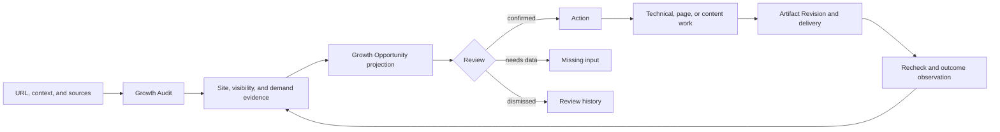

# Nevermore Unified Growth Opportunity — Product Design & PRD

**Date:** 2026-07-21  
**Status:** Approved design baseline  
**Decision:** Replace the parallel Audit and SEO/GEO Content loops with one evidence-led Growth Opportunity loop  
**Approved by:** User confirmation in the product-design thread on 2026-07-21  
**Supersedes:** `2026-07-20-connected-growth-audit-optimization-design.md` as the current product direction  
**Product requirements authority:** [`2026-07-21-unified-growth-opportunity-prd.md`](./2026-07-21-unified-growth-opportunity-prd.md)  
**Implementation companion:** `2026-07-21-unified-growth-opportunity-implementation.md`  
**Artifact companion:** `/Users/wzb/.codex/visualizations/2026/07/20/019f7ff0-3874-7623-90f3-1ebdea7c313f/index.html`

---

## 1. Executive Decision

The previous direction correctly expanded Nevermore beyond a narrow SEO/GEO Blog tool, but it exposed two nearly complete products side by side:

1. a complete site-audit and technical-optimization system; and
2. a market, keyword, content, approval, publishing, and measurement system.

The two systems shared backend nouns such as Evidence, Finding, Action, and Artifact, but users did not follow the same work object through both systems. Audit centered on modules, rules, findings, and URLs. SEO/GEO centered on competitors, topics, queries, drafts, and publications. Their visible intersection happened too late, usually in Growth Plan or Measurement.

The approved product definition is therefore:

> **Nevermore starts from a URL, runs one Growth Audit across the site and its market, turns evidence into ranked Growth Opportunities, then helps a team deliver and verify the appropriate technical or content work.**

The product has one loop:

```text
URL + Context + Sources
→ Growth Audit
→ Evidence-backed Growth Opportunities
→ Review and Decision
→ Technical / Page / Content Work
→ Delivery
→ Verification
→ New Evidence
```

SEO, GEO, keywords, competitors, technical health, accessibility, security, content quality, and conversion are not parallel products. They are evidence lenses and delivery capabilities inside the same loop.

---

## 2. Audit of the Superseded Proposal

### 2.1 What was correct and must remain

The following decisions remain load-bearing:

- Nevermore is the only product shell, authorization boundary, and long-term system of record.
- `gengrowth-agents` is a source of audit, diagnosis, discovery, and rule capabilities.
- `gengrowth-flow-mvp` is a source of research, drafting, quality-gate, publishing, indexing, and recap capabilities.
- `gengrowth-wiki` is governed knowledge, not an unfiltered corpus of publishable facts.
- Audit truth and optimization decisions are separate.
- `No Data` is not zero, failure, or evidence of a defect.
- Observation, Evidence, Review Event, Artifact Revision, Publication, and Verification are append-only records.
- A Finding must reference observed Evidence.
- A confirmed Finding creates an Action; an Action is not fabricated directly from a catalog entry.
- Approval binds to an immutable Artifact Revision.
- External writes fail closed when authorization, preflight, idempotency, or remote state is uncertain.
- Predicted impact, provider estimates, observed baselines, and verified results remain distinct.

### 2.2 Why the prior artifact felt too complex

The prior artifact exposed eleven primary navigation items, two guided paths, three taxonomies, a role switcher, a service-mode switcher, four automation tiers, a knowledge-governance surface, and complete publishing and measurement surfaces.

This created four forms of unnecessary cognitive load:

1. **Two product universes.** The homepage explained two operating loops before helping the user decide what to do.
2. **No persistent frontstage object.** Audit used Finding/URL while Content Growth used Topic/Query/Content Item.
3. **Taxonomy translation.** Users had to understand report modules, A0–A14 checks, and action domains.
4. **Dashboard repetition.** Overview, Audit, Findings, Plan, and Performance repeated the same counts and status summaries.

### 2.3 Why the prior implementation plan was too broad

The superseded implementation plan mixed three different levels of commitment:

- the long-term product vision;
- the next technical vertical slice; and
- future security, publishing, and measurement systems.

It described eighteen tasks and migrations through membership, CMS publishing, and scheduled measurement even though it also specified a product-review stop after the technical recheck slice.

It additionally contained mechanical contradictions:

- the v0.2 spec lock and implementation verifier use exact-set expectations for operations, tables, and rules;
- the table scanner reads only `0001_init.sql`;
- the proposed create-run contract had no corresponding web route task;
- the recheck E2E referred to a Checkpoint entity scheduled for a later phase;
- the Wiki/Verified Claim promise had no implementation landing point;
- a sample rule-to-module mapping contradicted the design taxonomy;
- the Flow source repository path was not pinned precisely.

The replacement plan separates current work, stop gates, and deferred capabilities.

---

## 3. Product Goal, Users, and Jobs

### 3.1 Product goal

For one project and one target site, Nevermore should make the following statement true:

> A user can understand the most important evidence-backed growth opportunities, decide which are real and worth pursuing, deliver the appropriate technical or content change, and later see whether the underlying condition improved.

### 3.2 Primary users

#### Internal operator

An internal strategist or specialist manages multiple client projects. They need to:

- start from a client URL with minimal setup;
- see source readiness and limitations;
- inspect technical, search, GEO, competitor, and content evidence together;
- prepare decisions for the client;
- produce technical tickets, page recommendations, and content deliverables;
- record what was approved and delivered;
- report observed outcomes without overstating attribution.

#### Client collaborator

A client administrator or editor works in the same project. They need to:

- understand why an opportunity exists;
- inspect client-safe evidence and limitations;
- confirm business facts and priorities;
- review a specific delivery revision;
- approve or request changes;
- understand what has and has not yet been verified.

#### Self-service user

A customer operates the same workflow without a managed-service team. They need more guidance and fewer operational controls, not a different database or parallel product.

### 3.3 Core jobs to be done

1. **URL to audit-ready:** create a project, crawl the site, connect optional sources, and understand whether the evidence is sufficient.
2. **Evidence to decision:** understand an issue or gap, inspect its sources and limitations, and confirm, dismiss, or request more data.
3. **Decision to work:** generate and refine the right technical or content artifact without losing the source evidence.
4. **Work to result:** recheck the changed condition and label the result as verified, observed, or insufficient data.

---

## 4. Product Mental Model

### 4.1 Container object: Project

`Project` remains the tenant-scoped container for:

- site and locale;
- business context;
- source connections;
- audit and diagnostic runs;
- evidence, findings, actions, and artifacts;
- exports and later verification records.

The project shell and project-scoped authorization remain unchanged conceptually.

### 4.2 Frontstage work object: Growth Opportunity

A `Growth Opportunity` is what the user reviews, approves, executes, and verifies.

In the first validated slice, it is a **read model**, not a new canonical table. It projects:

```text
Target
+ exactly one primary evidence-backed Finding in Slice 1
+ optional supporting Findings and cross-lens observations
+ evidence lenses and limitations
+ review state
+ one Action, when the primary Finding is confirmed
+ one fixed-type Artifact Revision, when generated
+ verification state, when available
```

This choice deliberately avoids copying or replacing the mature Nevermore Finding, Action, and Artifact models.

Related Opportunities may be grouped visually by stable target/topic keys, but that group is read-only and has no bulk Confirm mutation in Slice 1. Persistence for an explicit Opportunity Group may be introduced only after real use demonstrates that multiple Opportunities must maintain a durable grouping lifecycle independent of their primary Findings and Actions.

### 4.3 Opportunity targets

Every opportunity has one primary target type:

- `site`: site-wide protocol, reliability, policy, or measurement condition;
- `template`: a repeated layout or page class;
- `url`: an existing owned page;
- `topic`: a search/AI demand theme that may map to one or more pages;
- `new_asset`: a proven demand gap with no suitable owned page.

An opportunity may reference secondary targets but must have one primary target so the user can understand what changes.

### 4.4 User-facing work shapes

The frontstage classification uses action language rather than backend taxonomies:

1. **Fix:** repair an observed defect or blocking condition.
2. **Improve:** strengthen an existing page, template, or journey.
3. **Create:** build a missing page or content asset against observed demand.
`Expand`—authority, links, citations, and distribution—is a reserved future work shape. It is not emitted by the initial contract and does not appear in the first-slice enum.

Report modules, technical check IDs, and action domains remain available in Evidence detail and contracts, not as competing primary navigation systems.

---

## 5. One Unified Growth Loop



### 5.1 Audit is the observation boundary

The audit side may show:

- scope and source coverage;
- measured current values;
- nullable scores used for navigation;
- pass, warning, failed, pending, and no-data rule results;
- affected URLs and evidence samples;
- trend or previous-run comparison;
- limitations and exports.

It must not show:

- assignee;
- effort estimate;
- remediation steps;
- backlog lane;
- due date;
- publish controls;
- action status.

### 5.2 Opportunity Review is the decision boundary

Opportunity Review may show:

- why the evidence matters;
- primary target and related topic/query/page context;
- impact, confidence, effort, risk, and dependency factors;
- proposed work shape;
- review history;
- confirm, needs-data, and dismiss decisions.

Only review of the Opportunity's primary canonical Finding can create its Action. Opportunity Review is a projection over that single-Finding review; it does not introduce a second Action-creation path or a multi-Finding bulk mutation. Supporting Findings enrich the explanation and appear as related Opportunities when they require their own work. A candidate supported only by source observations may be inspected or marked as needing analysis, but it cannot be confirmed and cannot create an Action until a versioned rule or explicit analyst judgment materializes a canonical Finding with Evidence provenance.

### 5.3 Execution is the delivery boundary

Execution may show:

- action ordering and status;
- technical ticket, metadata rewrite, and content brief;
- research pack and a later content revision;
- validation and rollback requirements;
- approval tied to the current revision;
- a publish action only when a separately approved publishing milestone exists.

### 5.4 Results is the verification boundary

Results distinguishes:

- `verified`: a recheck or trustworthy outcome directly proves the targeted condition changed;
- `observed`: a signal changed, but causal attribution is not strong enough;
- `insufficient_data`: source, sample, window, or attribution is inadequate;
- `declined` or `regressed`: the targeted condition worsened or returned.

Execution logs and publication receipts are not evidence of growth by themselves.

---

## 6. Growth Audit Evidence Lenses

The Growth Audit has three frontstage lenses. They are filters over one evidence system, not independent product modules.

### 6.1 Site Health

Answers: “Can the site and its pages be crawled, rendered, understood, trusted, and used?”

Includes:

- performance and Core Web Vitals;
- accessibility;
- protocol, security, and best practices;
- crawl/index eligibility, canonical, robots, sitemap, hreflang;
- rendering and content consistency;
- structured data;
- internal links and architecture;
- compliance and measurement readiness.

The eight customer-readable audit modules and A0–A14 technical checks remain deep-detail taxonomies inside this lens.

### 6.2 Search & AI Visibility

Answers: “Where is the site currently visible, absent, declining, or difficult to cite?”

Includes:

- GSC queries, pages, impressions, clicks, CTR, and position;
- ranked keywords and SERP observations;
- index status and page-query fit;
- AI Answer presence, brand mention, citation, and extractability;
- entity and proof coverage;
- SearchQuery and GenerativeQuery observations.

Search and generative metrics remain separate. They may support the same Opportunity but must not be collapsed into a fabricated common volume or difficulty score.

### 6.3 Demand & Competition

Answers: “What does the market need, who currently satisfies it, and does the site have a suitable asset?”

Includes:

- competitor discovery and explicit competitor relation type;
- keyword intersection and gaps;
- topic clusters and intent;
- comparison, alternative, template, and guide demand;
- competitor ranking pages and AI citations;
- content freshness and publishing changes;
- whether an existing page should be fixed or improved before a new page is created.

Keyword and competitor libraries remain inspectable assets inside this lens. They are not primary navigation items in the first product shell.

---

## 7. Opportunity Construction

### 7.1 Required fields in the read model

```text
opportunity_key
title
readiness: candidate | reviewable | confirmed
work_shape: fix | improve | create
primary_target: site | template | url | topic | new_asset
target_ref
primary_finding_id?
supporting_finding_ids[]
evidence_summary[]
lenses[]
search_queries[]
generative_queries[]
competitor_refs[]
current_owned_asset
coverage_and_limitations
impact_factors
confidence_factors
effort_factors
risk_factors
dependency_factors
review_state
action_id?
artifact_summary?
verification_summary?
```

### 7.2 Deterministic projection rules

- In Slice 1, a reviewable Opportunity resolves to exactly one measured primary canonical Finding. Supporting Findings and observations enrich its cross-lens explanation but do not share its Confirm control. An observation-backed candidate may appear with `readiness=candidate`, but it has no Confirm control and cannot create an Action.
- A Rule Catalog entry alone cannot create an Opportunity.
- `pass` and `no_data` do not create an Opportunity.
- Candidate demand without a suitable owned page may appear as a non-confirmable `create` candidate only when demand, relevance, and coverage observations are present. It becomes reviewable only after a versioned demand-gap rule or an explicit analyst judgment writes a canonical Finding tied to those observations.
- The projection must preserve Finding IDs, rule versions, source freshness, and limitations.
- Grouping must use stable target and intent keys; it must not rely on an LLM-generated title.
- An LLM may summarize an existing evidence packet but may not invent evidence, impact, or confidence.
- Confirm reviews only `primary_finding_id` and reuses Nevermore's idempotent one-Finding-to-one-Action transaction. The Opportunity projection never writes an Action directly. Multi-Finding confirmation and atomic Opportunity-group approval are explicitly deferred.

### 7.3 Existing-page-first decision

Before proposing a new content asset, the system evaluates:

1. Is there an owned page for the topic or intent?
2. Is it indexable and technically eligible?
3. Does it rank or receive impressions?
4. Does it match the intended search and AI question?
5. Is the problem better solved by a technical fix, page improvement, or genuinely new asset?

This prevents the SEO/GEO workflow from becoming a Blog volume machine.

### 7.4 Example cross-lens target story

**Target:** `/customer-onboarding/`  
**Topic:** customer handoff automation

One target story contains three **related but separately reviewable Opportunities**:

| Opportunity | Primary Finding | Work shape | One fixed Artifact type |
|---|---|---|---|
| Repair canonical conflicts on the onboarding template | `TECH-CANONICAL-002` | Fix | `technical_ticket` |
| Improve SERP message and page-query alignment | `SEARCH-CTR-004` or reviewed equivalent | Improve | `metadata_rewrite` |
| Make the existing page a citation-ready answer asset | `CONTENT-COVERAGE-001` or reviewed equivalent | Improve | `content_brief` |

Shared supporting evidence:

- Site Health: canonical conflict on 18 URLs, weak internal-link connectivity, mobile LCP at 4.8 seconds on the template.
- Search Visibility: approximately 1,300 monthly demand in the observed provider snapshot; key queries sit around positions 11–18; page intent is only partially aligned.
- AI Visibility: brand present in 1 of 8 observed answers; competitors cited in 6 of 8; the owned page lacks concise answer and proof blocks.
- Competition: competitors own comparison, guide, and template assets for the same decision journey.
- Limitation: server logs are unavailable, so crawl-budget conclusions remain No Data.

Each Opportunity confirms its own primary Finding, creates its own canonical Action, and can generate only the Artifact type fixed by that Action template. The target-level visual grouping has no shared mutation and is not a second truth object.

A separate missing supporting-guide candidate may be shown as related evidence, but it remains its own `new_asset` Opportunity and cannot be confirmed until it has a canonical demand-gap Finding.

This is the primary artifact story because it visibly connects complete audit evidence with SEO/GEO demand and content execution without violating the one-Finding → one-Action → one-fixed-Artifact contract.

---

## 8. Information Architecture

The project shell has four primary entries.

### 8.1 Today

Purpose: answer what matters now, why, and what decision or work is next.

Required content:

- one top Opportunity with a clear next action;
- up to three decision or work cards;
- audit/source readiness when it blocks progress;
- compact program status;
- recent verified or observed result.

Forbidden content:

- system architecture diagram;
- dual-loop explanation;
- capability migration counts;
- complete module score grid;
- automation policy laboratory;
- role or operating-mode simulator.

### 8.2 Growth Map

Purpose: understand evidence and turn it into reviewed Opportunities.

Primary stages:

1. `Audit Evidence`;
2. `Opportunity Review`.

Audit Evidence contains:

- run, scope, freshness, and data completeness;
- Site Health, Search & AI Visibility, and Demand & Competition lenses;
- module and rule drilldown;
- URLs, topics, queries, and competitors as related evidence;
- No Data and limitations;
- compare and export.

Opportunity Review contains:

- ranked cross-lens Opportunity cards;
- a detail drawer with target, evidence, impact, confidence, effort, risk, and dependency;
- confirm, needs-data, and dismiss decisions;
- append-only review history.

### 8.3 Execution

Purpose: plan and deliver the work created from confirmed Opportunities.

Required content:

- Ready, In Progress, Review, and Done lanes;
- action ordering with transparent factors;
- one selected Opportunity context rail;
- current artifact type and revision;
- technical validation and rollback details;
- content research and fact-gate state where applicable;
- revision-specific review decision.

The first artifact demonstrates technical ticket, metadata rewrite, and content brief. It may show a reviewed content draft, but it must not simulate a real CMS write.

### 8.4 Results

Purpose: show what was delivered and what the evidence now supports.

Required content:

- technical before/after run comparison;
- indexing and publication state when available;
- Search, conversion, and AI observations with window and source;
- verified, observed, and insufficient-data labels;
- client-safe report and export access;
- next Opportunity created by regression or incomplete results.

### 8.5 Secondary and backstage surfaces

The following are not primary project navigation:

- Context: part of project setup and audit scope.
- Sources: audit-readiness drawer or project settings.
- Market and Demand: Growth Map lenses and tables.
- Findings: canonical records surfaced through Audit Evidence and Opportunity Review.
- Plan and Studio: combined in Execution.
- Publish: a guarded Execution action in a later milestone.
- Knowledge: governed backend capability and project settings.
- Membership and policy: settings and server authorization, not a demo switcher.

An internal Portfolio may exist outside the project shell when multi-client operations require it.

---

## 9. Key User Flows

### 9.1 URL to audit-ready

1. User enters URL, market, language, and minimal business context.
2. Nevermore creates Project, Site, default Crawl source, and a collection run.
3. Crawl begins without requiring every optional connector.
4. Growth Map shows source readiness and explicit limitations.
5. Optional GSC, GA4, keyword, AI Answer, and competitor sources are connected progressively.
6. The audit runs measured capabilities and leaves unsupported modules as No Data.

### 9.2 Evidence to confirmed Opportunity

1. User opens Growth Map.
2. Audit Evidence shows current facts without remediation fields.
3. User opens a reviewable Opportunity backed by one or more measured canonical Findings. An observation-only candidate is visibly non-confirmable and offers only evidence inspection or a request for analysis.
4. The detail shows target, Evidence, source, freshness, affected scope, and limitations.
5. User selects Confirm, Needs Data, or Dismiss for the Opportunity's primary Finding.
6. Confirm reuses the canonical Finding-review transaction to create the single corresponding Action idempotently; the Opportunity projection does not write it directly.
7. The Opportunity appears in Execution without duplicating the Finding or Action.

### 9.3 Confirmed Opportunity to technical work

1. User selects a confirmed Fix Opportunity.
2. Nevermore generates a `technical_ticket` Artifact Revision.
3. Ticket includes change contract, target, evidence, validation, acceptance, and rollback.
4. User delivers the ticket externally or records completion.
5. Recheck creates a new immutable audit/capability run referencing the prior run and Action.
6. Results compares rule-level current values across the two runs.

### 9.4 Confirmed Opportunity to content shadow

1. User selects an Improve or Create Opportunity supported by demand and owned-asset evidence.
2. Nevermore generates a `content_brief` against the same Opportunity evidence.
3. A pinned Flow Shadow capability produces normalized Research, Draft, and QA outputs.
4. Facts use governed source levels and display explicit missing inputs.
5. Output stops at a reviewed Artifact Revision.
6. No real CMS, GitHub, Webflow, WordPress, or Oracle write occurs.

### 9.5 Work to result

1. Technical changes are rechecked against a new run.
2. A later approved publishing milestone may record a Publication receipt.
3. Search and AI observations retain baseline, window, source, and limitations.
4. Results never infer success from a publication or execution log alone.
5. Regression or an uncovered follow-up condition can create new Evidence and a new Finding.

---

## 10. Managed and Self-service Experience

The same four surfaces serve managed, co-managed, and self-service usage.

Differences are contextual:

- internal users see operational source controls, owner, and delivery notes;
- client collaborators see client-safe evidence, decisions, and requested inputs;
- self-service users receive guided setup, explanations, and conservative defaults.

The first product slice does not build seven permanent roles. Until the first external login requirement is approved, the artifact demonstrates responsibility through content and action availability, not through a global role simulator.

When external access becomes real, the smallest acceptable authorization milestone is:

- one project membership table;
- two role classes: operator/admin and collaborator/editor;
- server-side project scope enforcement;
- 404-not-403 cross-tenant behavior;
- no reliance on hidden menus for security.

More roles require observed workflow distinctions, not speculative organization design.

---

## 11. Canonical Data and Runtime Model

### 11.1 Reuse Nevermore

The following remain canonical:

- `projects`, `sites`, and business context;
- `source_connections`, `collection_runs`, `data_snapshots`, `normalized_observations`;
- `diagnostic_runs`, `diagnostic_run_rules`;
- `evidence`, `findings`, `finding_observations`, `finding_review_events`;
- `actions`, `action_override_audit`;
- `execution_artifacts`, `artifact_revisions`, `export_bundles`;
- `async_runs`, queues, idempotency, and telemetry.

### 11.2 Minimum new persistence for the technical slice

Only five new tables are planned before the technical stop gate:

- `capability_runs`;
- `audit_runs`;
- `audit_module_results`;
- `site_pages`;
- `page_snapshots`.

Their ownership is deliberately narrow:

- `capability_runs` is a one-to-one extension of `async_runs`; it stores capability/version, input-manifest hash, mode, and side-effect class, never a competing run status.
- `audit_runs` is a one-to-one audit projection extension anchored to the canonical `diagnostic_runs` row in Slice 1; it stores audit scope identity and projection metadata, not a second frozen input manifest or rule-result truth.
- `audit_module_results` materializes nullable module navigation summaries for one audit run; canonical rule results and Findings remain in the diagnostic/evidence chain.
- `site_pages` stores project-scoped normalized URL identity, not raw crawl truth.
- `page_snapshots` stores derived page-level extracts referencing the canonical source `data_snapshot` and content hash; it is not a second raw snapshot store.

They do not duplicate:

- async run status;
- Finding lifecycle;
- Action lifecycle;
- Artifact lifecycle;
- review events.

### 11.3 Growth Opportunity remains a projection

The technical slice adds an Opportunity response/read model, not an Opportunity table. In Slice 1 it maps exactly one `primary_finding_id` to one optional `action_id` and one optional current Artifact summary. Supporting evidence does not change that mutation cardinality.

The projection may be built from:

- current Findings and Evidence;
- deterministic target grouping;
- confirmed Action;
- current Artifact Revision;
- recheck comparison.

### 11.4 Deferred data objects

The following are defined as future capabilities, not current migrations:

- durable competitor snapshots;
- complete SearchQuery and GenerativeQuery metric histories;
- content-item lifecycle tables;
- review decision and publication tables;
- scheduled performance checkpoints;
- membership, invitation, policy, and authorization tables;
- explicit Opportunity Group persistence.

Each requires a separate reviewed implementation plan when its re-entry condition is met.

---

## 12. Capability Ownership and Reproducibility

### 12.1 Nevermore

Path and baseline:

```text
/Users/wzb/Code/nevermore/signalframe-mvp-app
5960b6d2f67e84dca96c6a1261bdc7def1d11bc7
```

The main worktree also contains an untracked `.gstack/` directory. All planned changes therefore run in a dedicated clean worktree and must not treat the main worktree as a reproducible clean checkout.

Owns:

- product UI and project scope;
- canonical runs, evidence, decisions, actions, and artifacts;
- adapter contracts and normalized writes;
- audit logs, idempotency, and client-safe projections.

### 12.2 gengrowth-agents

Path and inspected baseline:

```text
/Users/wzb/Code/gengrowth-agents
af30cbf422fbb360e86fc6b7474e33003c0e0628
```

The worktree is dirty and remains read-only for migration work.

Provides capability and parity sources for:

- eight audit report modules;
- Website Audit and URL detail;
- technical health A0–A14;
- GEO H1–H6;
- competitor discovery and keyword intersection;
- opportunity discovery and growth-action patterns.

### 12.3 gengrowth-flow-mvp

Path and inspected baseline:

```text
/Users/wzb/gengrowth-flow-mvp
4e11c5e80cae7b62f0fffca90f570e46cfe3dfa6
```

Provides capability and parity sources for:

- keyword and cluster inputs;
- Research Pack and prompt rendering;
- Draft and binary quality gates;
- publish-ready staging;
- indexing ledger, recap, and repair flows.

No runtime import from a sibling repository is allowed. Reuse requires extraction, a pinned adapter, or a separately versioned package.

### 12.4 gengrowth-wiki

Path and inspected baseline:

```text
/Users/wzb/gengrowth-wiki
aff251b0385081f45492f1cd788b37d1deb31048
```

The worktree is dirty and remains read-only.

Authority levels remain:

- A: Canonical Policy;
- B: Approved Playbook;
- C: Client/Site Facts;
- D: Raw Research.

The first content Shadow uses an explicit Research Pack authority field. Full Manifest Sync and Verified Claim persistence are deferred until a dedicated knowledge milestone.

---

## 13. Delivery Slices and Stop Gates

### 13.1 Slice 1 — Technical Growth Opportunity loop

Goal:

```text
URL → Growth Audit → Evidence/Finding → Opportunity Review
→ technical_ticket → Recheck → Results
```

In scope:

- reviewed v0.3 authority delta for audit and recheck only;
- validator evolution policy;
- audit response contracts;
- read-only Growth Audit and Opportunity projections;
- audit run and page snapshot persistence;
- create-run and recheck routes;
- first parity-gated technical rules;
- four-entry shell projection for the relevant screens;
- one technical vertical E2E;
- concierge audit on one or two real or owned sites.

Stop gate:

- product review of honest No Data;
- client/operator comprehension of the Growth Map;
- proof that a measured Finding becomes one Action and one technical artifact;
- proof that recheck compares two immutable runs;
- no content migration before this gate is accepted.

### 13.2 Slice 2 — Cross-lens SEO/GEO Content Shadow

This slice requires a new implementation plan after the Slice 1 stop gate.

Goal:

```text
Demand + Competitor + Existing-page Audit
→ Confirmed Growth Opportunity
→ content_brief → Research → Reviewed Draft Revision
```

Bounded scope:

- one test project;
- one competitor set;
- one keyword/topic cluster;
- one independent GenerativeQuery set;
- one existing-page or missing-asset decision;
- pinned Flow Shadow capability;
- normalized schema and human side-by-side review;
- no external publishing.

Stop gate:

- technical and content work visibly reference the same Opportunity evidence;
- SearchQuery and GenerativeQuery remain metrically honest;
- existing-page-first decision is understandable;
- Research authority and fact-gate behavior are acceptable;
- Shadow does not write to a CMS.

### 13.3 Later milestones

Later work is not part of either current slice:

- full competitor and query asset libraries at production scale;
- daily content capacity planning;
- external customer membership and invitations;
- revision approval and real CMS Canary;
- generalized CMS connectors;
- scheduled measurement and attribution;
- full governed knowledge sync;
- authority/link/distribution execution;
- billing and enterprise administration.

---

## 14. Validator Evolution Policy

The repository’s frozen verification system must evolve in the same commit as the authority it checks.

### 14.1 Required same-commit updates

Every task that adds or removes a normative operation, table, queue, or rule must update:

- the v0.3 normative spec and OpenAPI/SQL authority;
- the authority package's own verifier (`implementation-spec-v0.3/scripts/verify-spec.mjs` or its reviewed successor);
- the app spec lock manifest;
- `scripts/verify-spec-lock.mjs` expectations;
- `scripts/verify-implementation.mjs` expectations;
- generated contracts when applicable;
- relevant fixture and parity expectations.

### 14.2 Migration scanning

Both the authority-package verifier and the app-side verifier must scan the reviewed ordered migration set, not only `0001_init.sql` or a stale monolithic SQL snapshot.

The verifier must fail when:

- the authority names a table that no migration creates;
- a reviewed migration creates an unlisted table;
- the same table is ambiguously created more than once;
- the migration order cannot be resolved.

### 14.3 Create-run contract

If the authority includes a create-run operation, the same slice must include:

- OpenAPI request and response;
- web route;
- project-scoped service;
- AsyncRun/CapabilityRun transaction;
- queue enqueue contract;
- idempotency behavior;
- route and worker tests.

### 14.4 Recheck without premature Checkpoint

Recheck is not a reuse of the current `createDiagnosticRun` request. It requires a reviewed v0.3 operation carrying, at minimum, `prior_run_id`, `action_id`, target scope, and the new capability contract version. That operation is allowed only after the v0.3 authority explicitly removes the current v0.2 recheck prohibition and the app is pinned to that reviewed authority.

Slice 1 recheck then compares:

- prior immutable audit/capability run;
- new immutable audit/capability run;
- rule-level current values and affected targets.

It does not require the deferred scheduled `performance_checkpoints` table.

---

## 15. Artifact Contract

The replacement artifact is a deterministic, high-fidelity **target-state design-validation demo spanning the Slice 1 technical path and the proposed Slice 2 Content Shadow storyboard**. It does not claim that Slice 2 is implemented in production, connect to real providers, or perform external writes. Production acceptance remains split by the stop gates in Section 13.

### 15.1 Required routes

1. Today;
2. Growth Map;
3. Execution;
4. Results.

Secondary states may use drawers or tabs. They do not become primary navigation.

### 15.2 Required main story

The demo must prove one cross-lens Opportunity:

1. open Growth Map;
2. inspect audit scope and No Data;
3. open the `/customer-onboarding/` target story;
4. see technical, Search, GEO, and competitor evidence together;
5. review the three related Opportunities separately;
6. confirm one primary Finding at a time and observe one canonical Action per Opportunity;
7. see the resulting technical ticket, metadata rewrite, and content brief as three related work items in Execution;
8. inspect technical validation and the target-state Content Shadow fact gate;
9. complete a simulated technical recheck;
10. see technical improvement while Search/GEO remains within an observation window.

### 15.3 Required interaction boundaries

- Audit Evidence contains no create-action control.
- Opportunity Review contains the explicit confirm boundary.
- Confirm applies to one primary Finding and is idempotent in demo state; the target grouping has no bulk Confirm.
- No Data cannot be selected as a failure.
- Content revision approval is not equivalent to publication.
- The demo never performs a real CMS write.
- Results never fabricate rank, traffic, AI citation, or revenue change.

### 15.4 Visual direction

Retain Nevermore’s warm paper, dark ink, cobalt, editorial-operational identity.

Remove:

- the dual-loop architecture diagram;
- eleven-item sidebar;
- global role/mode switchers;
- policy-tier laboratory;
- capability-migration cards;
- a complete standalone Market app;
- a complete standalone publishing app.

The memorable visual should be a single Opportunity evidence map: target in the center, observed Site, Search, AI, and Competitor evidence around it, followed by one clear decision and its work.

### 15.5 Responsive behavior

- 1440 px: full evidence map and Execution workspace;
- 1024 px and 768 px: compact two-column or staged layout;
- 390 px: show conclusion, evidence summary, and next decision first; deep tables become drawers or horizontally contained regions;
- no root horizontal overflow at any required viewport;
- all interactive controls remain keyboard reachable and visibly focused.

---

## 16. Acceptance Criteria

Sections 16.1–16.3 and the technical portions of 16.4–16.7 are Slice 1 production requirements. Content Brief, fact-gate, and reviewed-draft behaviors are target-state Artifact requirements and become production requirements only after Slice 1 passes and the separate Slice 2 implementation plan is approved.

### 16.1 Product comprehension

- A first-time reviewer can describe the product as one URL-to-opportunity-to-result loop.
- They do not describe Audit and SEO/GEO Content as separate products.
- They can identify the current primary Opportunity and next decision within one minute.

### 16.2 Audit and data honesty

- Audit Evidence separates measured, pending, failed-collection, and No Data states.
- A source can be connected while the metric remains unavailable.
- No Data does not lower a score or create a Finding.
- Every displayed judgment links to source, freshness, scope, and limitation.
- Audit Evidence contains no remediation, assignee, effort, or backlog controls.

### 16.3 Opportunity integration

- At least one target story shows technical, Search, GEO, and competitor evidence together, and each related Opportunity identifies one primary Finding.
- It identifies whether the target is an existing URL, topic, template, or new asset.
- It explains Fix, Improve, or Create without exposing multiple competing taxonomies.
- Confirm reviews one primary canonical Finding and creates or reveals one corresponding canonical Action without duplication on replay; observation-only candidates have no Confirm control and target-level groups have no bulk mutation.

### 16.4 Execution and revision governance

- Execution shows technical ticket, metadata rewrite, and content brief.
- Every artifact references its Action and evidence snapshot.
- An edit creates a new revision.
- Any approval is tied to the current revision and invalidates on subsequent edit.
- Content facts can be blocked by missing or insufficient authority.

### 16.5 Verification

- Technical recheck compares two immutable runs.
- Results labels verified, observed, and insufficient data distinctly.
- An execution or publication receipt alone cannot produce a positive outcome.
- Search/GEO windows can remain pending without fabricated improvement.

### 16.6 Complexity reduction

- The artifact has four primary entries, not eleven.
- Market, Demand, Findings, Plan, Studio, Publish, and Knowledge are not separate primary routes.
- There is one guided loop, not two guided paths.
- The user does not need to understand report taxonomy, A0–A14, and action domains simultaneously.

### 16.7 Technical quality

- JavaScript syntax check passes.
- Every required route renders its expected title and primary interaction.
- Main story completes without console errors.
- 1440, 1024, 768, and 390 px have no root overflow.
- Keyboard focus, dialog semantics, and reduced-motion behavior are verified.

---

## 17. Deferred Scope Register

| Capability | Why deferred | Re-entry condition |
|---|---|---|
| Seven-role membership model | No evidence that seven distinct permissions are needed | First external user requires project login; start with two role classes |
| Tier 0–3 automation policy | No real differentiated automation population | A customer requests low-risk pre-authorization |
| Real CMS publishing | External write risk and no accepted content Shadow yet | Slice 2 parity accepted; one rollback-capable Canary approved |
| Five scheduled checkpoints | No production publication sample | First real publication completes and follow-up is being missed |
| Full keyword six-source universe | Several sources are partial or planned | Each source has a live contract, budget, and honest availability |
| Full competitor history | First slice needs evidence, not a market-data warehouse | Repeated competitor-change decisions require durable history |
| Full AI Answer monitoring | Provider and query sampling are not yet authoritative | Real observation capability lands with versioned query set |
| Wiki Manifest and Verified Claim system | First Shadow can carry authority in Research Pack | Multiple projects require governed claim reuse and revocation |
| Opportunity table | Projection is sufficient for first slices | Multi-Finding grouping needs independent durable lifecycle |
| Billing and enterprise admin | Not part of product-value validation | External commercial rollout and tenancy requirements are approved |

---

## 18. Risks and Mitigations

### Risk: “Opportunity” becomes a euphemism for every Finding

Mitigation:

- require a clear primary target and work shape;
- group only deterministic target/intent matches;
- keep raw Findings inspectable;
- do not force unrelated site-wide issues into a topic narrative.

### Risk: A unified audit becomes a fabricated total score

Mitigation:

- use nullable lens/module scores for navigation only;
- show data completeness beside any score;
- preserve current values and evidence;
- never score No Data as zero.

### Risk: SEO and GEO metrics are falsely merged

Mitigation:

- keep SearchQuery and GenerativeQuery types and snapshots separate;
- group them only at target/topic Opportunity level;
- show platform, locale, time, and query version for AI observations.

### Risk: Content regains a parallel lifecycle

Mitigation:

- content begins from the canonical confirmed Action;
- content outputs remain Artifact Revisions in Nevermore;
- Flow is a capability runner, not the source of product status;
- no second task or approval system.

### Risk: Complete audit breadth delays all product learning

Mitigation:

- ship honest No Data for unported capabilities;
- use a bounded first parity rule set;
- run one or two concierge audits in parallel;
- review after the first visible Growth Map and after technical recheck.

---

## 19. Success Signals

The first slices are successful when:

- operators and clients understand one Opportunity story without a product walkthrough;
- users can distinguish fact, decision, work, and result;
- the technical slice reaches recheck without duplicated canonical state;
- the content Shadow visibly reuses the same Opportunity evidence;
- No Data is accepted as honest rather than perceived as a broken score;
- the team learns which audit lenses and Opportunity types clients will pay to act on;
- later membership, publishing, and measurement work is justified by observed demand rather than prebuilt governance.

The product is not successful merely because it displays eight audit modules, imports a large rule catalog, or generates a Blog draft.

---

## 20. Final Product Statement

> **Nevermore turns a URL and its market evidence into a reviewed queue of Growth Opportunities, then connects each opportunity to technical or content delivery and honest verification.**

This statement is the standard against which the PRD, implementation plan, artifact, and future production changes must be reviewed. If this design and the Chinese PRD differ, the PRD controls product scope while this document controls the detailed technical design until the discrepancy is resolved explicitly.
