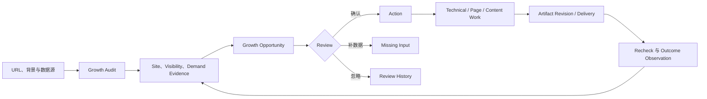

# GenGrowth 统一增长机会产品需求文档（当前 nevermore 代码库）

**日期：** 2026-07-21  
**状态：** 已确认，可进入 Artifact 与实施规划  
**产品决策：** 单一 Growth Audit + Growth Opportunity 主对象 + 四个一级入口  
**确认依据：** 用户于 2026-07-21 明确回复“确认”  
**配套设计：** [`2026-07-21-unified-growth-opportunity-design.md`](./2026-07-21-unified-growth-opportunity-design.md)  
**替代文档：** `2026-07-20-connected-growth-audit-optimization-design.md` 与其 18 任务实施计划  
**Artifact：** `/Users/wzb/.codex/visualizations/2026/07/20/019f7ff0-3874-7623-90f3-1ebdea7c313f/index.html`

---

## Revision 5 · Growth Framework 四个 Deep Dive 对 Nevermore 的能力吸收

本节来自 2026-07-21 对 `growth-framework` 四个 Deep Dive 与 Nevermore 现有产品链的重新校准，优先级高于 Revision 4 及本文后续任何冲突表述。这里的主客体必须保持明确：

> **需要优化的是 Nevermore 产品。四个 Deep Dive 是能力输入、领域检查表与目标态参考，不是要被继续优化的四份产品方案，也不是四套准备独立建设的系统。**

本 Revision 采用 **additive convergence（增量收敛）**：保留并延续 Revision 2 的四入口客户工作台、Revision 3 的丰富 B2B 上下文模型，以及 Revision 4 的 `Product URL → 后台生成 → Product Profile/ICP/竞品审核` 最新前台流程。它只补充 Nevermore 从四个 Deep Dive 吸收哪些能力、如何落入现有对象、实施顺序与 Demo 验收；不重写已有 PRD，不恢复已被后续 Revision 推翻的复杂首屏，也不把 Demo 目标态误写成当前生产能力。

输入材料：

- [`deepdive-01-diagnosis.md`](../../../docs/growth-framework/deepdive-01-diagnosis.md)：产品画像、诊断上下文、内容资产盘点与竞品候选；
- [`deepdive-02-webtech.md`](../../../docs/growth-framework/deepdive-02-webtech.md)：技术健康、性能、渲染、内链、Structured Data 与工程验证；
- [`deepdive-03-acquisition.md`](../../../docs/growth-framework/deepdive-03-acquisition.md)：Keyword、Competitor、Topic Cluster、SEO/GEO Content 与内容执行；
- [`deepdive-04-landing.md`](../../../docs/growth-framework/deepdive-04-landing.md)：Landing、CTA、Form、Trust、UTM 与转化观察。

四份文档中的 30/60/90 日历、独立模块导航、工具栈档位、ICE 公式、原始状态名和泛化自动化承诺不自动成为 Nevermore 产品需求。只有通过本 Revision 映射到 Nevermore canonical object、数据诚实规则、权限边界和实施停点的能力，才进入产品范围。

### R5.1 单一产品链与四个 Capability Lens

四个 Deep Dive 被吸收为四个 `Capability Lens`，即同一项目、同一证据和同一工作链上的观察角度：

1. `Product / Diagnosis`：这个产品是什么、服务谁、有哪些站点资产和可信业务上下文；
2. `WebTech`：网站能否被抓取、渲染、理解、信任和稳定使用；
3. `Search / GEO Acquisition`：市场在搜索什么、AI 在回答什么、现有页面覆盖什么，以及应该改善或创建什么内容；
4. `Landing / Conversion`：流量到达页面后，Message、CTA、Form、Trust 与 Measurement 是否支持转化。

它们统一进入现有 canonical chain：

```text
Project
→ Source / Snapshot / Observation
→ Evidence
→ Finding
→ Finding Review
→ Action
→ Artifact Revision
→ Approval / Authorized Delivery
→ Recheck / Outcome Observation
→ Results
```

强制约束：

- `Lens` 只用于组织 Evidence、筛选 Growth Map 和解释 Opportunity，不拥有独立生命周期；
- 一个 Observation 或 Evidence Packet 可以带多个 `lens_tags`，但每项可确认 Opportunity 仍恰好锚定一个 primary canonical Finding；
- Confirm 继续复用 Finding Review 事务并幂等创建唯一 Action；
- Artifact 继续由 Action 产生，编辑产生新的 Revision；
- Results 继续来自 immutable Snapshot、Recheck、Measurement Observation 和明确窗口，不来自任务完成状态；
- 不新增 `Diagnosis App`、`WebTech App`、`Acquisition App`、`Landing App` 四套一级导航；
- 不新增四套 stage、queue、approval、publish、result 或身份系统；
- Deep Dive 中的领域状态只能在必要时成为某个 canonical object 的局部属性，不得复制 Project、Run、Finding、Action、Artifact 或 Result 状态。

### R5.2 四个 Lens 的能力吸收与明确边界

| Lens | 本轮吸收到 Nevermore | 延后或不吸收 |
|---|---|---|
| `Product / Diagnosis` | URL 提交后的 Product Profile 草拟与审核；Product/Business Model/Offer/Market/ICP/JTBD/Buyer/User 建模；字段级 provenance、confidence、missing/conflicting；Profile Version；URL Portfolio 初始化；Competitor Candidate 初始化；Content Inventory 与数据覆盖基线 | 不把完整 ICP 变成首次问卷；不做独立“AI 探索”页面；不把产品画像确认等同于启动全站 Audit；不采用 Deep Dive 的通用 ICE 表作为 canonical priority；不自动承诺完整竞品流量、外链或社媒情报 |
| `WebTech` | Crawlability、Indexability、Canonical、Redirect、Sitemap、Raw HTML/JS Rendering、Core Web Vitals 来源分层、Resource/Cache、Internal Linking、Topic Cluster linking、Structured Data、Internationalization、Template-level 聚合；Technical Ticket、Schema/Internal Link/Performance Fix 投影；Validation、Rollback 与 Recheck | 首阶段不自动改生产代码或 CDN；不自建完整 RUM/CrUX 数据平台；不把 Lab 数据冒充 Field 数据；不强制客户重构 SSR/SSG；不把 CI/CD 性能门禁作为 Slice 1 前置条件 |
| `Search / GEO Acquisition` | Keyword 与 Competitor 候选建库；SearchQuery 与 GenerativeQuery；Cluster-first Page Map；Intent、Buyer Stage、Market 与 Existing-page-first；Content Gap/Decay；Content Brief、Research Pack、English Draft、SEO/GEO/Factual QA、Human Review；固定版本 `gengrowth-flow-mvp` Shadow adapter | 首阶段不做 Social Matrix、KOL/KOC、Outreach、HARO、Backlink CRM、多格式分发或完整 Rank Tracking 产品；不自建完整第三方竞品数据库；不自动写 CMS；不把 Keyword 数、文章数或 Draft 完成当增长结果 |
| `Landing / Conversion` | Traffic Source × Landing Page、Keyword Cluster × Page、Campaign × Page 的 Target 观察；Above-the-fold、Message Match、CTA、Form、Trust、Speed × Conversion Evidence；Landing Revision Brief、Headline/CTA Rewrite、Form Spec、Trust Pack、Tracking/UTM Plan；before/after 与 attribution limitation | 不自建 Landing Page Builder、Form Builder、Heatmap/Session Replay、CRM 或通用 A/B Testing 平台；不自动选择 winner；不在样本不足时排实验；不把相关性写成因果；不在没有授权与回滚能力时写生产环境 |

所有延期项都可以作为未来 Candidate 保留，但不能出现在当前 Demo 中伪装成已连接、已执行或已产生增长。

### R5.3 目标与读模型

四个 Lens 不要求四套数据库。Nevermore 在现有 canonical truth 之上增加客户可读 projection，目标态最少包括：

#### R5.3.1 `ProductContextReadModel`

用于概览和 Product Profile 审核，至少包含：

- `project_id`、`profile_version_id`、`generated_at`、`review_status`；
- Product category、business model、offer、value proposition、primary market；
- Primary ICP、Buyer、User、JTBD、trigger、pain、use case；
- Direct/Indirect competitor candidates；
- 每个关键字段的 `derivation`、`evidence_refs`、`confidence` 与 `missing/conflicting`；
- URL、Keyword、Competitor 和 connected source 的覆盖摘要。

该 Read Model 引用 append-only Profile Version，不覆盖历史诊断上下文。

#### R5.3.2 `TargetRef`

Opportunity 的主要 Target 继续使用统一引用：

- `site`；
- `template`；
- `url`；
- `topic`；
- `new_asset`；
- Slice 3 可扩展 `form`、`cta`、`campaign` 或 `conversion_path`。

扩展 Target Type 前必须同时更新 contract、validation、fixtures、projection 与 migration；不得把 Form/CTA/Campaign ID 塞进 URL 字符串或自由 JSON。

#### R5.3.3 `GrowthOpportunityReadModel`

继续由 canonical 对象投影，不成为第二套真相表：

```text
TargetRef
+ lens_tags[]
+ primary_finding_id
+ supporting_findings[] / observations[]
+ evidence_summary / source_coverage / limitations
+ work_type: Fix | Improve | Create
+ review_state
+ confirmed_action_id?
+ current_artifact_revision?
+ delivery_receipt?
+ verification_summary?
```

#### R5.3.4 Growth Map 数据面

Growth Map 至少提供以下 project-scoped read models：

| Read Model | 关键字段 |
|---|---|
| `UrlPortfolioItem` | normalized URL、page type、template、cluster、priority、issue/opportunity count、owner、last snapshot、before/current delta |
| `KeywordLibraryItem` | keyword、market、language、intent、buyer stage、cluster、mapped URL、volume/KD/rank 的 nullable observation、source、collected_at、freshness、status |
| `CompetitorLibraryItem` | domain、relation、analysis scope、origin、evidence refs、candidate/approved/excluded、last observed |
| `TopicClusterItem` | cluster intent、SearchQuery Set、GenerativeQuery Set、existing pages、page roles、coverage gap、primary CTA、status |
| `PageAssignmentItem` | cluster、page/new asset、page role、primary intent、primary query、supporting queries、canonical relationship、decision reason |

这些对象首先是读模型和经过治理的 Library 视图。只有真实查询、版本、去重、同步或生命周期需求得到证明时，才新增独立持久对象。

### R5.4 Keyword、Competitor 与 Cluster-first 规则

Nevermore 吸收 `gengrowth-flow-mvp` 的执行原则，而不是复制其 Google Sheet UI 或领域模板：

> **Keyword 是发现与衡量单位，Page 是交付单位，Topic Cluster 是执行与经营单位。**

最小关系链：

```text
Product Profile / ICP
→ Keyword Candidate + Competitor Candidate
→ Approved Competitor Scope
→ Canonical Keyword / SearchQuery / GenerativeQuery
→ Topic Cluster
→ Existing Page or New Asset Decision
→ Page Role + CTA
→ Finding / Opportunity
→ Action / Artifact / Outcome
```

产品要求：

- 首次建库不能是空表，系统从 Sitemap/Crawl、现有页面、GSC、approved competitor scope、SERP/Suggest/PAA、VOC、CSV 与 operator input 生成候选；
- 手工输入与自动发现进入同一 Library，只通过 `source_kind` 区分；
- 每条候选保留来源、采集时间、freshness、market、language 和 approval status；
- Competitor Candidate 在客户或运营人员确认 `relation` 与 `analysis_scope` 前，不进入全站 Keyword Gap；
- `direct`、`indirect`、`status_quo`、`benchmark`、`publisher` 与 `serp_competitor` 不得混为同一种关系；
- Cluster 必须展示包含的 Query、Existing URL、缺失 Page Role、重复/冲突映射和建议 CTA；
- `Existing-page-first` 是决策要求，不是永远禁止新页面。Create 必须证明现有 URL 无法合理承接该 intent；
- Keyword、Competitor 或 Cluster 自身不是可 Confirm 的 Action。只有形成 canonical Finding 后才能进入 Opportunity Review。

### R5.5 Execution Artifact Projection 与 Content Shadow

Execution 面向客户展示真实工作物正文，而不是把 `artifact_type`、gate 名或内部状态当主内容。客户可见 projection 包括：

| Lens | 客户侧 Artifact Projection | Canonical 要求 |
|---|---|---|
| WebTech | `Technical Ticket`、`Code Fix Proposal`、`Schema Patch`、`Internal Link Plan`、`Performance Fix` | 必须引用 Action、Target、Evidence Snapshot、Acceptance、Validation 与 Rollback |
| Search/GEO | `Content Brief`、`Research Pack`、`English Blog Draft`、`SEO/GEO QA`、`Factual Review` | 固定 Flow adapter/version；来源与 claim boundary 可检查；人审绑定当前 Revision |
| Landing | `Landing Revision Brief`、`Headline/CTA Rewrite`、`Form Optimization Spec`、`Trust Pack` | 必须引用 Landing Target、Message/Conversion Evidence 与 preview contract |
| Measurement | `Tracking Plan`、`UTM Plan`、`Publish/Change Receipt` | Plan 不等于已发布；Receipt 不等于 positive outcome |

Projection 不是新的状态机。一个客户侧卡片可以把同一 canonical Artifact Revision 的正文、附件、QA 和 Receipt 组合呈现，但不能偷偷创建平行 approval。若两个交付物需要独立确认、撤回、发布或回滚，它们必须在对应 Slice 中获得明确的新 Action Template / Artifact Type 与合同迁移，不能长期寄生在自由 JSON。

Slice 2 的 `Content Shadow` 固定为：

```text
一个 approved Competitor Set
+ 一个 SearchQuery Cluster
+ 一个独立 GenerativeQuery Set
+ 一个 Existing Page / New Asset 决策
→ canonical Content Finding
→ Confirmed Action
→ Content Brief
→ version-pinned Research Pack
→ English Draft
→ SEO / GEO / Factual Gates
→ Human Review
→ Reviewed Artifact Revision
```

Shadow 的边界：

- 不连接真实 CMS 写入；
- 不把 `drafted`、`qa_passed` 或 `reviewed` 写成 published；
- 不把 Flow 的本地文件、Sheet row 或脚本状态作为 Nevermore canonical truth；
- 不直接 runtime import sibling repository；使用 extraction、versioned package 或 pinned adapter；
- Astrology-specific 字段、prompt、模板与发布目标必须替换为 project/site policy pack；
- Draft 中无法由 Authority 或客户事实支持的 claim 必须阻塞或标记 `needs_review`；
- 编辑 Draft 后旧 Approval 失效，必须审核新 Revision。

### R5.6 Landing、UTM 与 Results 闭环

Landing / Conversion Lens 在 Slice 3 进入生产范围，并复用同一 Target、Finding、Action、Artifact 和 Results 链。

Landing Opportunity 可以聚合以下 scope：

- 单个 URL；
- Landing template；
- Traffic Source × Landing Page；
- Keyword Cluster × Landing Page；
- Campaign × Landing Page；
- Form、CTA 或 Trust block。

Landing Execution 至少能够生成：

- Above-the-fold / Message Match 诊断；
- Headline、Subheadline 与 CTA Rewrite；
- Form Optimization Spec；
- Trust Pack；
- Landing Revision Brief；
- Tracking Plan 与 UTM Plan。

进入 Results 前必须存在清晰合同：

- `baseline_snapshot_id`；
- 绝对 `before_window` 与 `after_window`；
- `approval_ref` 与被批准的 Artifact Revision；
- `preview_url`，适用时；
- `published_at`、`published_by` 与 `change_receipt`，真实发布后；
- `rollback_ref`；
- `utm_schema` 与 attribution limitation；
- `outcome_snapshot_id` 或明确的 `pending/unavailable`。

Results 分开表达：

1. `technical_verified`：Recheck 直接证明目标技术条件改变；
2. `observed`：在固定窗口观察到 Search、GEO、Landing 或 Conversion 变化，但不声称因果；
3. `insufficient_data`：样本、窗口、连接或归因不足；
4. `unavailable`：来源未连接、权限不足或 collection failed；
5. `regressed`：目标条件恶化或问题再次出现。

`0` 是真实测量值，不能代替 `unavailable`；连接了 Provider 也不等于该次 Run 有数据；Publish Receipt 只证明变更发生，不证明 Ranking、AI citation、Traffic、Conversion 或 Revenue 增长。

### R5.7 信息架构与状态约束

一级入口继续固定为四个：

1. `概览`；
2. `增长地图`；
3. `执行中心`；
4. `效果追踪`。

四个 Capability Lens 只出现在：

- Growth Map 的筛选器与 Evidence badges；
- Opportunity detail 的证据分组；
- Execution 的 Artifact projection 类型；
- Results 的验证来源与 limitation。

明确禁止：

- 在一级侧栏增加 Diagnosis、WebTech、Acquisition、Landing；
- 把四个 Lens 做成固定顺序的 Wizard；
- 在客户界面同时展示 Deep Dive phase、A0–A14、内部 queue 和 canonical state；
- 用 `slide`、`phase complete`、`AI exploring` 或规则说明面板作为页面主叙事；
- 为内部运营和客户自助建立两套 UI。两类用户看到同一项目与同一工作对象，差异只由服务端权限决定。

### R5.8 中文工作台、英文内容与数据诚实

- 工作台、决策说明、错误、limitation 与 Results 解释采用中文；
- SEO、GEO、ICP、CTA、SERP、Keyword、Competitor、Content Brief、UTM 等标准名词保留英文；
- 面向海外市场的 Blog、Article Draft、标题与正文默认使用选定市场的英文变体；
- Content Brief 可以中文解释策略，但交付字段与英文 Draft 的语言要求必须清楚分区；
- 市场、地区、关系、状态等枚举使用 select、multi-select、segmented control 或 filter，不使用自由文本代替结构化值；
- 客户侧默认展示结论、正文和下一步，Source、Rule、Revision、Manifest 与 QA 细节放入可展开 Drawer；
- 正文基准字号不低于 16px，表格主要内容不低于 15px，只有短标签和次级 metadata 可以使用 14px；行高不低于 1.5；
- 所有 `observed`、`computed`、`inferred`、`declared`、`missing`、`conflicting` 与 `unavailable` 必须在使用点可辨认；
- Demo 的确定性样例必须标记为 `示例数据 / Target State`，不得表现为已从真实 Provider 拉取的生产结果。

### R5.9 权限、审核与发布边界

同一工作台不等于所有用户拥有相同写权限。权限必须由服务端按 Project、Site、Action 与 Side-effect Class 校验，前端隐藏按钮不能代替授权。

最低边界：

- Product Profile、Competitor Scope、Finding、Artifact Revision 和 UTM Plan 可以分别审核；
- Approval 绑定精确 Revision，内容变化后旧 Approval 失效；
- `reviewed`、`approved`、`publish_ready`、`published` 和 `verified` 是不同事实；
- Slice 1 只允许可逆的内部数据写入与显式 Recheck，不写客户生产站点；
- Slice 2 Content Shadow 无任何外部 CMS write；
- Slice 3 真实发布必须具有 site-scoped permission、human approval、preview、idempotency、rollback reference 与 Change/Publish Receipt；
- CMS、Git、Tracking 或 Form 的授权分别管理，不因用户能编辑 Blog 就推断其能部署代码或修改 Measurement；
- 生产写入失败、部分成功或验证失败必须进入可检查状态，不能用成功 toast 覆盖。

### R5.10 三个实施 Slice 与 Stop Gates

#### Slice 1：Product Context + Multi-URL WebTech

```text
Product URL
→ Product Profile Draft / Review / Version
→ Multi-URL Portfolio
→ WebTech Audit
→ Evidence / Finding / Opportunity
→ Technical Artifact
→ Recheck
→ Technical Results
```

范围：

- Revision 4 的 URL-first Product Profile 体验；
- URL Portfolio 与 template-level Target；
- 第一批 Crawl/Index/Render/Structured Data/Internal Link/Performance rules；
- Technical Ticket、Metadata Rewrite、Schema/Internal Link/Performance projection；
- immutable Run compare 与 Recheck。

Stop Gate：

- 首屏只需 Product URL 与可选一句补充，Profile Draft 有来源且可审核；
- Profile 确认后形成 append-only version，旧 Run 不被改写；
- Growth Map 默认显示多个 URL，并可按 template 聚合；
- 至少一个真实 template/url Technical Finding 可 Confirm 为一个 Action；
- 一个 Technical Artifact 包含 Evidence、Acceptance、Validation 与 Rollback；
- Recheck 比较两个 immutable Run，并诚实展示 no data / unavailable；
- 没有新增平行 Finding、Action、Artifact 或 Lens 状态；
- 未通过此 Gate 前，不迁入 Content lifecycle。

#### Slice 2：Keyword / Competitor / SEO-GEO Content Shadow

```text
Approved Competitor Scope
+ Keyword / SearchQuery / GenerativeQuery Library
→ Topic Cluster + Page Map
→ Content Finding / Opportunity
→ Content Brief + Research + English Draft + QA
→ Human-reviewed Revision
```

范围：

- 初始 Keyword/Competitor candidates 与人工确认；
- Cluster-first、Existing-page-first 与 Page Assignment；
- 一个测试项目、一个 Competitor Set、一个 Cluster、一个 GenerativeQuery Set；
- 固定 commit/version 的 Flow Shadow；
- Content Brief、Research Pack、English Draft、SEO/GEO/Factual QA；
- Revision-bound human review。

Stop Gate：

- Keyword、Competitor、Query 与 Cluster 均有 source、market、freshness 和 approval 状态；
- Competitor Candidate 未经确认不能进入全站 Keyword Gap；
- 一个 Cluster 能清楚解释 Query、Existing URL/New Asset、Page Role 与 CTA；
- Content Opportunity 复用 Slice 1 的 Evidence/Finding/Action 链；
- Execution 可直接阅读 Brief、英文正文、来源、QA 和 Review Decision；
- unsupported claim 被阻塞或标记 needs review；
- 编辑后旧 Approval 失效；
- 没有真实 CMS、Git 或外部分发写入；
- 未通过此 Gate 前，不开放发布与自动 Measurement。

#### Slice 3：Landing / Authorized Publish / UTM Results

```text
Landing + Conversion Evidence
→ Landing Opportunity
→ Revision Brief / UTM Plan
→ Approval + Preview
→ Authorized Change / Publish Receipt
→ Recheck + UTM / Outcome Observation
→ Results
```

范围：

- Landing、CTA、Form、Trust 与 Message Match Evidence；
- Landing Revision、Tracking/UTM Artifact；
- 经批准的 CMS/Git/Tracking adapter Canary；
- Change/Publish Receipt、Rollback 与 post-change verification；
- page-level before/after、direct/assisted conversion 与 attribution limitation。

Stop Gate：

- 每次外部写入都有 site-scoped permission、当前 Revision Approval 与 preview；
- 写入幂等，partial failure 可见，并有 rollback reference；
- baseline、change 和 outcome 使用绝对时间与 immutable snapshot；
- UTM 表能区分 source/medium/campaign/content、direct 与 assisted conversion；
- 技术验证、观察到的业务变化和因果未知明确分开；
- 没有数据时显示 pending、insufficient_data 或 unavailable，不填 0；
- Publish/Change Receipt 不产生虚假的 positive outcome。

### R5.11 Artifact Demo 的页面与交互验收

Artifact Demo 是客户直接看到的 Target State，不是内部规则教学页。Demo 必须包含以下可操作页面。

#### 概览

- 展示已审核的 Product Profile Card、Primary ICP、Target Market 与 Competitor Candidate 摘要；
- 显示 Profile Version、最近更新时间和低置信度/待确认数量，但不平铺内部 schema；
- 显示 URL 数、Keyword 数、Competitor 数、Cluster 数和数据源状态；
- 数据源状态区分 connected、collecting、available、unavailable 与 failed；
- 有明确的 `编辑产品档案` 与 `审核竞品候选` 入口，不显示独立 `AI 探索` 导航。

#### 增长地图

- 默认首先展示不少于 8 个不同类型 URL，证明多 URL 是常态；
- 提供 `页面与机会`、`关键词库`、`竞品库` 三个明确子视图；
- 提供四 Lens filter，但 Lens 不是页面流程；
- URL 视图支持搜索、page type/template/cluster/status 筛选与批量展开，不提供 Bulk Confirm；
- 展示一个 template-level Technical Opportunity，并能展开受影响 URL；
- Keyword 视图展示 source、intent、cluster、mapped URL、nullable metrics、freshness；
- Competitor 视图支持 approve、exclude、修改 relation/scope 和手动添加；
- Cluster detail 展示 SearchQuery、GenerativeQuery、Existing Pages、Page Roles、Coverage Gap 与 CTA；
- Opportunity detail 展示 primary Finding、supporting Evidence、limitation、工作类型和一个明确 Next Decision。

#### 执行中心

- 直接展示至少一个 Technical Ticket 或 Code Fix Proposal 的实际内容；
- 直接展示一个 Metadata Rewrite 的 before/after；
- 直接展示一个可阅读的 Content Brief 与一篇英文 Blog Draft 正文；
- 展示 Research Sources、SEO/GEO/Factual QA 与 blocked/needs-review claim；
- 展示一个 Landing Revision Brief、Headline/CTA Rewrite 和 UTM Plan；
- 每张卡都显示 linked Target、Action、owner、status、current Revision、acceptance 和 preview；
- 编辑产生新 Revision，界面立即显示旧 Approval 已失效；
- Publish 按钮在 Slice 2 Demo 中明确为不可用或模拟，不用 toast 假装发布成功；
- 治理 metadata 收进 Drawer，正文和决策始终占据主视觉。

#### 效果追踪

- 显示绝对 before/after 时间窗口，而不是“最近一段时间”；
- 至少展示一个 Technical Recheck 的旧值、新值与 verified 结论；
- Search/GEO 数据可以保持 pending 或 insufficient_data，不伪造 ranking/AI citation 提升；
- 展示一张 UTM audit table，包括 source、medium、campaign、content、sessions、direct conversions、assisted conversions；
- 展示 Change/Publish Receipt 时间线，并明确 Receipt 与 Outcome 的区别；
- 每个结果旁显示 source、freshness、sample/window 与 attribution limitation；
- 没有数据的单元格显示 `未连接`、`采集中`、`数据不足` 或 `不可用`，不显示虚假的 0。

#### 跨页面与可用性

- 客户在 10 秒内能理解这是多 URL 的统一增长工作台，不是 SEO Blog 生成器或单 URL 审计器；
- 客户在 1 分钟内能完成：选择 Target → 查看 Evidence → Confirm primary Finding → 打开对应 Execution Artifact；
- 前台以中文为主，英文 Blog 正文与英文市场文案不被机器翻译成中文；
- 不出现第二套内部/客户模式开关；无权限动作由服务端结果和明确原因控制；
- 1440、1024、768、390 四个视口无 root overflow；表格在窄屏进入 Drawer 或受控横向容器；
- Dialog 满足 focus trap、背景 inert/aria-hidden、Escape 关闭和焦点恢复；
- Keyboard focus、Reduced Motion、空状态、错误状态和 loading 状态可验证；
- 禁止让小字号规则面板、slide 编号、phase 宣告或系统架构图占据客户首屏。

### R5.12 Revision 5 总验收

只有同时满足以下条件，才算成功吸收四个 Deep Dive：

- 团队能指出每项吸收能力属于哪个 Lens、进入哪条 canonical object chain、在哪个 Slice 实现；
- Product/Diagnosis、WebTech、Search/GEO 与 Landing 没有变成四个产品、四套导航或四套状态；
- Product Profile 使用少量输入生成、Evidence-backed 审核与版本化，而不是长表单；
- WebTech 支持多 URL 和 template-level Opportunity，并能产生可验证技术交付物；
- Keyword/Competitor Library 具有来源和审核，Content execution 遵守 Cluster-first；
- Content Shadow 可展示真实 Brief、英文 Draft、QA 与 Revision Review，但不外部发布；
- Landing/UTM 通过统一 Action/Artifact/Receipt/Results 链进入，而不是另建 CRO 系统；
- Demo 直接呈现客户可读工作物和 before/after，不以规则告知代替产品；
- 中文工作台、英文内容输出、No Data、数据 provenance 与权限边界均在使用点可见；
- 三个 Slice 均有强制 Stop Gate，前一 Gate 未通过时不得用后续 Target State 反向宣称生产能力已经完成。

---

## Revision 4 · 产品画像建模与 Audit 解耦

本节来自 2026-07-21 对 Artifact 的第三次 Context / ICP 评审，优先级高于 Revision 3 的四段式 Context 流程。Revision 3 对“完整 B2B 模型不能变成首次问卷”的判断仍然有效，但前台呈现仍暴露了过多 Audit、locale 与 schema-governance 信息。

### R4.1 产品决定

客户此时要完成的是**产品画像建模**，不是配置内容生产，也不是启动全站 Audit。客户侧路径收敛为：

1. 输入产品 URL；
2. 系统在后台读取公开产品页面并自动分类；
3. 直接审核产品档案卡、目标市场 / 用户画像与初始竞品池；
4. 确认后把该画像作为关键词库、竞品库、SEO/GEO 内容与后续 Audit 的公共输入。

`AI 探索` 不再作为独立可见步骤。抓取、解析和模型推断是 URL 提交后的后台生成过程，前台最多显示一条短暂的 `正在生成产品档案` 状态，然后直接进入审核结果。

### R4.2 首次输入

产品画像入口只要求 `Product URL`。当官网无法准确解释业务时，用户可以展开一个可选的“一句话业务补充”。以下信息不出现在该入口：

- 网站主要语言；
- 内容输出 locale；
- 工作台语言；
- Priority URLs；
- 增长目标与转化事件；
- Audit scope、技术诊断或执行约束；
- Context Packs、schema version、provenance ledger 等内部治理结构。

目标市场、客户类型、产品形态和商业模式由系统初始化，在结果卡中审核修改，而不是在生成前要求用户选择。

### R4.3 审核结果

客户侧只显示三部分：

1. `产品档案`：产品名称、one-liner、产品类别、产品形态、商业模式、价值主张、目标市场、目标用户标签与核心能力；
2. `目标市场与用户画像`：Primary ICP、目标公司 / 用户群、Buyer、User、主要场景、触发事件、核心痛点与 JTBD；
3. `初始竞品池`：默认 3–5 个 Direct competitors 与 3 个 Indirect competitors，展示名称、domain、关系、相似度和简短原因，允许取消、重新识别和手动补充。

产品档案和用户画像默认以可读结果卡呈现，不把编辑表单直接平铺。用户主动点击 `编辑档案` 或 `编辑画像` 后才显示结构化控件。`gengrowth-agents` 的 ProductProfileCard 可以作为呈现参考，但 GenGrowth 仍需覆盖更丰富的 B2B 业务，不继承其 schema 边界。

### R4.4 后续边界

Priority URLs、关键词机会、技术问题、Buying Committee、ACV、Procurement、内容输出语言和执行约束没有被删除；它们移到各自真正需要的后续阶段。可组合 Context Packs 与 governed attributes 保留为内部扩展机制，不作为产品画像首屏价值展示。

### R4.5 验收标准

- 首屏只有 Product URL 与一个折叠的可选补充，没有语言、locale、工作台偏好或 Audit 字段；
- 没有独立 `AI 探索` 导航页；生成完成后自动进入审核结果；
- 审核结果首屏首先展示 Product Profile Card，而不是 Priority URLs 或 Context Packs；
- 客户能修改产品档案和 Primary ICP，能取消错误竞品并手动添加竞品；
- 竞品池明确区分 Direct / Indirect，并能容纳至少 3–5 个 Direct 与 3 个 Indirect 候选；
- 产品画像确认后才成为关键词、竞品、内容与 Audit 的公共输入，不在该弹窗里直接启动 Audit。

---

## Revision 3 · 渐进式 B2B 上下文采集

本节来自 2026-07-21 对 Context / ICP Artifact 的再次评审，优先级高于 Revision 2 中“把四个完整内容块直接做成五步表单”的表述。

### R3.1 核心产品决定

完整 ICP 是系统必须维护的数据模型，**不是客户首次启动时必须手填的字段清单**。`gengrowth-agents` 只用于参考“少量输入 → Site Probe / 数据探索 → AI 草拟 → 人工审核”的交互方式；它的四个 onboarding 字段既不是 GenGrowth 的 ICP schema，也不足以覆盖复杂 B2B 业务。

客户首次只需确认四项启动信息：

1. Website URL；
2. 目标市场 / 地区，可多选并排序 primary / secondary；
3. 本阶段主要增长目标；
4. 主要转化目标。

网站主要语言、内容输出 locale、工作台语言、客户类型和业务类型应有可修改的检测值 / 默认值，不作为五个额外空白题。市场、语言、客户类型、业务类型、Sales Motion、公司规模、公司阶段、Customer Motion、ACV 区间和销售周期等可枚举字段必须使用 dropdown、multi-select、segmented control 或 checkbox，不使用自由文本模拟结构化数据。

### R3.2 四段式体验

Context 前台固定为四段，而不是把完整 schema 平铺给用户：

1. `基础信息`：四项启动信息；默认值折叠展示、可修改；
2. `AI 探索`：Probe 首页、robots.txt、Sitemap、Crawl、已有内容和已连接数据源；
3. `审核建议`：审核业务画像、B2B ICP Cards、JTBD、购买路径、Priority URLs、关键词与竞品候选；
4. `确认启动`：确认范围、来源、低置信度 / missing data，并冻结新的 append-only Context Version 后启动完整 Audit。

`Priority URLs` 不得作为首次必填 textarea。系统先从 Sitemap、Crawl、GSC landing pages、GA4 conversion proximity、SERP / keyword mapping 和技术问题中生成多个候选 URL；用户通过勾选、排除、搜索全站 URL 库或手动补充完成审核。全站 Audit scope 与 Priority URL ordering 必须分开表达。

### R3.3 B2B 不能退化成 Persona 文本框

当 `customerModel = B2B / B2B2C` 时，系统应生成 2–7 个 candidate ICP Cards，并允许标记 Primary、Secondary 与 Excluded。每个候选至少覆盖：

- Company Profile：industry / sub-industry、company size、company stage、business model、Customer Motion、region；
- Buyer Roles 与 User Roles，二者不能合并；
- Trigger Events、Pain Points、Use Cases 与 Current Workarounds；
- JTBD 的 situation、struggle、job statement、desired outcomes、anxieties；
- Success Metrics、Buying Barriers、Qualification Signals 与 Disqualifiers；
- Evidence coverage、confidence、assumptions、contradictions、missing data 与 review status。

另设 B2B buying context：Sales Motion、Buying Committee、Decision Criteria、典型 ACV、Sales Cycle、Procurement / Security / Legal 路径、Technographic Fit、主要购买阻力和所需 Proof。网站通常不能可靠推断 ACV、采购路径与完整 Buying Committee；这些字段必须以低置信度候选或待确认项呈现，不能伪装成 observed fact。

该模型不能只适配 B2B SaaS；业务类型至少覆盖 SaaS、专业服务 / Agency、Developer Tool、Marketplace、E-commerce、Media 及混合模式，并允许业务类型驱动不同的 ICP 模板与问题集。

同时，GenGrowth 不把上述字段清单固化为“全部 B2B 的唯一答案”。目标模型是可组合 Context，而不是复制 `gengrowth-agents` 或把当前 SaaS 示例扩成另一套僵硬问卷：

1. `Universal Core`：市场、目标、转化、Company / Buyer / User、JTBD、Evidence 等跨业务公共对象；
2. `Business-model Pack`：SaaS、服务、Developer Tool、Marketplace、制造 / 渠道型业务等按模式加载的结构；
3. `Vertical Pack`：例如合规、采购、渠道、地理覆盖、部署方式、门店 / 产能等行业特有维度；
4. `Evidence-discovered Attributes`：探索中发现、但模板尚未覆盖的业务事实，以有类型、有来源、有版本的扩展字段进入审核；
5. `Work-specific Context`：只在某类执行物需要时追问，例如 Comparison Page 的 approved claims 或 Technical Fix 的 deploy window。

系统允许 `unknown / not applicable`，也允许用户新增自定义属性。扩展字段必须声明稳定 ID、label、value type、applicability、provenance、evidence refs、confidence 与 schema version，不能退化成不可治理的自由 JSON 或拼接进旧字符串。首次 Audit 只加载与当前业务和工作相关的模块。

### R3.4 来源、证据与合同边界

每个生成字段至少区分：

- `declared`：用户输入或明确确认；
- `observed`：Crawl、GSC、GA4、SERP 或其他受治理来源直接观察；
- `computed`：从 observation 可重复计算；
- `inferred`：基于 Evidence 的 AI 草拟；
- `missing / contradicted`：证据不足或相互冲突。

`CompleteIcpProfileInputV2` 除 Revision 2 已列字段外，还需要在合同设计阶段评审 B2B 结构：candidate ICP Cards、buyer / user roles、success metrics、qualification signals、disqualifiers、Sales Motion、Buying Committee 和字段级 evidence / confidence。Technographic 与 Procurement 是合理目标态扩展，但当前 Nevermore 与 wiki 的正式合同证据不完整；它们必须先完成 schema / evidence review，不能直接塞入旧 constraint 字符串。

### R3.5 验收标准

- 首屏在桌面端和手机端都明确显示“只填写 4 项”，没有 Priority URLs 或完整 ICP 的人工文本域；
- 可枚举信息使用选择控件，检测 / 默认值折叠但可修改；
- 多市场必须有显式 Primary 控件；不能依赖“最先勾选”这种隐式顺序；
- AI 探索显示具体来源、进度与 observed / computed / inferred 边界；
- 审核页能看到多个 URL 候选、2–7 个 B2B ICP Cards 和独立 buying context；
- URL Inventory 必须真的支持搜索与手动添加；不能用 toast 假装已经打开；
- 修改 Website、Primary Market、目标、转化或其他探索输入后，旧建议立即标记 stale 并要求重新探索；
- 关键字段旁直接显示 derivation、evidence、confidence、missing / contradicted，而不只在页面底部给一个总说明；
- 所有 AI 建议可修改、重新生成、接受或排除；低置信度与 missing data 可见；
- Context dialog 在桌面和移动端都满足 focus trap、背景 inert / aria-hidden、Escape 关闭与焦点恢复；
- 完整 schema 可以很丰富，但首次 Audit 不以“用户手填 31 个字段组”为门槛。

---

## Revision 2 · 客户侧工作台修正

本节是 2026-07-21 的第二次产品修正，优先级高于本文后续任何冲突表述。触发原因是最新 artifact demo 暴露出 8 个核心问题：单 URL 视角过强、客户侧可读性差、中文优先策略不明确、Execution 过于抽象、Results 无法解释 before/after、关键词库与竞品库来源不透明、ICP 上下文采集过浅，以及 stage / slide 类内部术语泄漏到客户界面。

### R2.1 修正后的一句话定义

> **GenGrowth 是一套给客户直接看的海外增长工作台：用中文界面管理多 URL 审计、关键词库、竞品库、SEO/GEO brief、英文 blog draft、技术修复、发布与 UTM 结果追踪。当前生产基础位于 nevermore 代码库。**

### R2.2 现在明确推翻的旧假设

- 不再把“从一个 URL 出发”视为前台主叙事。多 URL portfolio 是常态，Growth Map 默认展示页面与机会；
- 不再区分内部运营视角与客户自助视角，前台只保留一套客户可理解的工作台；
- 不再让 Growth Map 以 `Audit Evidence` / `Opportunity Review` 两段式规则说明作为主视觉核心；客户首先看到的是 URL、关键词库、竞品库和机会明细；
- 不再把关键词库、竞品库仅视为 Growth Map 的隐含资产。它们必须在 Growth Map 中作为明确可见的子视图存在；
- 不再让 Execution 只讲 `artifact type`、`revision`、`fact gate` 等抽象对象；Execution 必须直出 code fix、metadata rewrite、content brief、English draft、publish receipt；
- 不再让 Results 主要围绕 immutable run 术语组织；Results 必须以明确日期窗口展示 before/after、page delta、UTM campaign、conversion observation；
- 不再接受过于简短的 ICP 填写。前台必须体现 Site/Market、Business/Offer、ICP/JTBD、Competitors/Constraints 四个内容块，再经过来源、完整度与不可变版本 Review；
- 不再在客户界面使用 `slide`、过强的 `stage`、或接近内部 SOP 的提示文案。

### R2.3 修正后的一级信息架构

一级入口固定为四个：

1. `概览`：项目上下文完整度、数据源状态、URL portfolio 摘要、当前优先事项；
2. `增长地图`：三个并列子视图 `页面与机会`、`关键词库`、`竞品库`；
3. `执行中心`：与已发现问题/机会直接对应的执行物；
4. `效果追踪`：before/after、UTM、recheck、时间线和限制说明。

### R2.4 修正后的语言与输出策略

- 前台 UI 文案：中文优先；
- 专有名词与标准对象：保留英文，例如 `Keyword`、`Competitor`、`Content Brief`、`UTM`；
- blog / brief / draft 正文输出：英文；
- Results 的解释文案：中文，但指标名可中英混排；
- 任何客户侧页面都要以“可读”优先，禁止使用纯内部治理话术堆砌。

### R2.5 修正后的 Growth Map 定义

Growth Map 必须同时支持三类对象：

- `URL Portfolio`：多 URL 列表、priority、issue counts、owner、status、before/current delta；
- `Keyword Library`：来源、intent、cluster、mapped URL、status、volume/KD；
- `Competitor Library`：relation、scope、origin、approve/exclude 状态、决策洞察。

关键词库来源至少支持前台解释：

- GSC；
- site crawl / existing pages；
- competitor keyword gap；
- suggest / PAA / SERP observation；
- VOC / sales notes / interviews；
- manual CSV or operator input。

首次建库不能从空表开始。Project 创建并确认 Complete ICP Profile 后，应自动形成可审核的初始数据集：

- URL 侧：Sitemap、Crawl-discovered pages、现有页面类型与 GSC landing pages；
- Keyword 侧：竞品关键词映射、Content Gap、种子词多维扩展、Suggest/PAA、社区与 VOC、趋势信号、GSC 意外词；
- 手工侧：单条添加、CSV 导入与历史词表迁移；
- 治理侧：标准化、去重、cluster、intent、market/language、mapped URL、来源、采集时间与 freshness 必须随记录保存。

每条 Keyword 至少保留：`keyword_id`、`normalized_keyword`、`market`、`language`、`cluster_id`、`intent`、`buyer_stage`、`volume`、`kd`、`current_rank`、`mapped_url`、`status`、`source_kind`、`source_ref`、`collected_at`、`freshness`。手工输入与自动发现只是不同来源，不是两套词库。

竞品库来源至少支持前台解释：

- manual approved domains；
- recurring SERP overlap；
- AI citation co-occurrence；
- customer interviews / sales notes；
- auto discovery candidates；
- approve / exclude 决策。

每条 Competitor 至少保留：`competitor_id`、`domain`、`relation`（direct / indirect / status quo / benchmark / publisher）、`analysis_scope`、`origin`、`evidence_refs`、`approval_status`、`last_observed_at`。自动发现只进入 Candidate；客户确认 analysis scope 后才允许进入 Keyword Gap，避免把大站、媒体站或偶然 SERP 重叠误当全站竞品。

### R2.6 修正后的 Execution 定义

Execution 必须直出以下工作物，而不是只展示抽象流程状态：

- `Code Fix`；
- `Metadata Rewrite`；
- `Content Brief`；
- `English Blog Draft`；
- `Publish Receipt / UTM Plan`。

每个执行物至少要显示：

- linked URL or keyword cluster；
- owner；
- status；
- acceptance checklist；
- preview body。

### R2.7 修正后的 Results 定义

Results 必须回答三个问题：

1. 改之前与改之后，页面级指标分别是什么；
2. 哪些变化来自技术 recheck，哪些来自 Search / GEO / content observation；
3. UTM campaign、source / medium、conversions、assisted conversions 在指定窗口内如何变化。

Results 必须显示：

- 绝对日期窗口；
- page-level before / after；
- UTM audit table；
- 关键动作时间线；
- limitation 与 insufficient data。

### R2.8 Revision 2 验收标准

- 客户首次打开 demo 时，能在 10 秒内理解这不是“单 URL 审计器”，而是一套多 URL 增长工作台；
- Growth Map 默认可见多个 URL，且能切换到关键词库和竞品库；
- 关键词库和竞品库都清楚标出来源，不要求用户从空白手工构建全部数据；
- Execution 至少能直接看到一个 code fix、一个 metadata rewrite、一个 content brief、一个英文 draft，以及一个可追溯的模拟 Publish Receipt / UTM Plan；
- Results 至少能直接看到一个页面的 before/after 和一个包含 direct / assisted conversions 的 UTM campaign 表；
- UI 字号与层级满足中文阅读习惯，不能再出现小字号规则面板主导界面；
- 项目上下文必须体现完整 ICP / JTBD / competitor / constraints，而不是只留简短自由输入框。

### R2.9 丰富 ICP 的数据契约边界

当前 nevermore 的 `CompleteIcpProfileInput` 是 strict contract，并非任意 JSON 表单。它已经覆盖产品、业务模式、市场/语言、segments、Persona 的 Jobs 与 pains、use cases、offers、differentiators、primary conversion、priority products/URLs、competitors、四类 constraints、growth questions 和 90-day goals；但它**没有** objections、buying triggers、decision criteria、buying committee、Negative ICP、secondary conversions、alternatives、approved proof、content voice 和字段来源。因此 Artifact 中的 31 个字段组属于目标态 `CompleteIcpProfileInputV2`，不能宣称已可直接写入当前 API。

生产落地必须满足：

- V2 显式包含 `profileSchemaVersion: "2"`；
- Persona V2 增加 `objections[]`、`buyingTriggers[]`、`decisionCriteria[]`；
- Profile V2 增加 `firmographicCriteria`、`secondaryConversions[]`、`buyingCommittee[]`、`exclusionCriteria[]`、`alternatives[]`、`approvedProofSources[]`、`claimRestrictions[]`、`contentVoice`、`fieldProvenance`；
- UI language 属于用户/项目偏好，不混入 ICP；market、site language 与 delivery locale 仍是 Profile / Project 的明确输入；
- 不允许把新字段拼进旧 `segments[]`、`competitors[]` 或 constraint 字符串来绕过 schema；
- OpenAPI、Zod、生成类型、表单、pointer-level validation、fixtures、content hash 与 Audit input manifest 必须同一生产 Slice 更新；
- 每次确认 V2 都创建新的 append-only ICP profile 版本；历史 V1 不原地修改，URL 自动草拟字段保留来源并经用户确认；
- 现有 `icp_profiles.profile` JSONB 可继续承载 V2；只有在实现审计证明需要单独查询/索引某字段时才新增迁移。

---

## 1. 文档目的

本 PRD 回答五个问题：

1. Nevermore 的核心产品到底是什么；
2. 完整审计和 SEO/GEO 如何真正成为同一套产品；
3. 内部团队代运营和客户自助如何使用同一条链；
4. 首阶段必须交付什么、明确不交付什么；
5. 新 Artifact 与后续实现应如何验收。

本 PRD 是当前产品范围权威。配套设计文档补充领域、运行时、数据诚实和迁移约束；实施计划不得把本 PRD 的延后能力重新写成本期承诺。

---

## 2. 审计结论

### 2.1 总体判断

前一版方向并非完全错误。完整审计、证据治理、Finding Review、多类型交付和验证闭环都应该保留。

真正的问题是：前一版把“完整审计与优化”和“SEO/GEO Content Growth”画成两个并行且近乎完整的产品。

- 审计线以 Module、Rule、Finding、URL 为中心；
- 内容线以 Competitor、Topic、Keyword、AI Query、Content、Publish 为中心；
- 两边只有在 Growth Plan 或 Measurement 才发生可见连接；
- 用户不能持续跟随同一个问题、页面或增长机会。

因此，上一版给人的直觉是“一个审计产品 + 一个内容增长产品”，而不是一个完整增长系统。

### 2.2 复杂度根因

上一版 Artifact 同时暴露了：

- 11 个一级导航；
- 2 条 Guided Path；
- 3 套分类法；
- Managed、Co-managed、Self-service 模式切换；
- 多角色切换；
- Tier 0–3 策略实验室；
- 完整 Market、Demand、Content、Publish、Measurement 与 Knowledge 页面。

这些能力并非全部无价值，但它们被提前放到了同一层级。首页必须先解释产品架构，用户才能决定去哪里。

### 2.3 工程方案审计结论

旧实施计划还存在两类问题。

第一类是过度保底：

- 七角色 Membership；
- 多层 Automation Policy；
- 五档定时 Checkpoint；
- 完整 CMS Canary 与通用 Connector；
- 对非确定性 LLM 输出做字段级 Parity；
- 为未来功能预建大量表和一级页面。

第二类是会阻断实施的机械矛盾：

- v0.2 验证器锁死 operations、tables、rules 的 exact set；
- 表扫描只读取 `0001_init.sql`；
- create-run 有合同要求但没有 Web 路由任务；
- Task 11 引用了 Task 17 才建立的 Checkpoint；
- Wiki/Verified Claim 承诺没有实现落点；
- Flow 仓库路径没有被准确冻结。

新版实施计划必须先修验证器演进策略，并在技术闭环后停止评审。后续内容、发布、权限与度量各自重新规划。

---

## 3. 产品定义

### 3.1 一句话定义

> **GenGrowth 从一个目标站点及其多 URL portfolio 出发，通过统一 Growth Audit 发现、确认、执行并验证增长机会。技术审计、SEO 需求、GEO 可见性、竞品研究和内容生产，是同一个 Opportunity 的证据与执行能力。**

### 3.2 产品承诺

Nevermore 帮助用户完成：

```text
看清事实
→ 理解机会
→ 做出决定
→ 交付改变
→ 验证结果
```

产品不承诺：

- 排名必然提升；
- 流量或收入必然增长；
- 未连接或缺失数据可以被 AI 推断补齐；
- 发布成功等于索引或增长成功；
- 一个总分可以代替规则、来源、范围与证据。

### 3.3 产品边界

Nevermore 是唯一产品壳、项目边界和长期 System of Record。

- `gengrowth-agents` 提供审计、诊断、发现、规则和机会能力来源；
- `gengrowth-flow-mvp` 提供 Research、Draft、Quality Gate、Publish、Index、Recap 的能力来源；
- `gengrowth-wiki` 提供经过治理的 Canonical、Playbook、客户事实和研究资料；
- 外部 Crawl、GSC、GA4、DataForSEO、PageSpeed、AI Answer、CMS 通过 Nevermore Connector/Capability 接入。

不得把来源仓库的页面、状态表或任务系统作为第二套产品并行运行。

---

## 4. 产品目标与非目标

### 4.1 当前目标

在一个 Project 内，让以下陈述成立：

> 用户可以理解最重要的、由证据支持的增长机会；决定是否值得执行；生成正确的技术或内容交付物；并在后续看到目标条件是否改善。

### 4.2 首阶段目标

首阶段必须证明两个 Vertical Slice：

1. 技术问题可以从完整审计进入 Finding Review、Technical Ticket 和 Recheck；
2. SEO/GEO 内容机会可以同时引用站点审计、关键词、AI Query 和竞品证据，并停在 Reviewed Draft Shadow。

### 4.3 当前非目标

- 不一次性迁移 `gengrowth-agents` 全部规则与 17 模块；
- 不建立第二套 Finding、Action、Artifact、Run 或身份系统；
- 不建设七角色 RBAC；
- 不真实写入 Webflow、WordPress、GitHub 或 Oracle；
- 不建设通用 CMS 平台；
- 不建设完整第三方竞品数据产品；
- 不把所有 Wiki 内容无治理地用于文章事实；
- 不用 AI 生成缺失测量值；
- 不用执行日志或发布回执证明增长；
- 不把关键词数量或文章数量当作产品成功指标。

---

## 5. 目标用户

### 5.1 内部运营

内部策略师、SEO/GEO 专家、技术专家和编辑需要：

- 管理多个客户项目；
- 从 URL 快速启动审计；
- 看到数据连接、覆盖与限制；
- 将技术、Search、GEO、竞品和内容信号放在一起判断；
- 为客户准备决策；
- 生成技术工单、页面优化建议和内容交付物；
- 跟踪交付与复查；
- 输出不夸大归因的客户报告。

### 5.2 客户协作方

客户管理员或编辑需要：

- 看懂为什么这是一个问题或机会；
- 检查客户安全的证据与限制；
- 补充业务事实；
- 确认、忽略或要求更多数据；
- 审阅具体 Artifact Revision；
- 理解哪些结果已验证、哪些仍需观察。

### 5.3 单一客户侧工作台规则

内部团队代客户执行与客户本人登录时，使用同一项目、同一证据、同一工作对象和同一套四入口界面。首阶段不展示“内部运营 / 客户自助”模式开关，也不创建两套页面或状态；权限差异只控制具体动作能否执行，不改变客户看到的产品模型。

---

## 6. 核心工作对象

### 6.1 Project 是容器

Project 持有：

- Site、市场、语言和业务背景；
- Source Connection；
- Collection/Audit/Diagnostic Run；
- Observation、Evidence、Finding；
- Review Event、Action；
- Artifact Revision、Export；
- 后续 Verification。

Project 前台必须天然支持多个目标 URL、多个关键词 cluster 和多个 competitor object 并存。单个 URL 可以是某个 Opportunity 的 primary target，但不能再被误当成整个项目的唯一前台中心。

### 6.2 Growth Opportunity 是前台主对象

用户真正持续跟随的是 Growth Opportunity。

Opportunity 回答：

- 发现了什么；
- 为什么重要；
- 影响哪个站点、模板、URL、Topic 或缺失资产；
- 有哪些技术、Search、GEO 和竞品证据；
- 数据有什么限制；
- 应该 Fix、Improve 还是 Create；
- 已确认什么 Action；
- 当前交付物是什么版本；
- 结果是否已验证。

### 6.3 首版 Opportunity 不是新真相表

首版 Opportunity 是读模型：

```text
Target
+ 首阶段恰好一项 primary canonical Finding
+ 可选 supporting Finding 与跨 Lens Observation
+ Evidence Lens 与 limitation
+ Review State
+ 一个 Confirmed Action（如有）
+ 一个固定类型的 Current Artifact Revision（如有）
+ Verification Summary（如有）
```

这样可以直接复用 Nevermore 已成熟的 Finding、Action 和 Artifact，不复制状态。

同一 Target/Topic 下可以用稳定 Key 只读展示 Related Opportunities，但该组在首阶段没有 Bulk Confirm Mutation。只有真实使用证明“多个 Opportunity 的聚合关系本身需要独立持久生命周期”时，才评审 Opportunity Group 表。

### 6.4 Opportunity Target

每个 Opportunity 必须有一个主要目标：

- `site`：站点级协议、安全、合规或 Measurement；
- `template`：重复页面模板；
- `url`：现有页面；
- `topic`：关联多个 Query 或页面的主题；
- `new_asset`：没有合适现有页面的已验证需求缺口。

### 6.5 前台工作类型

用户只需要理解一套工作语言：

1. **Fix：** 修复已观察到的缺陷或阻塞；
2. **Improve：** 改善现有 URL、模板或转化路径；
3. **Create：** 为真实且相关的缺口创建新资产；
`Expand`（权威、链接、引用与分发）是后续保留类型，不进入首阶段枚举，也不由首阶段合同产出。

报告模块、A0–A14 和 Action Domain 继续存在于后台与 Evidence Detail，不作为三套一级导航语言。

---

## 7. 单一产品闭环



### 7.1 Audit Evidence 边界

允许：

- Scope、Source、Freshness、Coverage；
- Current Value；
- nullable score；
- pass、warning、failed、pending、no_data；
- affected URL；
- Evidence Sample；
- Previous Run Compare；
- Limitation 与 Export。

禁止：

- Assignee；
- Effort；
- Remediation Step；
- Backlog Lane；
- Due Date；
- Publish 控件；
- Action Status。

### 7.2 Opportunity Review 边界

允许：

- Target 与相关 Topic/Query/Page；
- 跨 Lens 证据；
- Impact、Confidence、Effort、Risk、Dependency；
- 建议工作类型；
- Review History；
- Confirm、Needs Data、Dismiss。

只有 Confirm 才创建 Action。

### 7.3 Execution 边界

允许：

- Action 顺序与状态；
- Technical Ticket、Metadata Rewrite、Content Brief；
- Research Pack 与后续 Content Revision；
- Validation、Acceptance、Rollback；
- 当前 Revision 的 Review Decision；
- 获得单独授权后的外部写入。

### 7.4 Results 边界

结果只能表达：

- `verified`：目标条件被可信复测直接证明已改变；
- `observed`：观察到变化，但不能做强因果归因；
- `insufficient_data`：来源、样本、窗口或归因不足；
- `declined/regressed`：目标条件变差或再次出现。

---

## 8. Growth Audit 三个 Evidence Lens

三个 Lens 是同一证据系统的观察角度，不是独立产品模块。

### 8.1 Site Health

回答：网站和页面能否被抓取、渲染、理解、信任和正常使用？

覆盖：

- Performance 与 Core Web Vitals；
- Accessibility；
- HTTPS、安全 Header、Best Practices；
- Crawl/Index、Canonical、Robots、Sitemap、Hreflang；
- Rendering 与内容一致性；
- Structured Data；
- 内链、架构与 Orphan；
- Compliance；
- Measurement Readiness。

用户侧八面报告和 A0–A14 技术深钻保留在 Lens 内部。

### 8.2 Search & AI Visibility

回答：网站在哪里可见、缺席、衰退或不易被引用？

覆盖：

- GSC Query/Page、Impression、Click、CTR、Position；
- Ranked Keyword 与 SERP Observation；
- Index 状态与 Page-Query Fit；
- AI Answer Presence、Brand Mention、Citation；
- Entity、Proof、Extractability；
- SearchQuery 与 GenerativeQuery Observation。

SearchQuery 和 GenerativeQuery 保持独立类型、来源和指标。它们可以共同支持一个 Opportunity，但不能伪造共同 Volume、KD 或统一排名。

### 8.3 Demand & Competition

回答：市场需要什么、谁正在满足、我们是否有合适资产？

覆盖：

- 业务竞品、搜索竞品、替代方案和 AI 引用来源；
- Keyword Intersection 与 Gap；
- Topic Cluster 与 Intent；
- Comparison、Alternative、Template、Guide 需求；
- 竞品排名页与 AI Citation；
- 竞品内容变化；
- Existing Page 与 New Asset 决策。

关键词库、竞品库和 Query 库是 Growth Map 内部可检查的资产，不是首阶段一级导航。

---

## 9. Opportunity 生成要求

### 9.1 最小字段

```text
opportunity_key
title
work_shape
readiness: candidate | reviewable | confirmed
primary_target
target_ref
primary_finding_id?
supporting_finding_ids[]
evidence_summary[]
lenses[]
search_queries[]
generative_queries[]
competitor_refs[]
current_owned_asset
coverage_and_limitations
impact_factors
confidence_factors
effort_factors
risk_factors
dependency_factors
review_state
action_id?
artifact_summary?
verification_summary?
```

### 9.2 生成约束

- Slice 1 的 Reviewable Opportunity 必须恰好对应一项 measured primary canonical Finding；Supporting Finding 与 Observation 只增强跨 Lens 解释，不共享 Confirm；只有 Observation 的候选可以以 `readiness=candidate` 展示，但没有 Confirm 控件，也不能创建 Action；
- Rule Catalog 本身不能制造 Opportunity；
- `pass` 和 `no_data` 不产生 Opportunity；
- Demand candidate 必须有需求、相关性与覆盖缺口 Observation；只有 versioned demand-gap rule 或明确的 Analyst Judgment 把这些 Observation 写成 canonical Finding 后，候选才能变为 reviewable；
- 保留 Finding ID、Rule Version、Source Freshness 和 Limitation；
- 聚合必须基于稳定 Target 与 Intent Key；
- LLM 可以总结 Evidence Packet，但不能生成新的 Evidence、Impact 或 Confidence；
- Opportunity 本身不直接写 Action；Confirm 只审阅 `primary_finding_id`，必须复用一条 Finding → 一条 Action 的 canonical Finding Review 事务；
- Multi-Finding Confirm 与 Opportunity Group Atomic Approval 明确延后；
- Opportunity replay 不得重复创建 Action。

### 9.3 Existing-page-first

提出新页面或新文章前，必须回答：

1. 是否已有覆盖该 Topic/Intent 的页面；
2. 页面是否可索引且技术合格；
3. 是否已有 Impression、Click 或 Rank；
4. 是否匹配 Search Intent 与 AI Question；
5. 最正确的工作是 Fix、Improve 还是 Create。

这条规则防止系统退化为 Blog 数量机器。

---

## 10. 信息架构

项目内只保留四个一级入口。

### 10.1 概览 / Overview

回答：现在最重要的 Opportunity 是什么，为什么重要，下一步需要什么决定？

客户端显示名称固定为“概览”；现有 `today` 只可作为兼容 route key，不得继续显示为一级入口名称。

必须有：

- 1 个最高优先 Opportunity；
- 最多 3 个需要决定或执行的事项；
- 阻塞进度时的数据准备度；
- 简洁项目状态；
- 最近 verified/observed 结果。

不得有：

- 双循环架构图；
- 完整模块分数矩阵；
- 160 checks 迁移状态；
- 角色/模式模拟器；
- Automation Policy Lab。

### 10.2 Growth Map

产品核心工作区，包含三个客户可见的对象视图：

1. `页面与机会`：默认多 URL portfolio；
2. `关键词库`：Keyword、cluster、intent、market、mapped URL、status、source/freshness；
3. `竞品库`：domain、relation、analysis scope、origin/evidence、approval status。

`Audit Evidence` 与 `Opportunity Review` 只作为当前选中 URL、Keyword、Competitor 或 Opportunity 的详情状态，不是一级阶段或主导航。选中对象的 Evidence 详情必须展示：

- Run、Scope、Freshness、Data Completeness；
- Site Health、Search & AI Visibility、Demand & Competition；
- Module、Rule、URL、Topic、Query、Competitor Drilldown；
- No Data 与 Limitation；
- Compare 与 Export。

选中对象的 Opportunity 详情必须展示：

- 跨 Lens Opportunity 列表；
- Target、Evidence、Impact、Confidence、Effort、Risk、Dependency；
- Confirm、Needs Data、Dismiss；
- append-only Review History。

### 10.3 Execution

合并 Growth Plan、Delivery、Content Pipeline 与 Studio。

必须展示：

- 按真实交付物类型与状态筛选的队列；
- 当前选中交付物的可读正文，而不是规则说明；
- linked URL / keyword cluster、source Opportunity、owner、status、acceptance checklist；
- Code Fix、Metadata Rewrite、Content Brief、English Blog Draft、Schema Patch、Comparison Brief、Publish Receipt / UTM Plan；
- 技术交付物的 Validation / Rollback 与内容交付物的 Research / claim boundaries；
- 发布交付物的 canonical URL、CMS entry、revision checksum、rollback snapshot、UTM 与 measurement window。

Artifact Type、Revision 与 Review Decision 是可检查的治理元数据，但不得成为主视觉。Demo 中的 Publish Receipt 是确定性目标态模拟，不连接真实 CMS。

### 10.4 Results

合并 Recheck、Measurement、Report 与 Export。

必须展示：

- 固定绝对日期的 baseline / current 窗口；
- 技术 before/after Run；
- 页面级 Search / Conversion / AI before/after；
- UTM campaign、source/medium/content、direct conversions、assisted conversions；
- Index/Publication 状态（如有）；
- Source、Limitation 与 attribution boundary；
- verified、observed、insufficient_data；
- 客户安全 Report 与 Export；
- Regression 产生的新 Evidence/Finding。

### 10.5 非一级入口

- Context：项目创建和 Audit Setup；
- Sources：Growth Audit 数据边界抽屉或 Settings；
- Market/Demand：Growth Map Lens；
- Findings：Audit Evidence 与 Opportunity Review 内部 canonical record；
- Plan/Studio：Execution；
- Publish：Execution 内的风险动作与回执；
- Knowledge：后台治理与 Settings；
- Membership/Policy：服务端权限与 Settings。

内部团队未来可在项目壳外增加 Portfolio；客户自助无需看到该入口。

---

## 11. 核心用户流程

### 11.1 URL → Audit-ready

1. 输入主域名并确认市场、语言、priority URLs、业务与完整 ICP / JTBD；URL 自动草拟字段，但 Audit 不得以单句背景代替 Complete ICP Profile；
2. 创建 Project、Site 和默认 Crawl Source；
3. 自动启动 Crawl，不强制先连接所有可选数据源；
4. Growth Map 显示 Source Readiness 与 Limitation；
5. 渐进连接 GSC、GA4、Keyword、AI Answer、Competitor Source；
6. 只执行有真实数据的 Capability；
7. 无来源的模块显示 No Data。

### 11.2 Evidence → Confirmed Opportunity

1. 打开 Growth Map；
2. 在 Audit Evidence 查看事实；
3. 打开恰好由一项 measured primary canonical Finding 锚定的 Reviewable Opportunity；它可以引用 supporting Finding 或跨 Lens Observation 作为只读解释，但这些对象不共享 Confirm；Observation-only Candidate 只能检查证据或请求分析，不能 Confirm；
4. 检查 Target、Source、Freshness、Scope、Limitation；
5. 对 Opportunity 的 primary Finding 选择 Confirm、Needs Data 或 Dismiss；
6. Confirm 复用 Finding Review 事务，幂等创建唯一对应 Action；Opportunity Projection 不直接写 Action；
7. Opportunity 出现在 Execution，不复制 Finding/Action。

### 11.3 Opportunity → Technical Work

1. 选择 Fix Opportunity；
2. 生成 `technical_ticket` Revision；
3. Ticket 包含 Change Contract、Evidence、Validation、Acceptance、Rollback；
4. 记录交付或外部 handoff；
5. Recheck 创建新的 immutable Audit/Capability Run；
6. Results 对比新旧 Run 的 Rule Current Value 和 Target。

### 11.4 Opportunity → Content Shadow

1. 选择 Improve/Create Opportunity；
2. 同时查看 Demand、Competitor、Existing Page 与技术可用性证据；
3. 生成 `content_brief`；
4. 固定版本 Flow Shadow 输出 Research、Draft、QA；
5. Research 标记 A/B/C/D 权威级别；
6. 缺乏可信来源的 Fact 被阻塞；
7. 停在 Reviewed Artifact Revision；
8. 不真实发布。

### 11.5 Work → Result

1. 技术变更进入新 Run 复测；
2. 后续获批的出版里程碑可以记录 Publication；
3. Search/AI Observation 保留 Baseline、Window、Source、Limitation；
4. Publication Receipt 不产生“增长成功”；
5. Regression 或新缺口产生新的 Evidence 与 Finding。

---

## 12. 代表性跨 Lens Target Story

**目标：** `/customer-onboarding/`  
**Topic：** customer handoff automation

同一个 Target Story 包含三项**相互关联但分别审阅的 Opportunity**：

| Opportunity | Primary Finding | Work Shape | 唯一固定 Artifact Type |
|---|---|---|---|
| 修复 Onboarding Template 的 Canonical 冲突 | `TECH-CANONICAL-002` | Fix | `technical_ticket` |
| 改善 SERP Message 与 Page-Query Alignment | `SEARCH-CTR-004` 或经过审阅的等价 Finding | Improve | `metadata_rewrite` |
| 把现有页面建设成可引用答案资产 | `CONTENT-COVERAGE-001` 或经过审阅的等价 Finding | Improve | `content_brief` |

### 12.1 共享 Site Health Evidence

- 18 个 URL 存在 canonical 冲突；
- Topic Cluster 内链不足；
- 相关模板移动端 LCP 4.8s；
- Server Log 未接入，因此 Crawl Budget 为 No Data。

### 12.2 共享 Search Evidence

- Provider Snapshot 观测到约 1,300/月相关需求；
- 主要 Query 位于 11–18；
- 当前页面已有 Impression，但 Intent 只部分匹配。

### 12.3 共享 GEO Evidence

- 品牌在目标问题集 1/8 出现；
- 竞品在 6/8 Answer 被引用；
- 当前页面缺少清晰 Answer Block 与可信 Proof。

### 12.4 共享 Competitor Evidence

- 竞品已经覆盖 Comparison、Guide、Template；
- 当前站点只有 Product Page；
- 不是简单复制竞品文章，而是补齐缺失决策资产。

### 12.5 Review 与 Work 约束

- 每项 Opportunity 只 Confirm 自己的 primary Finding；
- 每项 Opportunity 创建自己的 canonical Action；
- 每项 Action 只能生成 Action Template 固定的一个 Artifact Type；
- Target-level Group 只是只读投影，没有共享 Mutation；
- 技术改变可以立即 Recheck；
- Index、Search、AI 进入观察窗口，不提前宣称增长。

缺失 supporting guide 可以作为相关的独立 `new_asset` Candidate 展示，但它必须拥有自己的 canonical demand-gap Finding 后才能确认。

该 Target Story 是新版 Artifact 唯一主故事，用于证明 Audit、Keyword、GEO Query、Competitor 和 Content Delivery 的真实交集，同时保持一条 Finding → 一条 Action → 一个固定 Artifact Type。

---

## 13. 数据与领域要求

### 13.1 继续复用

- Project/Site/Context；
- Source Connection、Collection Run、Snapshot、Observation；
- Diagnostic Run/Rule；
- Evidence、Finding、Finding Observation、Review Event；
- Action、Action Override Audit；
- Execution Artifact、Artifact Revision、Export Bundle；
- Async Run、Queue、Idempotency、Telemetry。

### 13.2 技术 Slice 最小新增

只新增：

- `capability_runs`；
- `audit_runs`；
- `audit_module_results`；
- `site_pages`；
- `page_snapshots`。

所有权必须明确：

- `capability_runs` 一对一扩展 `async_runs`，只保存 Capability/Version、Manifest Hash、Mode 和 Side-effect Class，不保存第二套 Run Status；
- `audit_runs` 在 Slice 1 一对一锚定 canonical `diagnostic_runs`，只保存 Audit Scope Identity 与 Projection Metadata，不复制 Frozen Input Manifest 或 Rule-result Truth；
- `audit_module_results` 是模块导航摘要，canonical Rule Result 与 Finding 仍在 Diagnostic/Evidence 链；
- `site_pages` 保存 Project-scoped Normalized URL Identity，不是 Raw Crawl Truth；
- `page_snapshots` 是引用 canonical `data_snapshot` 与 Content Hash 的 Page-level Derived Extract，不是第二套 Raw Snapshot。

不得复制 Async Run、Finding、Action、Artifact 或 Review 状态。

### 13.3 延后持久对象

- 完整 Competitor Snapshot；
- 完整 SearchQuery/GenerativeQuery Metric History；
- Content Item Lifecycle；
- Publication 与 Review Decision；
- Scheduled Performance Checkpoint；
- Membership/Invitation/Policy/Authorization；
- Opportunity Group。

这些对象只有在重新进入条件满足后，才能进入新的实施计划。

---

## 14. 能力来源与版本边界

### 14.1 Nevermore

```text
/Users/wzb/Code/nevermore/signalframe-mvp-app
5960b6d2f67e84dca96c6a1261bdc7def1d11bc7
```

主工作树还有未跟踪的 `.gstack/`。所有计划修改必须在独立干净 Worktree 执行，不能把主工作树描述为可复现的 Clean Checkout。

负责 Product、Project Scope、Canonical State、Adapter Contract、Normalized Write、Audit Log 与 Client-safe Projection。

### 14.2 gengrowth-agents

```text
/Users/wzb/Code/gengrowth-agents
af30cbf422fbb360e86fc6b7474e33003c0e0628
```

当前工作树有用户未提交修改，只读使用。

作为能力/Parity 来源：

- 八面 Audit；
- Website Audit 与 URL Detail；
- Technical Health A0–A14；
- GEO H1–H6；
- Competitor Discovery；
- Keyword Intersection；
- Opportunity/Growth Action Pattern。

### 14.3 gengrowth-flow-mvp

```text
/Users/wzb/gengrowth-flow-mvp
4e11c5e80cae7b62f0fffca90f570e46cfe3dfa6
```

作为能力/Parity 来源：

- Keyword/Cluster 输入；
- Research Pack；
- Draft 与 Binary Quality Gate；
- Publish-ready Staging；
- Index Ledger、Recap、Repair。

### 14.4 gengrowth-wiki

```text
/Users/wzb/gengrowth-wiki
aff251b0385081f45492f1cd788b37d1deb31048
```

当前工作树有用户未提交修改，只读使用。

权威级别：

- A Canonical；
- B Approved Playbook；
- C Client/Site Fact；
- D Raw Research。

首个 Content Shadow 只要求 Research Pack 携带 Authority。完整 Manifest Sync 与 Verified Claim Persistence 延后。

---

## 15. 交付 Slice

### 15.1 Slice 1：Technical Growth Opportunity

```text
URL → Growth Audit → Evidence/Finding → Opportunity Review
→ Technical Ticket → Recheck → Results
```

范围：

- v0.3 Audit/Recheck 权威增量；
- Validator Evolution；
- Audit 与 Opportunity Response Contract；
- Read-only Growth Audit；
- Audit Run/Page Snapshot Persistence；
- Create-run；
- 第一批 Parity-gated 技术规则；
- Technical Ticket；
- Recheck；
- 一个技术 E2E；
- 1–2 次 Concierge Audit。

停点：

- No Data 表达得到认可；
- Growth Map 可以被内部/客户理解；
- Finding → Action → Ticket 无重复状态；
- Recheck 对比两个 immutable Run；
- 未通过评审前不迁内容。

### 15.2 Slice 2：SEO/GEO Content Shadow

Slice 1 通过后另写实施计划。

```text
Demand + Competitor + Existing-page Audit
→ Confirmed Opportunity
→ Content Brief → Research → Reviewed Draft Revision
```

限制：

- 一个测试项目；
- 一个 Competitor Set；
- 一个 Keyword/Topic Cluster；
- 一个独立 GenerativeQuery Set；
- 一个 Existing Page/New Asset 决策；
- 固定版本 Flow Shadow；
- Schema Validation + 人工 Side-by-side；
- 不外部发布。

停点：

- 技术与内容引用同一 Opportunity Evidence；
- SEO/GEO 指标诚实独立；
- Existing-page-first 可理解；
- Fact Gate 可接受；
- Shadow 无外部写入。

---

## 16. 延后清单与重新进入条件

| 能力 | 延后原因 | 重新进入条件 |
|---|---|---|
| 七角色 Membership | 没有七种真实权限差异 | 第一个外部用户登录，先做两类角色 |
| Tier 0–3 Policy | 没有差异化自动化对象 | 客户提出低风险免审批需求 |
| 真实 CMS Publish | 外部写风险且 Shadow 未验收 | Slice 2 通过并批准可回滚 Canary |
| 五档定时 Checkpoint | 没有真实发布样本 | 首次真实发布后确有遗漏复盘 |
| 六来源关键词宇宙 | 多来源仍 partial/planned | 每个来源有真实合同、预算和 availability |
| 完整竞品历史 | 首阶段只需决策证据 | 重复决策需要历史变化 |
| AI Answer 全平台监控 | Query/Provider 尚未权威 | 真实 Observation Capability 落地 |
| Wiki Manifest/Verified Claim | Shadow 可先携带 Authority | 多项目需要 Claim 复用与撤回 |
| Opportunity Table | 首版 Projection 足够 | 聚合本身需要独立生命周期 |
| Billing/Enterprise Admin | 不验证当前产品价值 | 商业化与企业租户需求批准 |

---

## 17. Validator 演进要求

### 17.1 同一提交更新

新增/删除 operation、table、queue 或 rule 时，同一提交必须更新：

- v0.3 Narrative/OpenAPI/SQL Authority；
- 仓库内版本化 Authority Package 自身的 Verifier（`authority/implementation-spec-v0.3/scripts/verify-spec.mjs` 或经过审阅的后继脚本）；
- Spec Lock Manifest；
- `verify-spec-lock.mjs`；
- `verify-implementation.mjs`；
- Generated Contract；
- Fixture/Parity Expectation。

### 17.2 Migration 扫描

Authority Package 与 App-side 验证器都必须扫描经过审阅的有序 Migration 集，不得只读 `0001_init.sql` 或过期的 Monolithic SQL Snapshot。

### 17.3 Create-run 完整合同

只要权威包含 create-run，本 Slice 必须同时包含：

- OpenAPI；
- Project-scoped Web Route/Service；
- AsyncRun/CapabilityRun Transaction；
- Queue Enqueue；
- Idempotency；
- Route/Worker Test。

### 17.4 Recheck 不提前依赖 Checkpoint

Recheck 不能复用当前 `createDiagnosticRun` Request 冒充。它需要经过审阅的 v0.3 Operation，至少携带 `prior_run_id`、`action_id`、Target Scope 和新的 Capability Contract Version；只有 v0.3 Authority 明确移除当前 v0.2 的 Recheck 禁止项、且 App 已锁定到该 Authority 后，才能实施。

Slice 1 使用 prior/new 两个 immutable Run 做 Rule-level 比较，不依赖延后的 Scheduled Checkpoint 表。

---

## 18. Artifact 需求

Artifact 是跨 Slice 1 技术路径和拟议 Slice 2 Content Shadow 故事板的目标态设计验证，不表示 Slice 2 已经在生产实现。生产验收仍严格服从第 15 节的两个停点；Content Brief、Fact Gate 与 Reviewed Draft 只有在 Slice 1 通过并批准独立 Slice 2 实施计划后，才成为生产验收项。

### 18.1 一级入口

只有：

1. 概览 / Overview；
2. 增长地图 / Growth Map；
3. 执行中心 / Execution；
4. 效果追踪 / Results。

### 18.2 主演示路径

1. 打开 Growth Map，默认直接看到可搜索的多 URL portfolio；
2. 在页面与机会、关键词库与竞品库之间切换，并看到数据来源；
3. 从 URL 列表中选择 `/customer-onboarding/` 作为一个示例，而不是唯一目标；
4. 检查 Scope、Coverage、No Data，并同时查看技术、Search、GEO、Competitor Evidence；
5. 分别查看三项 Related Opportunity；
6. 每次只 Confirm 一项 primary Finding，并观察每项 Opportunity 对应一个 canonical Action；
7. Execution 直接展示 Code Fix、Metadata Rewrite、Content Brief、English Blog Draft 与 Publish Receipt / UTM Plan 正文；
8. 查看技术 Validation、Rollback、内容 Research 与 claim boundaries；
9. 模拟 Technical Recheck 并检查确定性的模拟 Publish Receipt；
10. Results 用固定窗口展示页面与 UTM before/after、direct / assisted conversions 与 attribution limitation。

### 18.3 交互边界

- Audit Evidence 无 Create Action；
- Opportunity Review 有明确 Confirm；
- Confirm 只作用于一个 primary Finding，replay 不重复 Action；Target Group 没有 Bulk Confirm；
- No Data 不可作为 failure；
- Revision Approval 不等于 Publication；独立模拟 Publish Receipt 用来证明这一区别；
- 即使展示模拟回执，也不执行真实 CMS；
- 不伪造 Ranking、Traffic、AI Citation 或 Revenue。

### 18.4 视觉要求

保留 warm paper、dark ink、cobalt、editorial/operational 语言。

删除：

- 双循环系统图；
- 11 项侧栏；
- 全局 Role/Mode Switch；
- Policy Tier Lab；
- Capability Migration 卡；
- 独立 Market App；
- 独立 Publish App。

核心视觉是一个 Opportunity Evidence Map：

- 中心是 Target；
- 周围是 Site、Search、AI、Competitor Evidence；
- 下方是一个明确 Decision；
- Decision 之后是 Technical/Page/Content Work。

### 18.5 响应式

- 1440：完整 Evidence Map 与 Execution Workspace；
- 1024/768：两列或纵向堆叠布局；
- 390：先显示结论、Evidence Summary 和 Next Decision；
- 深层表格进入 Drawer 或受控横向容器；
- 所有关键视口无 Root Overflow；
- 控件可键盘访问，Focus 可见；
- 支持 Reduced Motion。

---

## 19. 验收标准

### 19.1 产品理解

- 新用户能把产品描述成 Site + URL Portfolio + Market Data → Opportunity → Work → Result 闭环；
- 不再把 Audit 与 SEO/GEO Content 描述成两个产品；
- 1 分钟内找到最高优先 Opportunity 和下一步决定。

### 19.2 数据诚实

- measured、pending、collection failed、No Data 可区分；
- Connected Source 可以仍 unavailable；
- No Data 不降低分数、不创建 Finding；
- Judgment 可以回到 Source、Freshness、Scope、Limitation；
- Audit Evidence 无 Remediation/Assignee/Effort/Backlog。

### 19.3 真实交集

- 至少一个 Target Story 同时展示 Technical、Search、GEO、Competitor Evidence，每项 Related Opportunity 明确一个 primary Finding；
- 明确 Target 是 URL、Template、Topic 还是 New Asset；
- 用 Fix/Improve/Create 解释工作，不要求理解三套 Taxonomy；
- Confirm 复用 canonical Finding Review，只创建或揭示一个对应 canonical Action；
- Observation-only Candidate 没有 Confirm；
- Target Group 没有 Bulk Mutation；
- Replay 不重复 Action。

### 19.4 Execution 与 Revision

- 同时展示 Technical Ticket、Metadata Rewrite、Content Brief；
- Artifact 引用 Action 与 Evidence Snapshot；
- 编辑产生新 Revision；
- Approval 绑定当前 Revision；
- 新编辑使旧 Approval 失效；
- 缺乏可信来源的 Fact 被阻塞。

### 19.5 Results

- Recheck 对比两个 immutable Run；
- verified、observed、insufficient_data 可区分；
- Execution/Publication Receipt 不产生 positive outcome；
- Search/GEO 可以保持 pending，不伪造提升。

### 19.6 复杂度下降

- 4 个一级入口，不是 11 个；
- Market、Demand、Findings、Plan、Studio、Publish、Knowledge 不做独立一级路由；
- 1 条主闭环，不是 2 条 Guided Path；
- 前台无需同时理解八面、A0–A14 和 Action Domain。

### 19.7 Artifact 技术验证

- JS Syntax Check 通过；
- 四个路由渲染正确标题；
- 主路径完整；
- 无 Browser Console Error；
- 1440、1024、768、390 无 Root Overflow；
- Keyboard、Dialog Semantics、Reduced Motion 通过。

---

## 20. 成功信号

首阶段成功不等于“展示八个审计模块”或“生成一篇 Blog”。成功意味着：

- 内部与客户无需架构讲解即可理解同一个 Opportunity；
- 用户能区分 Fact、Decision、Work、Result；
- 技术 Slice 完成 Recheck 且没有平行状态；
- Content Shadow 复用同一 Opportunity Evidence；
- 用户接受 No Data 是诚实边界；
- 团队获得客户愿意为什么 Opportunity 付费的真实信号；
- 后续权限、发布和 Measurement 建设来自真实需求，而不是预建治理。

---

## 21. 最终产品声明

> **GenGrowth 把一个目标站点、多 URL portfolio 及其市场证据转化为经过确认的 Growth Opportunity 队列，再把每个 Opportunity 连接到技术或内容交付与诚实验证。**

后续 Artifact、实施计划和生产变更都必须能够证明这句话，而不能重新长成两个平行产品。
