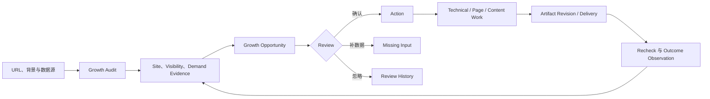

# Nevermore 统一增长机会产品需求文档（PRD）

**日期：** 2026-07-21  
**状态：** 已确认，可进入 Artifact 与实施规划  
**产品决策：** 单一 Growth Audit + Growth Opportunity 主对象 + 四个一级入口  
**确认依据：** 用户于 2026-07-21 明确回复“确认”  
**配套设计：** [`2026-07-21-unified-growth-opportunity-design.md`](./2026-07-21-unified-growth-opportunity-design.md)  
**替代文档：** `2026-07-20-connected-growth-audit-optimization-design.md` 与其 18 任务实施计划  
**Artifact：** `/Users/wzb/.codex/visualizations/2026/07/20/019f7ff0-3874-7623-90f3-1ebdea7c313f/index.html`

---

## 1. 文档目的

本 PRD 回答五个问题：

1. Nevermore 的核心产品到底是什么；
2. 完整审计和 SEO/GEO 如何真正成为同一套产品；
3. 内部团队代运营和客户自助如何使用同一条链；
4. 首阶段必须交付什么、明确不交付什么；
5. 新 Artifact 与后续实现应如何验收。

本 PRD 是当前产品范围权威。配套设计文档补充领域、运行时、数据诚实和迁移约束；实施计划不得把本 PRD 的延后能力重新写成本期承诺。

---

## 2. 审计结论

### 2.1 总体判断

前一版方向并非完全错误。完整审计、证据治理、Finding Review、多类型交付和验证闭环都应该保留。

真正的问题是：前一版把“完整审计与优化”和“SEO/GEO Content Growth”画成两个并行且近乎完整的产品。

- 审计线以 Module、Rule、Finding、URL 为中心；
- 内容线以 Competitor、Topic、Keyword、AI Query、Content、Publish 为中心；
- 两边只有在 Growth Plan 或 Measurement 才发生可见连接；
- 用户不能持续跟随同一个问题、页面或增长机会。

因此，上一版给人的直觉是“一个审计产品 + 一个内容增长产品”，而不是一个完整增长系统。

### 2.2 复杂度根因

上一版 Artifact 同时暴露了：

- 11 个一级导航；
- 2 条 Guided Path；
- 3 套分类法；
- Managed、Co-managed、Self-service 模式切换；
- 多角色切换；
- Tier 0–3 策略实验室；
- 完整 Market、Demand、Content、Publish、Measurement 与 Knowledge 页面。

这些能力并非全部无价值，但它们被提前放到了同一层级。首页必须先解释产品架构，用户才能决定去哪里。

### 2.3 工程方案审计结论

旧实施计划还存在两类问题。

第一类是过度保底：

- 七角色 Membership；
- 多层 Automation Policy；
- 五档定时 Checkpoint；
- 完整 CMS Canary 与通用 Connector；
- 对非确定性 LLM 输出做字段级 Parity；
- 为未来功能预建大量表和一级页面。

第二类是会阻断实施的机械矛盾：

- v0.2 验证器锁死 operations、tables、rules 的 exact set；
- 表扫描只读取 `0001_init.sql`；
- create-run 有合同要求但没有 Web 路由任务；
- Task 11 引用了 Task 17 才建立的 Checkpoint；
- Wiki/Verified Claim 承诺没有实现落点；
- Flow 仓库路径没有被准确冻结。

新版实施计划必须先修验证器演进策略，并在技术闭环后停止评审。后续内容、发布、权限与度量各自重新规划。

---

## 3. 产品定义

### 3.1 一句话定义

> **Nevermore 从一个 URL 出发，通过统一 Growth Audit 发现、确认、执行并验证增长机会。技术审计、SEO 需求、GEO 可见性、竞品研究和内容生产，是同一个 Opportunity 的证据与执行能力。**

### 3.2 产品承诺

Nevermore 帮助用户完成：

```text
看清事实
→ 理解机会
→ 做出决定
→ 交付改变
→ 验证结果
```

产品不承诺：

- 排名必然提升；
- 流量或收入必然增长；
- 未连接或缺失数据可以被 AI 推断补齐；
- 发布成功等于索引或增长成功；
- 一个总分可以代替规则、来源、范围与证据。

### 3.3 产品边界

Nevermore 是唯一产品壳、项目边界和长期 System of Record。

- `gengrowth-agents` 提供审计、诊断、发现、规则和机会能力来源；
- `gengrowth-flow-mvp` 提供 Research、Draft、Quality Gate、Publish、Index、Recap 的能力来源；
- `gengrowth-wiki` 提供经过治理的 Canonical、Playbook、客户事实和研究资料；
- 外部 Crawl、GSC、GA4、DataForSEO、PageSpeed、AI Answer、CMS 通过 Nevermore Connector/Capability 接入。

不得把来源仓库的页面、状态表或任务系统作为第二套产品并行运行。

---

## 4. 产品目标与非目标

### 4.1 当前目标

在一个 Project 内，让以下陈述成立：

> 用户可以理解最重要的、由证据支持的增长机会；决定是否值得执行；生成正确的技术或内容交付物；并在后续看到目标条件是否改善。

### 4.2 首阶段目标

首阶段必须证明两个 Vertical Slice：

1. 技术问题可以从完整审计进入 Finding Review、Technical Ticket 和 Recheck；
2. SEO/GEO 内容机会可以同时引用站点审计、关键词、AI Query 和竞品证据，并停在 Reviewed Draft Shadow。

### 4.3 当前非目标

- 不一次性迁移 `gengrowth-agents` 全部规则与 17 模块；
- 不建立第二套 Finding、Action、Artifact、Run 或身份系统；
- 不建设七角色 RBAC；
- 不真实写入 Webflow、WordPress、GitHub 或 Oracle；
- 不建设通用 CMS 平台；
- 不建设完整第三方竞品数据产品；
- 不把所有 Wiki 内容无治理地用于文章事实；
- 不用 AI 生成缺失测量值；
- 不用执行日志或发布回执证明增长；
- 不把关键词数量或文章数量当作产品成功指标。

---

## 5. 目标用户

### 5.1 内部运营

内部策略师、SEO/GEO 专家、技术专家和编辑需要：

- 管理多个客户项目；
- 从 URL 快速启动审计；
- 看到数据连接、覆盖与限制；
- 将技术、Search、GEO、竞品和内容信号放在一起判断；
- 为客户准备决策；
- 生成技术工单、页面优化建议和内容交付物；
- 跟踪交付与复查；
- 输出不夸大归因的客户报告。

### 5.2 客户协作方

客户管理员或编辑需要：

- 看懂为什么这是一个问题或机会；
- 检查客户安全的证据与限制；
- 补充业务事实；
- 确认、忽略或要求更多数据；
- 审阅具体 Artifact Revision；
- 理解哪些结果已验证、哪些仍需观察。

### 5.3 客户自助

客户自助使用同一项目、同一证据和同一工作对象。差异来自引导、权限和责任，不创建另一套页面和状态。

首阶段 Artifact 不展示七角色与模式模拟器。真实外部登录出现时，从两类权限开始：

- Operator/Admin；
- Collaborator/Editor。

---

## 6. 核心工作对象

### 6.1 Project 是容器

Project 持有：

- Site、市场、语言和业务背景；
- Source Connection；
- Collection/Audit/Diagnostic Run；
- Observation、Evidence、Finding；
- Review Event、Action；
- Artifact Revision、Export；
- 后续 Verification。

### 6.2 Growth Opportunity 是前台主对象

用户真正持续跟随的是 Growth Opportunity。

Opportunity 回答：

- 发现了什么；
- 为什么重要；
- 影响哪个站点、模板、URL、Topic 或缺失资产；
- 有哪些技术、Search、GEO 和竞品证据；
- 数据有什么限制；
- 应该 Fix、Improve 还是 Create；
- 已确认什么 Action；
- 当前交付物是什么版本；
- 结果是否已验证。

### 6.3 首版 Opportunity 不是新真相表

首版 Opportunity 是读模型：

```text
Target
+ 首阶段恰好一项 primary canonical Finding
+ 可选 supporting Finding 与跨 Lens Observation
+ Evidence Lens 与 limitation
+ Review State
+ 一个 Confirmed Action（如有）
+ 一个固定类型的 Current Artifact Revision（如有）
+ Verification Summary（如有）
```

这样可以直接复用 Nevermore 已成熟的 Finding、Action 和 Artifact，不复制状态。

同一 Target/Topic 下可以用稳定 Key 只读展示 Related Opportunities，但该组在首阶段没有 Bulk Confirm Mutation。只有真实使用证明“多个 Opportunity 的聚合关系本身需要独立持久生命周期”时，才评审 Opportunity Group 表。

### 6.4 Opportunity Target

每个 Opportunity 必须有一个主要目标：

- `site`：站点级协议、安全、合规或 Measurement；
- `template`：重复页面模板；
- `url`：现有页面；
- `topic`：关联多个 Query 或页面的主题；
- `new_asset`：没有合适现有页面的已验证需求缺口。

### 6.5 前台工作类型

用户只需要理解一套工作语言：

1. **Fix：** 修复已观察到的缺陷或阻塞；
2. **Improve：** 改善现有 URL、模板或转化路径；
3. **Create：** 为真实且相关的缺口创建新资产；
`Expand`（权威、链接、引用与分发）是后续保留类型，不进入首阶段枚举，也不由首阶段合同产出。

报告模块、A0–A14 和 Action Domain 继续存在于后台与 Evidence Detail，不作为三套一级导航语言。

---

## 7. 单一产品闭环



### 7.1 Audit Evidence 边界

允许：

- Scope、Source、Freshness、Coverage；
- Current Value；
- nullable score；
- pass、warning、failed、pending、no_data；
- affected URL；
- Evidence Sample；
- Previous Run Compare；
- Limitation 与 Export。

禁止：

- Assignee；
- Effort；
- Remediation Step；
- Backlog Lane；
- Due Date；
- Publish 控件；
- Action Status。

### 7.2 Opportunity Review 边界

允许：

- Target 与相关 Topic/Query/Page；
- 跨 Lens 证据；
- Impact、Confidence、Effort、Risk、Dependency；
- 建议工作类型；
- Review History；
- Confirm、Needs Data、Dismiss。

只有 Confirm 才创建 Action。

### 7.3 Execution 边界

允许：

- Action 顺序与状态；
- Technical Ticket、Metadata Rewrite、Content Brief；
- Research Pack 与后续 Content Revision；
- Validation、Acceptance、Rollback；
- 当前 Revision 的 Review Decision；
- 获得单独授权后的外部写入。

### 7.4 Results 边界

结果只能表达：

- `verified`：目标条件被可信复测直接证明已改变；
- `observed`：观察到变化，但不能做强因果归因；
- `insufficient_data`：来源、样本、窗口或归因不足；
- `declined/regressed`：目标条件变差或再次出现。

---

## 8. Growth Audit 三个 Evidence Lens

三个 Lens 是同一证据系统的观察角度，不是独立产品模块。

### 8.1 Site Health

回答：网站和页面能否被抓取、渲染、理解、信任和正常使用？

覆盖：

- Performance 与 Core Web Vitals；
- Accessibility；
- HTTPS、安全 Header、Best Practices；
- Crawl/Index、Canonical、Robots、Sitemap、Hreflang；
- Rendering 与内容一致性；
- Structured Data；
- 内链、架构与 Orphan；
- Compliance；
- Measurement Readiness。

用户侧八面报告和 A0–A14 技术深钻保留在 Lens 内部。

### 8.2 Search & AI Visibility

回答：网站在哪里可见、缺席、衰退或不易被引用？

覆盖：

- GSC Query/Page、Impression、Click、CTR、Position；
- Ranked Keyword 与 SERP Observation；
- Index 状态与 Page-Query Fit；
- AI Answer Presence、Brand Mention、Citation；
- Entity、Proof、Extractability；
- SearchQuery 与 GenerativeQuery Observation。

SearchQuery 和 GenerativeQuery 保持独立类型、来源和指标。它们可以共同支持一个 Opportunity，但不能伪造共同 Volume、KD 或统一排名。

### 8.3 Demand & Competition

回答：市场需要什么、谁正在满足、我们是否有合适资产？

覆盖：

- 业务竞品、搜索竞品、替代方案和 AI 引用来源；
- Keyword Intersection 与 Gap；
- Topic Cluster 与 Intent；
- Comparison、Alternative、Template、Guide 需求；
- 竞品排名页与 AI Citation；
- 竞品内容变化；
- Existing Page 与 New Asset 决策。

关键词库、竞品库和 Query 库是 Growth Map 内部可检查的资产，不是首阶段一级导航。

---

## 9. Opportunity 生成要求

### 9.1 最小字段

```text
opportunity_key
title
work_shape
readiness: candidate | reviewable | confirmed
primary_target
target_ref
primary_finding_id?
supporting_finding_ids[]
evidence_summary[]
lenses[]
search_queries[]
generative_queries[]
competitor_refs[]
current_owned_asset
coverage_and_limitations
impact_factors
confidence_factors
effort_factors
risk_factors
dependency_factors
review_state
action_id?
artifact_summary?
verification_summary?
```

### 9.2 生成约束

- Slice 1 的 Reviewable Opportunity 必须恰好对应一项 measured primary canonical Finding；Supporting Finding 与 Observation 只增强跨 Lens 解释，不共享 Confirm；只有 Observation 的候选可以以 `readiness=candidate` 展示，但没有 Confirm 控件，也不能创建 Action；
- Rule Catalog 本身不能制造 Opportunity；
- `pass` 和 `no_data` 不产生 Opportunity；
- Demand candidate 必须有需求、相关性与覆盖缺口 Observation；只有 versioned demand-gap rule 或明确的 Analyst Judgment 把这些 Observation 写成 canonical Finding 后，候选才能变为 reviewable；
- 保留 Finding ID、Rule Version、Source Freshness 和 Limitation；
- 聚合必须基于稳定 Target 与 Intent Key；
- LLM 可以总结 Evidence Packet，但不能生成新的 Evidence、Impact 或 Confidence；
- Opportunity 本身不直接写 Action；Confirm 只审阅 `primary_finding_id`，必须复用一条 Finding → 一条 Action 的 canonical Finding Review 事务；
- Multi-Finding Confirm 与 Opportunity Group Atomic Approval 明确延后；
- Opportunity replay 不得重复创建 Action。

### 9.3 Existing-page-first

提出新页面或新文章前，必须回答：

1. 是否已有覆盖该 Topic/Intent 的页面；
2. 页面是否可索引且技术合格；
3. 是否已有 Impression、Click 或 Rank；
4. 是否匹配 Search Intent 与 AI Question；
5. 最正确的工作是 Fix、Improve 还是 Create。

这条规则防止系统退化为 Blog 数量机器。

---

## 10. 信息架构

项目内只保留四个一级入口。

### 10.1 今日

回答：现在最重要的 Opportunity 是什么，为什么重要，下一步需要什么决定？

必须有：

- 1 个最高优先 Opportunity；
- 最多 3 个需要决定或执行的事项；
- 阻塞进度时的数据准备度；
- 简洁项目状态；
- 最近 verified/observed 结果。

不得有：

- 双循环架构图；
- 完整模块分数矩阵；
- 160 checks 迁移状态；
- 角色/模式模拟器；
- Automation Policy Lab。

### 10.2 Growth Map

产品核心工作区，包含两个阶段：

1. `Audit Evidence`；
2. `Opportunity Review`。

Audit Evidence 必须展示：

- Run、Scope、Freshness、Data Completeness；
- Site Health、Search & AI Visibility、Demand & Competition；
- Module、Rule、URL、Topic、Query、Competitor Drilldown；
- No Data 与 Limitation；
- Compare 与 Export。

Opportunity Review 必须展示：

- 跨 Lens Opportunity 列表；
- Target、Evidence、Impact、Confidence、Effort、Risk、Dependency；
- Confirm、Needs Data、Dismiss；
- append-only Review History。

### 10.3 Execution

合并 Growth Plan、Delivery、Content Pipeline 与 Studio。

必须展示：

- Ready、In Progress、Review、Done；
- 排序因子而非不可解释总分；
- 当前选中 Opportunity；
- Artifact Type 与 Revision；
- 技术 Validation 与 Rollback；
- 内容 Research/Fact Gate；
- 绑定 Revision 的 Review Decision。

首个 Artifact 展示：

- `technical_ticket`；
- `metadata_rewrite`；
- `content_brief`。

可演示 Reviewed Draft，但不连接真实 CMS。

### 10.4 Results

合并 Recheck、Measurement、Report 与 Export。

必须展示：

- 技术 before/after Run；
- Index/Publication 状态（如有）；
- Search、Conversion、AI Observation；
- Window、Source、Limitation；
- verified、observed、insufficient_data；
- 客户安全 Report 与 Export；
- Regression 产生的新 Evidence/Finding。

### 10.5 非一级入口

- Context：项目创建和 Audit Setup；
- Sources：Growth Audit 数据边界抽屉或 Settings；
- Market/Demand：Growth Map Lens；
- Findings：Audit Evidence 与 Opportunity Review 内部 canonical record；
- Plan/Studio：Execution；
- Publish：后续 Execution 风险动作；
- Knowledge：后台治理与 Settings；
- Membership/Policy：服务端权限与 Settings。

内部团队未来可在项目壳外增加 Portfolio；客户自助无需看到该入口。

---

## 11. 核心用户流程

### 11.1 URL → Audit-ready

1. 输入 URL、市场、语言和最少业务背景；
2. 创建 Project、Site 和默认 Crawl Source；
3. 自动启动 Crawl，不强制先连接所有可选数据源；
4. Growth Map 显示 Source Readiness 与 Limitation；
5. 渐进连接 GSC、GA4、Keyword、AI Answer、Competitor Source；
6. 只执行有真实数据的 Capability；
7. 无来源的模块显示 No Data。

### 11.2 Evidence → Confirmed Opportunity

1. 打开 Growth Map；
2. 在 Audit Evidence 查看事实；
3. 打开由一项或多项 canonical Finding 支持的 Reviewable Opportunity；Observation-only Candidate 只能检查证据或请求分析，不能 Confirm；
4. 检查 Target、Source、Freshness、Scope、Limitation；
5. 对 Opportunity 的 primary Finding 选择 Confirm、Needs Data 或 Dismiss；
6. Confirm 复用 Finding Review 事务，幂等创建唯一对应 Action；Opportunity Projection 不直接写 Action；
7. Opportunity 出现在 Execution，不复制 Finding/Action。

### 11.3 Opportunity → Technical Work

1. 选择 Fix Opportunity；
2. 生成 `technical_ticket` Revision；
3. Ticket 包含 Change Contract、Evidence、Validation、Acceptance、Rollback；
4. 记录交付或外部 handoff；
5. Recheck 创建新的 immutable Audit/Capability Run；
6. Results 对比新旧 Run 的 Rule Current Value 和 Target。

### 11.4 Opportunity → Content Shadow

1. 选择 Improve/Create Opportunity；
2. 同时查看 Demand、Competitor、Existing Page 与技术可用性证据；
3. 生成 `content_brief`；
4. 固定版本 Flow Shadow 输出 Research、Draft、QA；
5. Research 标记 A/B/C/D 权威级别；
6. 缺乏可信来源的 Fact 被阻塞；
7. 停在 Reviewed Artifact Revision；
8. 不真实发布。

### 11.5 Work → Result

1. 技术变更进入新 Run 复测；
2. 后续获批的出版里程碑可以记录 Publication；
3. Search/AI Observation 保留 Baseline、Window、Source、Limitation；
4. Publication Receipt 不产生“增长成功”；
5. Regression 或新缺口产生新的 Evidence 与 Finding。

---

## 12. 代表性跨 Lens Target Story

**目标：** `/customer-onboarding/`  
**Topic：** customer handoff automation

同一个 Target Story 包含三项**相互关联但分别审阅的 Opportunity**：

| Opportunity | Primary Finding | Work Shape | 唯一固定 Artifact Type |
|---|---|---|---|
| 修复 Onboarding Template 的 Canonical 冲突 | `TECH-CANONICAL-002` | Fix | `technical_ticket` |
| 改善 SERP Message 与 Page-Query Alignment | `SEARCH-CTR-004` 或经过审阅的等价 Finding | Improve | `metadata_rewrite` |
| 把现有页面建设成可引用答案资产 | `CONTENT-COVERAGE-001` 或经过审阅的等价 Finding | Improve | `content_brief` |

### 12.1 共享 Site Health Evidence

- 18 个 URL 存在 canonical 冲突；
- Topic Cluster 内链不足；
- 相关模板移动端 LCP 4.8s；
- Server Log 未接入，因此 Crawl Budget 为 No Data。

### 12.2 共享 Search Evidence

- Provider Snapshot 观测到约 1,300/月相关需求；
- 主要 Query 位于 11–18；
- 当前页面已有 Impression，但 Intent 只部分匹配。

### 12.3 共享 GEO Evidence

- 品牌在目标问题集 1/8 出现；
- 竞品在 6/8 Answer 被引用；
- 当前页面缺少清晰 Answer Block 与可信 Proof。

### 12.4 共享 Competitor Evidence

- 竞品已经覆盖 Comparison、Guide、Template；
- 当前站点只有 Product Page；
- 不是简单复制竞品文章，而是补齐缺失决策资产。

### 12.5 Review 与 Work 约束

- 每项 Opportunity 只 Confirm 自己的 primary Finding；
- 每项 Opportunity 创建自己的 canonical Action；
- 每项 Action 只能生成 Action Template 固定的一个 Artifact Type；
- Target-level Group 只是只读投影，没有共享 Mutation；
- 技术改变可以立即 Recheck；
- Index、Search、AI 进入观察窗口，不提前宣称增长。

缺失 supporting guide 可以作为相关的独立 `new_asset` Candidate 展示，但它必须拥有自己的 canonical demand-gap Finding 后才能确认。

该 Target Story 是新版 Artifact 唯一主故事，用于证明 Audit、Keyword、GEO Query、Competitor 和 Content Delivery 的真实交集，同时保持一条 Finding → 一条 Action → 一个固定 Artifact Type。

---

## 13. 数据与领域要求

### 13.1 继续复用

- Project/Site/Context；
- Source Connection、Collection Run、Snapshot、Observation；
- Diagnostic Run/Rule；
- Evidence、Finding、Finding Observation、Review Event；
- Action、Action Override Audit；
- Execution Artifact、Artifact Revision、Export Bundle；
- Async Run、Queue、Idempotency、Telemetry。

### 13.2 技术 Slice 最小新增

只新增：

- `capability_runs`；
- `audit_runs`；
- `audit_module_results`；
- `site_pages`；
- `page_snapshots`。

所有权必须明确：

- `capability_runs` 一对一扩展 `async_runs`，只保存 Capability/Version、Manifest Hash、Mode 和 Side-effect Class，不保存第二套 Run Status；
- `audit_runs` 在 Slice 1 一对一锚定 canonical `diagnostic_runs`，只保存 Audit Scope Identity 与 Projection Metadata，不复制 Frozen Input Manifest 或 Rule-result Truth；
- `audit_module_results` 是模块导航摘要，canonical Rule Result 与 Finding 仍在 Diagnostic/Evidence 链；
- `site_pages` 保存 Project-scoped Normalized URL Identity，不是 Raw Crawl Truth；
- `page_snapshots` 是引用 canonical `data_snapshot` 与 Content Hash 的 Page-level Derived Extract，不是第二套 Raw Snapshot。

不得复制 Async Run、Finding、Action、Artifact 或 Review 状态。

### 13.3 延后持久对象

- 完整 Competitor Snapshot；
- 完整 SearchQuery/GenerativeQuery Metric History；
- Content Item Lifecycle；
- Publication 与 Review Decision；
- Scheduled Performance Checkpoint；
- Membership/Invitation/Policy/Authorization；
- Opportunity Group。

这些对象只有在重新进入条件满足后，才能进入新的实施计划。

---

## 14. 能力来源与版本边界

### 14.1 Nevermore

```text
/Users/wzb/Code/nevermore/signalframe-mvp-app
5960b6d2f67e84dca96c6a1261bdc7def1d11bc7
```

主工作树还有未跟踪的 `.gstack/`。所有计划修改必须在独立干净 Worktree 执行，不能把主工作树描述为可复现的 Clean Checkout。

负责 Product、Project Scope、Canonical State、Adapter Contract、Normalized Write、Audit Log 与 Client-safe Projection。

### 14.2 gengrowth-agents

```text
/Users/wzb/Code/gengrowth-agents
af30cbf422fbb360e86fc6b7474e33003c0e0628
```

当前工作树有用户未提交修改，只读使用。

作为能力/Parity 来源：

- 八面 Audit；
- Website Audit 与 URL Detail；
- Technical Health A0–A14；
- GEO H1–H6；
- Competitor Discovery；
- Keyword Intersection；
- Opportunity/Growth Action Pattern。

### 14.3 gengrowth-flow-mvp

```text
/Users/wzb/gengrowth-flow-mvp
4e11c5e80cae7b62f0fffca90f570e46cfe3dfa6
```

作为能力/Parity 来源：

- Keyword/Cluster 输入；
- Research Pack；
- Draft 与 Binary Quality Gate；
- Publish-ready Staging；
- Index Ledger、Recap、Repair。

### 14.4 gengrowth-wiki

```text
/Users/wzb/gengrowth-wiki
aff251b0385081f45492f1cd788b37d1deb31048
```

当前工作树有用户未提交修改，只读使用。

权威级别：

- A Canonical；
- B Approved Playbook；
- C Client/Site Fact；
- D Raw Research。

首个 Content Shadow 只要求 Research Pack 携带 Authority。完整 Manifest Sync 与 Verified Claim Persistence 延后。

---

## 15. 交付 Slice

### 15.1 Slice 1：Technical Growth Opportunity

```text
URL → Growth Audit → Evidence/Finding → Opportunity Review
→ Technical Ticket → Recheck → Results
```

范围：

- v0.3 Audit/Recheck 权威增量；
- Validator Evolution；
- Audit 与 Opportunity Response Contract；
- Read-only Growth Audit；
- Audit Run/Page Snapshot Persistence；
- Create-run；
- 第一批 Parity-gated 技术规则；
- Technical Ticket；
- Recheck；
- 一个技术 E2E；
- 1–2 次 Concierge Audit。

停点：

- No Data 表达得到认可；
- Growth Map 可以被内部/客户理解；
- Finding → Action → Ticket 无重复状态；
- Recheck 对比两个 immutable Run；
- 未通过评审前不迁内容。

### 15.2 Slice 2：SEO/GEO Content Shadow

Slice 1 通过后另写实施计划。

```text
Demand + Competitor + Existing-page Audit
→ Confirmed Opportunity
→ Content Brief → Research → Reviewed Draft Revision
```

限制：

- 一个测试项目；
- 一个 Competitor Set；
- 一个 Keyword/Topic Cluster；
- 一个独立 GenerativeQuery Set；
- 一个 Existing Page/New Asset 决策；
- 固定版本 Flow Shadow；
- Schema Validation + 人工 Side-by-side；
- 不外部发布。

停点：

- 技术与内容引用同一 Opportunity Evidence；
- SEO/GEO 指标诚实独立；
- Existing-page-first 可理解；
- Fact Gate 可接受；
- Shadow 无外部写入。

---

## 16. 延后清单与重新进入条件

| 能力 | 延后原因 | 重新进入条件 |
|---|---|---|
| 七角色 Membership | 没有七种真实权限差异 | 第一个外部用户登录，先做两类角色 |
| Tier 0–3 Policy | 没有差异化自动化对象 | 客户提出低风险免审批需求 |
| 真实 CMS Publish | 外部写风险且 Shadow 未验收 | Slice 2 通过并批准可回滚 Canary |
| 五档定时 Checkpoint | 没有真实发布样本 | 首次真实发布后确有遗漏复盘 |
| 六来源关键词宇宙 | 多来源仍 partial/planned | 每个来源有真实合同、预算和 availability |
| 完整竞品历史 | 首阶段只需决策证据 | 重复决策需要历史变化 |
| AI Answer 全平台监控 | Query/Provider 尚未权威 | 真实 Observation Capability 落地 |
| Wiki Manifest/Verified Claim | Shadow 可先携带 Authority | 多项目需要 Claim 复用与撤回 |
| Opportunity Table | 首版 Projection 足够 | 聚合本身需要独立生命周期 |
| Billing/Enterprise Admin | 不验证当前产品价值 | 商业化与企业租户需求批准 |

---

## 17. Validator 演进要求

### 17.1 同一提交更新

新增/删除 operation、table、queue 或 rule 时，同一提交必须更新：

- v0.3 Narrative/OpenAPI/SQL Authority；
- Authority Package 自身的 Verifier（`implementation-spec-v0.3/scripts/verify-spec.mjs` 或经过审阅的后继脚本）；
- Spec Lock Manifest；
- `verify-spec-lock.mjs`；
- `verify-implementation.mjs`；
- Generated Contract；
- Fixture/Parity Expectation。

### 17.2 Migration 扫描

Authority Package 与 App-side 验证器都必须扫描经过审阅的有序 Migration 集，不得只读 `0001_init.sql` 或过期的 Monolithic SQL Snapshot。

### 17.3 Create-run 完整合同

只要权威包含 create-run，本 Slice 必须同时包含：

- OpenAPI；
- Project-scoped Web Route/Service；
- AsyncRun/CapabilityRun Transaction；
- Queue Enqueue；
- Idempotency；
- Route/Worker Test。

### 17.4 Recheck 不提前依赖 Checkpoint

Recheck 不能复用当前 `createDiagnosticRun` Request 冒充。它需要经过审阅的 v0.3 Operation，至少携带 `prior_run_id`、`action_id`、Target Scope 和新的 Capability Contract Version；只有 v0.3 Authority 明确移除当前 v0.2 的 Recheck 禁止项、且 App 已锁定到该 Authority 后，才能实施。

Slice 1 使用 prior/new 两个 immutable Run 做 Rule-level 比较，不依赖延后的 Scheduled Checkpoint 表。

---

## 18. Artifact 需求

Artifact 是跨 Slice 1 技术路径和拟议 Slice 2 Content Shadow 故事板的目标态设计验证，不表示 Slice 2 已经在生产实现。生产验收仍严格服从第 15 节的两个停点；Content Brief、Fact Gate 与 Reviewed Draft 只有在 Slice 1 通过并批准独立 Slice 2 实施计划后，才成为生产验收项。

### 18.1 一级入口

只有：

1. 今日；
2. Growth Map；
3. Execution；
4. Results。

### 18.2 主演示路径

1. 打开 Growth Map；
2. 检查 Scope、Coverage 与 No Data；
3. 打开 `/customer-onboarding/` Target Story；
4. 同时查看技术、Search、GEO、Competitor Evidence；
5. 分别查看三项 Related Opportunity；
6. 每次只 Confirm 一项 primary Finding，并观察每项 Opportunity 对应一个 canonical Action；
7. Execution 将 Technical Ticket、Metadata Rewrite、Content Brief 显示为三项 Related Work；
8. 查看技术 Validation 与目标态 Content Shadow Fact Gate；
9. 模拟 Technical Recheck；
10. Results 显示技术改善，Search/GEO 仍在 Observation Window。

### 18.3 交互边界

- Audit Evidence 无 Create Action；
- Opportunity Review 有明确 Confirm；
- Confirm 只作用于一个 primary Finding，replay 不重复 Action；Target Group 没有 Bulk Confirm；
- No Data 不可作为 failure；
- Revision Approval 不等于 Publication；
- 不执行真实 CMS；
- 不伪造 Ranking、Traffic、AI Citation 或 Revenue。

### 18.4 视觉要求

保留 warm paper、dark ink、cobalt、editorial/operational 语言。

删除：

- 双循环系统图；
- 11 项侧栏；
- 全局 Role/Mode Switch；
- Policy Tier Lab；
- Capability Migration 卡；
- 独立 Market App；
- 独立 Publish App。

核心视觉是一个 Opportunity Evidence Map：

- 中心是 Target；
- 周围是 Site、Search、AI、Competitor Evidence；
- 下方是一个明确 Decision；
- Decision 之后是 Technical/Page/Content Work。

### 18.5 响应式

- 1440：完整 Evidence Map 与 Execution Workspace；
- 1024/768：两列或阶段布局；
- 390：先显示结论、Evidence Summary 和 Next Decision；
- 深层表格进入 Drawer 或受控横向容器；
- 所有关键视口无 Root Overflow；
- 控件可键盘访问，Focus 可见；
- 支持 Reduced Motion。

---

## 19. 验收标准

### 19.1 产品理解

- 新用户能把产品描述成一个 URL → Opportunity → Result 闭环；
- 不再把 Audit 与 SEO/GEO Content 描述成两个产品；
- 1 分钟内找到最高优先 Opportunity 和下一步决定。

### 19.2 数据诚实

- measured、pending、collection failed、No Data 可区分；
- Connected Source 可以仍 unavailable；
- No Data 不降低分数、不创建 Finding；
- Judgment 可以回到 Source、Freshness、Scope、Limitation；
- Audit Evidence 无 Remediation/Assignee/Effort/Backlog。

### 19.3 真实交集

- 至少一个 Target Story 同时展示 Technical、Search、GEO、Competitor Evidence，每项 Related Opportunity 明确一个 primary Finding；
- 明确 Target 是 URL、Template、Topic 还是 New Asset；
- 用 Fix/Improve/Create 解释工作，不要求理解三套 Taxonomy；
- Confirm 复用 canonical Finding Review，只创建或揭示一个对应 canonical Action；
- Observation-only Candidate 没有 Confirm；
- Target Group 没有 Bulk Mutation；
- Replay 不重复 Action。

### 19.4 Execution 与 Revision

- 同时展示 Technical Ticket、Metadata Rewrite、Content Brief；
- Artifact 引用 Action 与 Evidence Snapshot；
- 编辑产生新 Revision；
- Approval 绑定当前 Revision；
- 新编辑使旧 Approval 失效；
- 缺乏可信来源的 Fact 被阻塞。

### 19.5 Results

- Recheck 对比两个 immutable Run；
- verified、observed、insufficient_data 可区分；
- Execution/Publication Receipt 不产生 positive outcome；
- Search/GEO 可以保持 pending，不伪造提升。

### 19.6 复杂度下降

- 4 个一级入口，不是 11 个；
- Market、Demand、Findings、Plan、Studio、Publish、Knowledge 不做独立一级路由；
- 1 条主闭环，不是 2 条 Guided Path；
- 前台无需同时理解八面、A0–A14 和 Action Domain。

### 19.7 Artifact 技术验证

- JS Syntax Check 通过；
- 四个路由渲染正确标题；
- 主路径完整；
- 无 Browser Console Error；
- 1440、1024、768、390 无 Root Overflow；
- Keyboard、Dialog Semantics、Reduced Motion 通过。

---

## 20. 成功信号

首阶段成功不等于“展示八个审计模块”或“生成一篇 Blog”。成功意味着：

- 内部与客户无需架构讲解即可理解同一个 Opportunity；
- 用户能区分 Fact、Decision、Work、Result；
- 技术 Slice 完成 Recheck 且没有平行状态；
- Content Shadow 复用同一 Opportunity Evidence；
- 用户接受 No Data 是诚实边界；
- 团队获得客户愿意为什么 Opportunity 付费的真实信号；
- 后续权限、发布和 Measurement 建设来自真实需求，而不是预建治理。

---

## 21. 最终产品声明

> **Nevermore 把一个 URL 及其市场证据转化为经过确认的 Growth Opportunity 队列，再把每个 Opportunity 连接到技术或内容交付与诚实验证。**

后续 Artifact、实施计划和生产变更都必须能够证明这句话，而不能重新长成两个平行产品。
