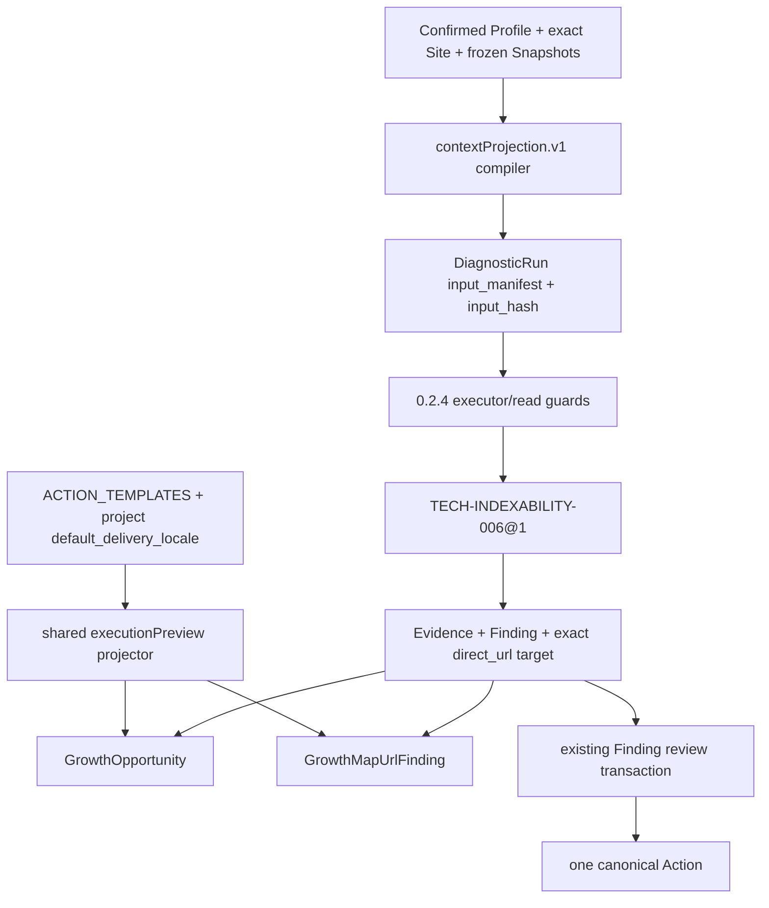

# SEO Audit URL Opportunity Integration Implementation Plan

> **For Claude:** REQUIRED SUB-SKILL: Use superpowers:executing-plans to implement this plan task-by-task.

**Goal:** 将已确认的产品画像、Site 语言与冻结数据源编译成可重放的审计上下文，新增第 12 条 sitemap/indexability 确定性规则，并在不创建 Action 的前提下向 authenticated Opportunity 与 Growth Map URL 详情提供同源 `executionPreview`。

**Architecture:** 保持 Product Profile、Site、Snapshot、Finding、Action 的现有 authority 不变。当前 `mvp.rules.0.2.4` run 在 `DiagnosticRun.input_manifest` 内冻结 exact-key `contextProjection.v1`，worker 只用冻结投影路由当前规则；历史 `0.2.1–0.2.3` 仍用各自旧 manifest/executor。`TECH-INDEXABILITY-006@1` 只消费 exact Crawl 事实。`executionPreview` 由同一 server-side pure helper 从 `ACTION_TEMPLATES` 与 Project delivery locale 投影，同时进入 `GrowthOpportunity` 和 `GrowthMapUrlFinding`，但不进入 run hash、approval、publication 或 measurement lineage。

**Tech Stack:** pnpm workspace, TypeScript, Zod, Vitest, Next.js/React, Drizzle/PostgreSQL migrations, OpenAPI/Redocly, repository-owned v0.4 authority and lock generators.

---

## 0. Execution contract

Work from:

```bash
cd /Users/wzb/Code/nevermore/seo-audit-opportunity-logic-v1
```

This worktree is based on `origin/main` at `1bc2a5c` and uses branch `codex/seo-audit-opportunity-logic-v1`.

Permissions for this plan are intentionally narrower than the code scope:

- Allowed now: local source/test/document edits, local code generation, read-only inspection, and non-destructive unit/type/lint/build checks.
- Not authorized now: commit, push, PR, deploy, production/shared configuration change, or applying any migration to a shared/hosted/production database.
- Before running a disposable PostgreSQL migration/integration gate, ask once for explicit authorization and name the exact commands.
- Authorization update on 2026-08-05: the user authorized the named local loopback disposable PostgreSQL gates (`pnpm test:integration`, `pnpm db:migrate:check`, and `pnpm db:smoke`). That one-time authorization did not include Supabase/shared/production migration, deploy, commit, push, or PR.
- Release authorization update on 2026-08-05: the user separately authorized commit, push, PR/merge, the production Supabase backup/restore-verification and ordered migration, the Railway worker deployment, the Vercel unique deployment/promotion, and deployed-origin verification for this exact release candidate. This does not authorize repository source or secret upload, product-level GitHub/WordPress/CMS external-write capability, unrelated production configuration changes, or customer business-data operations beyond the release migration and its sanitized verification.
- Every commit command below is a **conditional checkpoint only**. Do not execute it unless the user explicitly authorizes commits.
- Preserve the original user worktree `/Users/wzb/Code/nevermore/seo-audit-no-free-quota`; do not touch its untracked `.context/` or `scripts/point-marketing-at-supabase.sh`.
- Keep the ChatGPT Pro review task available at `https://chatgpt.com/c/6a72f022-b9bc-83e8-b228-9729cd485627`; do not upload repository source or secrets.

The frozen version decisions for implementation are:

| Boundary | New/current value | Historical behavior |
|---|---|---|
| deterministic rule set | `mvp.rules.0.2.4` | `0.2.1`, `0.2.2`, `0.2.3` remain executable with their own 11-rule arrays |
| prompt set | unchanged `mvp.prompts.0.2.0` | unchanged |
| context schema | `context-projection.v1` | absent and forbidden on `0.2.1–0.2.3` |
| context compiler | `context-projection.compiler.1.0.0` | self-description only; no new DB version column |
| Growth Audit projection | `growth-audit.0.3.1` | latest reads use `0.3.1`; exact pinned historical reads may admit known `0.3.0` |
| Growth Audit capability | unchanged `0.3.0` | public request/addressing contract unchanged |
| capability contract | unchanged `growth-audit.0.3.0` | request shape unchanged |
| migration head | `0042_contextual_indexability_opportunities` | migrations remain append-only |
| operation / async / table counts | `79 / 10 / 78` | no new endpoint or table |
| rule count | `12` | historical runs still see 11 |

`mvp.rules.0.2.0` is a DB-accepted historical residue, not a shipped executor in
the current application. Migration `0042` must preserve its existing database
acceptance for immutable rows, while `rulesForRuleSetVersion()` and worker
execution continue to fail closed for it.

## 1. Dependency graph and atomicity



Tasks 1–6 can be developed in slices, but activation is not releasable until all of these agree atomically:

1. current rule registry and historical executor arrays;
2. manifest writers and every exact read boundary;
3. SQL rule-set/manifest/rule-version/target-lineage guards;
4. Zod/OpenAPI/generated contracts;
5. `growth-audit.0.3.1` selectors;
6. authority schema, lock, inventory prose, and verification tests.

Do not treat an intermediate green package test as a releasable state.

## Task 1: Build the pure, generation-aware `contextProjection.v1` compiler

**Files:**

- Create: `packages/engine/src/context-projection.ts`
- Create: `packages/engine/src/context-projection.test.ts`
- Modify: `packages/engine/src/index.ts`
- Modify: `packages/engine/src/icp.ts`
- Modify: `packages/engine/src/icp.test.ts` if present; otherwise add coverage to the new test
- Modify: `packages/engine/src/context.ts`
- Modify: `packages/engine/src/context.test.ts` or the nearest language-routing tests

### Step 1.1: Write failing compiler-shape tests

Cover all exact boundaries before implementation:

```ts
it("compiles Product Profile 0.3 without borrowing legacy fields", () => {
  const projection = buildContextProjectionV1({
    profileContentHash: "a".repeat(64),
    profile: {
      profileSchemaVersion: "product-profile.0.3.0",
      productName: "Acme",
      oneLiner: "Ship faster",
      productType: "saas",
      businessModels: ["subscription"],
      targetMarkets: [{ marketCode: "US", priority: "primary" }],
      targetAudiences: [],
      primaryConversion: { label: "legacy leak", type: "demo", targetUrl: "https://acme.test/demo" },
      priorityUrls: ["https://acme.test/pricing"],
    },
    siteLanguageCodes: [],
  });

  expect(projection.profileGeneration).toBe("product-profile.0.3.0");
  expect(projection.primaryConversion).toEqual({
    state: "missing",
    sourceKind: "not_declared_for_generation",
  });
  expect(projection.priorityUrlSubjects).toEqual({
    state: "missing",
    sourceKind: "not_declared_for_generation",
  });
  expect(projection.siteLanguage).toEqual({
    sourceKind: "site",
    state: "declared_empty",
    languageCodes: [],
  });
});
```

Also assert:

- legacy ICP extracts only its explicit `primaryConversion`, `priorityUrls`, `technicalConstraints`, and `resourceConstraints`;
- Product Profile routing uses `productName`, `oneLiner`, `productType`, `businessModels`, the explicit primary market, and an explicit primary/non-excluded audience summary;
- `profileSchemaVersion` is the only new-generation discriminator; do not infer the generation from content;
- normalized priority URL subjects are HTTP(S), canonical, ASCII-sorted, unique, and deterministic under input reordering;
- invalid/unknown projection keys throw rather than being stripped;
- `parseContextProjectionV1(buildContextProjectionV1(x))` returns a fresh deeply frozen graph;
- `schemaVersion` and `compilerVersion` are exact literals;
- no provider availability, mode, permission, priority band, severity, confidence, ROI, cadence, or mutable workflow field is accepted.

Run and expect failure because the module does not exist:

```bash
pnpm test -- packages/engine/src/context-projection.test.ts
```

### Step 1.2: Define the strict JSON contract

Use a discriminated, exact-key structure. Keep optional business facts as explicit `available | missing` objects rather than omitted properties:

```ts
export const CONTEXT_PROJECTION_SCHEMA_VERSION = "context-projection.v1";
export const CONTEXT_PROJECTION_COMPILER_VERSION =
  "context-projection.compiler.1.0.0";

export interface ContextProjectionV1 {
  readonly schemaVersion: typeof CONTEXT_PROJECTION_SCHEMA_VERSION;
  readonly compilerVersion: typeof CONTEXT_PROJECTION_COMPILER_VERSION;
  readonly profileGeneration: "product-profile.0.3.0" | "legacy-icp.v1";
  readonly productRouting: {
    readonly sourceKind: "product_profile" | "legacy_icp";
    readonly productName: string;
    readonly oneLiner: string;
    readonly productType: string;
    readonly businessModels: readonly string[];
    readonly primaryMarket: string | null;
    readonly primaryAudience: string | null;
  };
  readonly siteLanguage: {
    readonly sourceKind: "site";
    readonly state: "declared_non_empty" | "declared_empty";
    readonly languageCodes: readonly string[];
  };
  readonly primaryConversion:
    | { readonly state: "available"; readonly sourceKind: "legacy_icp"; readonly value: EngineConversion }
    | { readonly state: "missing"; readonly sourceKind: "legacy_icp" | "not_declared_for_generation" };
  readonly priorityUrlSubjects:
    | { readonly state: "available"; readonly sourceKind: "legacy_icp"; readonly sourceHash: string; readonly normalizedRefs: readonly string[] }
    | { readonly state: "missing"; readonly sourceKind: "legacy_icp" | "not_declared_for_generation" };
  readonly declaredExecutionConstraints:
    | { readonly state: "available"; readonly sourceKind: "legacy_icp"; readonly technical: readonly string[]; readonly resource: readonly string[] }
    | { readonly state: "missing"; readonly sourceKind: "legacy_icp" | "not_declared_for_generation" };
}
```

Implementation requirements:

- Follow the strict-parser pattern in `packages/engine/src/governance.ts`: exact keys, bounded strings/arrays, canonical ordering where the projected field owns ordering, uniqueness, and deep freeze.
- The pure compiler may reuse the existing contracts-layer RFC 5646 validator; do not depend on DB, network, clock, or model output.
- `sourceHash` is the already-frozen ICP `content_hash`; do not invent another mutable revision.
- Keep empty legacy arrays honest: an empty `priorityUrls` means `missing`, not `available` with fabricated targets.
- Validate Site language tags with the existing complete RFC 5646 validator, but preserve the exact declared array order, spelling, and members. This keeps the frozen projection byte-equal to `sites.language_codes`, including valid grandfathered/private-use tags that `Intl.getCanonicalLocales` does not support and any legacy/direct-SQL duplicates already stored there. An empty Site array remains empty and unknown.

### Step 1.3: Add a current-generation ICP adapter without changing historical parsing

Do **not** rewrite existing `parseIcp(profile)` semantics for historical `0.2.1–0.2.3` replay. Add a separate adapter:

```ts
export function parseIcpForContextProjectionV1(
  profile: unknown,
  projection: ContextProjectionV1,
): EngineIcp;
```

It must:

- branch on `projection.profileGeneration` and verify it matches the profile discriminator;
- use only Product Profile fields for `product-profile.0.3.0`;
- use only legacy fields for `legacy-icp.v1`;
- set `siteLanguageCodes`, `primaryConversion`, and `priorityUrls` from the frozen projection;
- set Product Profile conversion/priority values to missing rather than borrowing opaque legacy-looking keys;
- keep fields needed by existing content/GEO rules (`segments`, `useCases`, `offers`, `differentiators`) generation-specific.

Add a run-local `contextProjection` field to `DiagnosticContextInput`/`DiagnosticContext`. For current runs:

- `isEnglish()` consults `contextProjection.siteLanguage.languageCodes[0]` only;
- `declared_empty` returns false so language-sensitive rules return `inconclusive`;
- it never falls back to `deliveryLocale`, market, audience, browser locale, or model output;
- priority/conversion helpers consume the values compiled into the current Engine ICP.

Historical contexts without `contextProjection` keep the old `isEnglishProject()` behavior.

### Step 1.4: Run focused tests

```bash
pnpm test -- \
  packages/engine/src/context-projection.test.ts \
  packages/engine/src/rules/content-coverage.test.ts \
  packages/engine/src/rules/content-gap.test.ts \
  packages/engine/src/rules/geo-entity.test.ts \
  packages/engine/src/rules/cro-path.test.ts
pnpm --filter @sf/engine typecheck
```

Expected: Product Profile with `Site.languageCodes=[]` is inconclusive for language-sensitive rules even when delivery locale is English; legacy tests remain unchanged.

**Conditional commit checkpoint (do not run without authorization):**

```bash
git add packages/engine/src/context-projection.ts packages/engine/src/context-projection.test.ts packages/engine/src/index.ts packages/engine/src/icp.ts packages/engine/src/context.ts
git commit -m "feat(engine): compile frozen audit context"
```

## Task 2: Implement `TECH-INDEXABILITY-006@1` as a pure exact-URL rule

**Files:**

- Create: `packages/engine/src/rules/tech-indexability.ts`
- Create: `packages/engine/src/rules/tech-indexability.test.ts`
- Modify: `packages/engine/src/rule.ts`
- Modify: `packages/engine/src/registry.ts`
- Modify: `packages/engine/src/rules/index.ts`
- Modify: `packages/engine/src/rules/index.test.ts`
- Modify: `packages/engine/src/summaries.ts`
- Modify: `packages/engine/src/summaries.test.ts` if present
- Modify: `packages/engine/src/action-templates.ts`
- Modify: `packages/engine/src/action-templates.test.ts`
- Modify: `packages/engine/src/pipeline.test.ts`
- Modify: `packages/engine/src/rules/canonical-outputs.test.ts`

### Step 2.1: Write the rule truth table first

Use the existing `tech-canonical` exact-variant fixtures. The minimum test matrix is:

| `page.status` | `finalStatus` | `sitemapMember` | `robotsIndexable` | crawl availability | expected |
|---:|---:|---|---|---|---|
| 200 | 200 | true | false | available | one candidate |
| 200 | 200 | true | false | partial | one candidate with partial Evidence |
| 200 | 200 | false | false | available | pass |
| 200 | 200 | true | true | available | pass |
| 301 | 200 | true | false | available | pass; terminal HTML fact must not attach to redirect source |
| 404 | 404 | true | false | available | pass; owned by HTTP rule |
| 0/null | 200/null | true | false | available | pass/inconclusive, never a defect |
| 200 | 200 | true | false | unavailable | skipped missing dataset |
| 200 | 200 | true | false | available but lineage missing/ambiguous | inconclusive |

Also assert:

- exactly one candidate per exact affected `fetchUrl`;
- candidate severity is fixed `high`, never promoted from priority/ICP/model input;
- target is `direct_url` / `url`, `targetRef` is the exact fetch URL, and the member is `resolved + crawl_exact_fetch`;
- evidence `origin=direct_public`, `method=observed`, `grade=B`, `support=supports`;
- partial crawl limitation says the evidence proves only the observed URL and not complete sitemap coverage;
- the rule does not double-count a non-2xx URL already eligible for `TECH-HTTP-001`.

Run and expect failure:

```bash
pnpm test -- packages/engine/src/rules/tech-indexability.test.ts
```

### Step 2.2: Implement the narrow predicate

The implementation should mirror canonical attribution, not `finalStatus`-only logic:

```ts
function isExact2xx(status: number | null): boolean {
  return status !== null && status >= 200 && status < 300;
}

for (const [, variants] of ctx.pageVariants) {
  for (const page of variants) {
    if (
      !isExact2xx(page.status) ||
      page.sitemapMember !== true ||
      page.robotsIndexable !== false
    ) continue;

    const members = crawlTargetMembers(ctx, [page.fetchUrl]);
    if (members === null) {
      return { status: "inconclusive", reason: "missing_observation_lineage" };
    }
    // emit one direct_url candidate for this exact fetch identity
  }
}
```

Do not add `priority_noindex`, live sitemap reads, GSC index coverage, manual overrides, or model intent classification.

### Step 2.3: Add deterministic metadata, copy, and ActionTemplate

Add to `RuleId` and all exhaustive registries:

```ts
"TECH-INDEXABILITY-006": {
  ruleFamily: "sitemap-indexability",
  intent: "resolve_sitemap_indexability_conflict",
  domain: "technical_seo",
  titleKey: "finding.indexability",
}
```

Summary args should be `url` only. Summary copy must state the observed contradiction, not declare what the operator must change.

Action template:

```ts
{
  templateId: "resolve_sitemap_indexability_conflict.v1",
  artifactType: "technical_ticket",
  templateVersion: 1,
  effort: "medium",
  risk: "high",
  copy: {
    en: {
      title: "Resolve a sitemap and indexability conflict",
      description: "Confirm the intended index state, then align the sitemap entry and page-level indexability signal without changing the canonical URL unintentionally.",
      expectedOutcome: "The URL no longer has contradictory sitemap membership and indexability signals, while the intended canonical URL remains verifiable."
    },
    "zh-CN": {
      title: "解决 Sitemap 与可索引性冲突",
      description: "先确认页面预期的收录状态，再协调 Sitemap 条目与页面级索引信号，避免误改 canonical URL。",
      expectedOutcome: "该 URL 的 Sitemap 成员关系与可索引性信号不再冲突，同时预期 canonical URL 仍可验证。"
    }
  }
}
```

### Step 2.4: Preserve all three historical rule arrays before activating `0.2.4`

The current implementation derives legacy arrays from `ALL_RULES`; blindly appending the new rule would make historical `0.2.1/0.2.2` execute it. Refactor explicitly:

```ts
export const LEGACY_RULE_SET_VERSION = "mvp.rules.0.2.1";
export const GOVERNED_LEGACY_RULE_SET_VERSION = "mvp.rules.0.2.2";
export const LINKGRAPH_LEGACY_RULE_SET_VERSION = "mvp.rules.0.2.3";

const PRE_CONTEXT_RULES = [/* the existing eleven, current implementations */];
export const ALL_RULES = [
  techHttpStatusRule,
  techCanonicalRule,
  techIndexabilityRule,
  techLinkgraphRule,
  // remaining rules in fixed documented order
];
```

Requirements:

- `0.2.1`: 11 rules, `CONTENT-GAP-011@1`, `TECH-LINKGRAPH-005@2`;
- `0.2.2`: 11 rules, `CONTENT-GAP-011@2`, `TECH-LINKGRAPH-005@2`;
- `0.2.3`: 11 rules, `CONTENT-GAP-011@2`, `TECH-LINKGRAPH-005@3`;
- `0.2.4`: 12 rules including `TECH-INDEXABILITY-006@1`;
- unknown versions return `null`;
- no historical array may be built by mapping over the new 12-rule `ALL_RULES` without first filtering the new rule.

Set `RULE_SET_VERSION = "mvp.rules.0.2.4"` only when Task 4 manifest/executor changes are ready in the same working batch.

### Step 2.5: Run engine tests

```bash
pnpm test -- \
  packages/engine/src/rules/tech-indexability.test.ts \
  packages/engine/src/rules/index.test.ts \
  packages/engine/src/action-templates.test.ts \
  packages/engine/src/pipeline.test.ts \
  packages/engine/src/rules/canonical-outputs.test.ts
pnpm --filter @sf/engine typecheck
```

**Conditional commit checkpoint:**

```bash
git add packages/engine/src/rule.ts packages/engine/src/registry.ts packages/engine/src/rules packages/engine/src/summaries.ts packages/engine/src/action-templates.ts
git commit -m "feat(engine): detect sitemap indexability conflicts"
```

## Task 3: Add one shared, non-authoritative `ExecutionPreview` contract

**Files:**

- Create: `packages/contracts/src/zod/execution-preview.ts`
- Modify: `packages/contracts/src/index.ts`
- Modify: `packages/contracts/src/zod/opportunities.ts`
- Modify: `packages/contracts/src/zod/opportunities.test.ts`
- Modify: `packages/contracts/src/zod/growth-map.ts`
- Modify: `packages/contracts/src/zod/growth-map.test.ts`
- Create: `apps/web/src/lib/services/execution-preview.ts`
- Create: `apps/web/src/lib/services/execution-preview.test.ts`
- Modify: `apps/web/src/lib/services/opportunities-projection.ts`
- Modify: `apps/web/src/lib/services/opportunities-projection.test.ts`

### Step 3.1: Write contract tests first

Define one shared schema:

```ts
export const ExecutionPreview = z.object({
  templateId: z.string().trim().min(1).max(200),
  templateVersion: z.number().int().positive(),
  artifactType: ArtifactType,
  effort: z.enum(["small", "medium", "large"]),
  risk: z.enum(["low", "medium", "high"]),
  contentLocale: z.enum(["en", "zh-CN"]),
  title: z.string().trim().min(1).max(500),
  description: z.string().trim().min(1).max(4000),
  expectedOutcome: z.string().trim().min(1).max(4000),
}).strict();
```

Contract behavior:

- candidate Opportunity forbids `executionPreview` because it has no primary rule;
- reviewable and confirmed Opportunity require the key but allow `ExecutionPreview | null`;
- a non-null preview `artifactType` must equal the rule-fixed artifact type;
- preview cannot contain `actionId`, `status`, `revision`, `baseRevision`, `queued`, `artifactId`, or measurement fields;
- `GrowthMapUrlFinding.executionPreview` is the same `ExecutionPreview | null` schema;
- `executionRef` remains independent and canonical: preview must not make an unconfirmed Finding look executed.

Run and expect failures:

```bash
pnpm test -- \
  packages/contracts/src/zod/opportunities.test.ts \
  packages/contracts/src/zod/growth-map.test.ts
```

### Step 3.2: Add the pure server projector

`apps/web/src/lib/services/execution-preview.ts` is the only runtime adapter from ActionTemplate to read DTO:

```ts
export function buildExecutionPreview(
  ruleId: string,
  deliveryLocale: string,
): ExecutionPreview | null {
  if (!Object.hasOwn(ACTION_TEMPLATES, ruleId)) return null;
  const template = ACTION_TEMPLATES[ruleId as RuleId];
  const { copy, contentLocale } = resolveActionCopy(template, deliveryLocale);
  return ExecutionPreviewSchema.parse({
    templateId: template.templateId,
    templateVersion: template.templateVersion,
    artifactType: template.artifactType,
    effort: template.effort,
    risk: template.risk,
    contentLocale,
    ...copy,
  });
}
```

Tests must prove:

- `zh-CN` project delivery locale produces Chinese copy even when `uiLocale` is English;
- every `RuleId` resolves through the exhaustive `ACTION_TEMPLATES` registry;
- unknown runtime rule returns `null` and never invokes a model;
- calling the helper performs no DB write and allocates no Action/idempotency key.

### Step 3.3: Project preview into `GrowthOpportunity`

Add `deliveryLocale` to `buildOpportunity()` input and create the preview after `ruleId` is validated. Include it in both reviewable and confirmed branches.

Update `validateRuleProjection()` so a non-null preview is checked against the rule mapping. Do not validate copy text against a persisted Action because preview is current-view presentational copy.

Add `TECH-INDEXABILITY-006` to:

- `OPPORTUNITY_RULE_IDS`;
- exact version map (`1`);
- `RULE_OPPORTUNITY_PROJECTION` as `technical_search / site_health / fix / technical_ticket`;
- `opportunityRuleVersion()`.

Run:

```bash
pnpm test -- \
  apps/web/src/lib/services/execution-preview.test.ts \
  apps/web/src/lib/services/opportunities-projection.test.ts \
  packages/contracts/src/zod/opportunities.test.ts
```

**Conditional commit checkpoint:**

```bash
git add packages/contracts/src/zod apps/web/src/lib/services/execution-preview.ts apps/web/src/lib/services/execution-preview.test.ts apps/web/src/lib/services/opportunities-projection.ts apps/web/src/lib/services/opportunities-projection.test.ts
git commit -m "feat(opportunities): project execution previews"
```

## Task 4: Freeze the new context in every current-run writer

**Files:**

- Modify: `apps/web/src/lib/services/diagnostics.ts`
- Modify: `apps/web/src/lib/services/__tests__/diagnostics-idempotency.test.ts` or nearest builder tests
- Modify: `apps/web/src/lib/services/audit-runs.ts`
- Modify: `apps/web/src/lib/services/__tests__/audit-runs.test.ts`
- Modify: `apps/web/src/lib/services/__tests__/audit-runs.integration.test.ts`
- Modify: `apps/web/src/lib/services/action-recheck.ts`
- Modify: `apps/web/src/lib/services/__tests__/action-recheck.test.ts`
- Modify: `apps/worker/src/analysis-refresh/frozen-input.ts`
- Modify: `apps/worker/src/analysis-refresh/analysis-refresh-helpers.test.ts`
- Modify: `apps/worker/src/analysis-refresh/run-analysis-refresh.ts`
- Modify: `apps/worker/src/analysis-refresh/run-analysis-refresh.test.ts`

### Step 4.1: Make frozen-input tests require the exact new key

For every current writer, assert the manifest has exactly:

```ts
[
  "contextProjection",
  "deliveryLocale",
  "governance",
  "icp",
  "projectId",
  "promptSetVersion",
  "ruleSetVersion",
  "siteId",
  "snapshots",
]
```

Also assert:

- input hash changes when Site language, confirmed profile, or a projected legacy conversion/priority URL/constraint changes;
- snapshot ordering behavior and governance hash behavior remain unchanged;
- delivery locale changes preview copy later, but is not reused as Site language;
- repeated construction with identical input is byte/canonical-hash identical;
- idempotent command replay still returns the originally accepted run rather than recomputing from a later mutable Site/Profile.

### Step 4.2: Extend builder inputs with the actual immutable/mutable source facts

Change `buildDiagnosticFrozenInput()` and `buildAnalysisRefreshDiagnosticFrozenInput()` to receive:

```ts
readonly icp: {
  readonly id: string;
  readonly version: number;
  readonly contentHash: string;
  readonly profile: unknown;
};
readonly siteLanguageCodes: readonly string[];
```

Compile and parse before hashing:

```ts
const contextProjection = parseContextProjectionV1(
  buildContextProjectionV1({
    profile: input.icp.profile,
    profileContentHash: input.icp.contentHash,
    siteLanguageCodes: input.siteLanguageCodes,
  }),
);
```

Update all writers:

- direct Diagnostic creation already loads `confirmedIcp.profile` and exact `currentSite.language_codes` inside the transaction;
- `loadGrowthAuditInputs()` must return the complete immutable `icp.profile` plus exact Site `language_codes`;
- recheck receives the same expanded `GrowthAuditInputs` and freezes the new current values intentionally;
- Analysis Refresh must load its pinned confirmed profile and exact Site inside the same transaction immediately before child Diagnostic creation, verify IDs/version/hash against the parent payload, then compile;
- no writer may read a different primary Site as a fallback when the run has an exact `siteId`.

### Step 4.3: Keep request and capability addressing stable

Do not add context fields to `CreateGrowthAuditRunRequest` or the capability hash. Keep:

- `GROWTH_AUDIT_CAPABILITY_CONTRACT_VERSION = growth-audit.0.3.0`;
- capability version `0.3.0`;
- existing scope and idempotency request hashes.

The Diagnostic input hash, not the capability request hash, owns the new frozen context.

### Step 4.4: Run non-DB writer tests

```bash
pnpm test -- \
  apps/web/src/lib/services/__tests__/audit-runs.test.ts \
  apps/worker/src/analysis-refresh/analysis-refresh-helpers.test.ts \
  apps/worker/src/analysis-refresh/run-analysis-refresh.test.ts
pnpm --filter @sf/web typecheck
pnpm --filter @sf/worker typecheck
```

Defer integration tests that apply migrations until the permission checkpoint in Task 8.

**Conditional commit checkpoint:**

```bash
git add apps/web/src/lib/services/diagnostics.ts apps/web/src/lib/services/audit-runs.ts apps/web/src/lib/services/action-recheck.ts apps/worker/src/analysis-refresh
git commit -m "feat(diagnostics): freeze contextual audit projection"
```

## Task 5: Version and validate every executor/read boundary

**Files:**

- Modify: `apps/worker/src/diagnostic/executor-version.ts`
- Modify: `apps/worker/src/diagnostic/executor-version.test.ts`
- Modify: `apps/worker/src/diagnostic/run-diagnostic.ts`
- Modify: `apps/worker/src/diagnostic/run-diagnostic.test.ts`
- Modify: `apps/web/src/lib/services/growth-map-projection.ts`
- Modify: `apps/web/src/lib/services/growth-map-projection.test.ts`
- Modify: `apps/web/src/lib/services/growth-map-generation.ts`
- Modify: `apps/web/src/lib/services/growth-map-generation.test.ts`
- Modify: `apps/web/src/lib/services/opportunities.ts`
- Modify: `apps/web/src/lib/services/opportunities.test.ts`
- Modify: `packages/db/src/repositories/audit-runs.ts`
- Modify: `packages/db/src/repositories/growth-map.ts`
- Modify: `packages/db/src/repositories/growth-map.integration.test.ts`
- Modify: `apps/web/src/lib/services/audit-projection.ts` and tests where the current projection constant is asserted

### Step 5.1: Extend executor policy to two independent exact envelopes

Use explicit policies:

```ts
interface DiagnosticExecutor {
  readonly ruleSetVersion: string;
  readonly promptSetVersion: string;
  readonly governance: "required" | "forbidden";
  readonly contextProjection: "required" | "forbidden";
  readonly rules: readonly DiagnosticRule[];
}
```

Truth table:

| rule set | governance | contextProjection | rules |
|---|---|---|---:|
| `0.2.1` | forbidden | forbidden | 11 legacy |
| `0.2.2` | required | forbidden | 11 governed/linkgraph v2 |
| `0.2.3` | required | forbidden | 11 governed/linkgraph v3 |
| `0.2.4` | required | required | 12 current |

`0.2.0` remains outside this executor table intentionally: SQL keeps admitting
historical rows, but the application does not ship an executor for that version.

Unknown rule/prompt pairs return unsupported; they never fall back to current.

### Step 5.2: Update worker manifest parsing and current Engine ICP construction

Add a `CURRENT_CONTEXT_MANIFEST_KEYS` set and require it only for `0.2.4`. The parser must return a parsed `contextProjection` for current runs and `undefined` for historical runs.

At execution:

```ts
const recompiledContext = frozenManifest.contextProjection === undefined
  ? undefined
  : buildContextProjectionV1({
      profile: icpRow.profile,
      profileContentHash: icpRow.content_hash,
      // Site is mutable after run creation. Recompile profile-derived fields
      // while retaining the already-frozen, creation-time Site language value.
      siteLanguageCodes:
        frozenManifest.contextProjection.siteLanguage.languageCodes,
    });
if (
  recompiledContext !== undefined &&
  canonicalize(recompiledContext) !==
    canonicalize(frozenManifest.contextProjection)
) {
  throw new Error("frozen context projection does not match its ICP source");
}

const icp = frozenManifest.contextProjection === undefined
  ? parseIcp(icpRow.profile)
  : parseIcpForContextProjectionV1(
      icpRow.profile,
      frozenManifest.contextProjection,
    );
```

Pass `contextProjection` into `DiagnosticContext.build()` only when present. Continue validating immutable ICP id/version/content hash. Recompilation must catch drift in every duplicated profile-derived convenience field (`productRouting`, conversion, priority URL subjects, and constraints), not only the generation discriminator. Do not compare frozen Site language with the current mutable Site row at replay time; the DB insert guard owns creation-time source equivalence.

Tests must reject:

- `0.2.4` missing context;
- `0.2.4` malformed/extra-key context;
- `0.2.4` context/profile generation mismatch;
- `0.2.3` carrying a context key;
- context compiler/schema version drift;
- altered context without matching `input_hash`;
- Product Profile empty Site language being treated as English from output locale.

### Step 5.3: Update Growth Map and Opportunity read guards

`validateGrowthMapFrozenRun()` must apply the same three manifest generations. `readFrozenGrowthRelationAuthority()` in Opportunities must at least parse/validate the current context and exact manifest root before admitting growth relations; malformed context cannot be ignored merely because governance is valid.

Do not synthesize context for historical runs. Do not make preview part of frozen-run validation.

### Step 5.4: Bump only the read-model projection version and centralize it

Set the single canonical DB-exported constant:

```ts
export const LEGACY_GROWTH_AUDIT_PROJECTION_VERSION =
  "growth-audit.0.3.0" as const;
export const GROWTH_AUDIT_PROJECTION_VERSION =
  "growth-audit.0.3.1" as const;
```

Use the DB export from web and worker instead of keeping three independently typed string literals.

Repository behavior:

- `findLatestReadableRun()` filters only `growth-audit.0.3.1`;
- `findReadableRunById()` may admit `0.3.1` or the known `0.3.0`, then the run's own manifest/rule-set validator decides readability;
- no latest query mixes `0.3.0` and `0.3.1`;
- new audit rows persist `0.3.1`;
- capability version and capability contract remain unchanged.

Document/test the rollout effect: until a project completes a new `0.3.1`
audit, latest-current primary audit surfaces (Growth Map, Overview/module
projections, and Opportunities) have no current projection; an explicitly
pinned supported historical generation remains inspectable where that surface
already supports a DiagnosticRun pin.

### Step 5.5: Run focused boundary tests

```bash
pnpm test -- \
  apps/worker/src/diagnostic/executor-version.test.ts \
  apps/worker/src/diagnostic/run-diagnostic.test.ts \
  apps/web/src/lib/services/growth-map-projection.test.ts \
  apps/web/src/lib/services/growth-map-generation.test.ts \
  apps/web/src/lib/services/opportunities.test.ts
```

**Conditional commit checkpoint:**

```bash
git add apps/worker/src/diagnostic apps/web/src/lib/services/growth-map-projection.ts apps/web/src/lib/services/growth-map-generation.ts apps/web/src/lib/services/opportunities.ts packages/db/src/repositories/audit-runs.ts packages/db/src/repositories/growth-map.ts
git commit -m "feat(audit): activate contextual executor generation"
```

## Task 6: Surface the same preview in Opportunities and the Growth Map rail

**Files:**

- Modify: `apps/web/src/lib/services/opportunities.ts`
- Modify: `apps/web/src/lib/services/opportunities.test.ts`
- Modify: `apps/web/src/lib/services/__tests__/audit-opportunities.integration.test.ts`
- Modify: `apps/web/src/lib/api/hooks-opportunities.test.ts`
- Modify: `apps/web/src/app/api/mvp/projects/[projectId]/opportunities/route.test.ts`
- Modify: `apps/web/src/app/api/mvp/projects/[projectId]/opportunities/[opportunityId]/route.test.ts`
- Modify: `apps/web/src/lib/services/growth-map.ts`
- Modify: `apps/web/src/lib/services/growth-map-service.test.ts`
- Modify: `apps/web/src/app/api/mvp/projects/[projectId]/audit/urls/[sitePageId]/route.test.ts`
- Modify: `apps/web/src/lib/api/hooks-growth-map.test.ts`
- Modify: `apps/web/src/app/p/[projectId]/growth-map/_growth-map.tsx`
- Modify: `apps/web/src/app/p/[projectId]/growth-map/growth-map.module.css`
- Modify: `packages/i18n/src/messages/en.json`
- Modify: `packages/i18n/src/messages/zh-CN.json`
- Modify: `packages/i18n/src/__tests__/parity.test.ts`

### Step 6.1: Pass the authoritative delivery locale through read contexts

`loadReadableRun()` already loads the Project; return `project.default_delivery_locale` with the run and pass it to `buildOpportunity()` for list and detail.

Extend `GrowthMapReadContext`:

```ts
interface GrowthMapReadContext {
  readonly projectScope: ProjectScope;
  readonly uiLocale: UiLocale;
  readonly projectDeliveryLocale: string;
  readonly run: GrowthMapReadableRunRow;
  readonly frozen: FrozenGrowthMapRun;
}
```

In `findingDetails()`, call the same `buildExecutionPreview(finding.rule_id, context.projectDeliveryLocale)` used by Opportunities. Do not add an Opportunity API request per card and do not join in the browser.

### Step 6.2: Prove read-only behavior

Tests must assert:

- Opportunity list/detail includes preview without inserting an Action;
- Growth Map URL detail includes the byte-equivalent preview for the same rule and delivery locale;
- `uiLocale=zh-CN` with project delivery locale `en` keeps English preview content but Chinese chrome labels;
- reviewable Finding still has `executionRef=null`;
- confirming through the existing Finding review endpoint creates exactly one Action;
- confirmed reads show canonical `action`/`executionRef` plus presentational preview, without using preview as identity;
- unknown/missing runtime template yields `executionPreview=null`, evidence remains readable, and confirm remains fail-closed through existing registry behavior.

### Step 6.3: Render a clearly non-promissory preview

Place the preview in `FindingCard` before review controls. Render:

- title and description;
- artifact type, effort, and risk as translated labels/chips;
- `expectedOutcome` under a UI label translated as **Validation target** / **验证目标**;
- no Apply/Publish/Deploy wording;
- no status, ID, progress, or implied Action creation.

Suggested i18n keys under `growthMap.executionPreview`:

```json
{
  "eyebrow": "Execution preview",
  "validationTarget": "Validation target",
  "artifactType": "Artifact",
  "effort": "Effort",
  "risk": "Risk",
  "notAvailable": "No deterministic execution preview is available for this Finding."
}
```

Add enum-label maps for artifact/effort/risk in both locales and keep parity tests green.

### Step 6.4: Run service, route, hook, and UI-adjacent tests

```bash
pnpm test -- \
  apps/web/src/lib/services/opportunities.test.ts \
  apps/web/src/lib/services/growth-map-service.test.ts \
  apps/web/src/lib/api/hooks-opportunities.test.ts \
  apps/web/src/lib/api/hooks-growth-map.test.ts \
  packages/i18n/src/__tests__/parity.test.ts
pnpm --filter @sf/web typecheck
```

If the route test paths are not matched by the broad command, run them explicitly with quoted paths.

**Conditional commit checkpoint:**

```bash
git add apps/web/src/lib/services apps/web/src/lib/api 'apps/web/src/app/api/mvp/projects/[projectId]' 'apps/web/src/app/p/[projectId]/growth-map' packages/i18n/src
git commit -m "feat(growth-map): show deterministic execution previews"
```

## Task 7: Add append-only SQL guards in migration `0042`

**Files:**

- Create: `packages/db/migrations/0042_contextual_indexability_opportunities.sql`
- Modify: `packages/db/src/migration-version.ts`
- Modify: `packages/db/src/migration-version.test.ts`
- Modify: `packages/db/src/__tests__/current-diagnostic-manifest.integration.test.ts`
- Modify: `packages/db/src/__tests__/finding-target-ledger-upgrade.integration.test.ts`
- Modify: `packages/db/migrations/schema-smoke.sql`
- Regenerate later: `authority/implementation-spec-v0.4/schema.sql`
- Regenerate later: `authority/implementation-spec-v0.4/scripts/schema-smoke.sql`

Do not edit `0017` or `0040`; migrations are append-only.

### Step 7.1: Write migration-source assertions first

Extend `packages/db/src/migration-version.test.ts` to require the new file to contain:

- rule-set check allowing `mvp.rules.0.2.4` while preserving `0.2.0–0.2.3`;
- `CREATE OR REPLACE FUNCTION app.enforce_current_diagnostic_manifest()`;
- exact validation for the `contextProjection` root and nested discriminated shapes;
- `CREATE OR REPLACE FUNCTION app.expected_diagnostic_rule_version(...)`;
- `TECH-INDEXABILITY-006` mapped to version 1 only for `0.2.4`;
- `CREATE OR REPLACE FUNCTION app.enforce_finding_target_lineage()`;
- `TECH-INDEXABILITY-006 -> direct_url`;
- the new rule in the `resolved + crawl_exact_fetch` whitelist;
- migration view head `0042_contextual_indexability_opportunities`.

Run and expect failure:

```bash
pnpm test -- packages/db/src/migration-version.test.ts
```

### Step 7.2: Implement the rule-set and manifest trigger generation split

The SQL trigger must enforce:

- `0.2.1`: legacy keys, no governance, no context;
- `0.2.2/0.2.3`: legacy keys + exact governance, no context;
- `0.2.4`: legacy keys + exact governance + exact context;
- all frozen run/ICP/snapshot checks from `0040` remain intact;
- root key extras are rejected, not silently ignored;
- `contextProjection.siteLanguage.languageCodes` equals the exact `sites.language_codes` for `NEW.site_id` at insert time;
- `declared_non_empty` iff the array is non-empty, `declared_empty` iff empty;
- profile generation agrees with `icp_profiles.profile->>'profileSchemaVersion'`;
- `priorityUrlSubjects.sourceHash`, when available, equals the pinned ICP `content_hash`;
- product-profile generation cannot claim legacy-only conversion/priority/constraint availability;
- no provider availability or workflow state key is admitted.

The SQL trigger validates priority URL subject shape, source hash, ordering, and
uniqueness. Exact WHATWG/IDNA/tracking-parameter normalization remains the pure
`subjectUrlOf()` compiler's authority: the current worker recompiles from the
immutable pinned profile and rejects any byte-canonical mismatch before rule
execution. PostgreSQL must not introduce a second, approximate URL normalizer.

Do not read current Site language again at replay time; creation-time equality plus the immutable manifest hash freezes it.

### Step 7.3: Replace the two rule/target guards

`app.expected_diagnostic_rule_version()` must return:

- `1` for `TECH-INDEXABILITY-006` only under `mvp.rules.0.2.4`;
- existing exact versions for every historical set;
- `NULL` for the new rule under `0.2.0–0.2.3` and for unknown rules/sets.

Copy the full current `app.enforce_finding_target_lineage()` body into the new migration and change only the rule mappings needed for the new current rule:

```sql
WHEN 'TECH-INDEXABILITY-006' THEN 'direct_url'
```

and add it to the exact-crawl rule list. Preserve every generic downstream proof:

- resolved exact SitePage lineage;
- `direct_url.target_ref = site_pages.normalized_url`;
- crawl Observation is `crawl.page.v1`;
- `member_ref` and page normalized URL match exact fetch identity;
- PageSnapshot belongs to the frozen crawl snapshot.

Do not create a second URL-lineage function or table.

### Step 7.4: Add SQL smoke cases

Add positive cases for a valid `0.2.4` manifest and `TECH-INDEXABILITY-006@1` target. Add negative cases for:

- `0.2.4` old manifest shape;
- `0.2.3` with context;
- context with extra key;
- profile generation mismatch;
- Site language mismatch;
- new rule at version 2;
- new rule on `0.2.3`;
- new rule target not `direct_url`;
- unresolved or non-crawl target member.

### Step 7.5: Run only source-level DB tests now

```bash
pnpm test -- packages/db/src/migration-version.test.ts
```

Do **not** run `pnpm db:migrate:check`, `pnpm db:smoke`, or DB integration tests until the user grants the explicit disposable-DB permission in Task 10.

**Conditional commit checkpoint:**

```bash
git add packages/db/migrations/0042_contextual_indexability_opportunities.sql packages/db/migrations/schema-smoke.sql packages/db/src/migration-version.ts packages/db/src/migration-version.test.ts packages/db/src/__tests__
git commit -m "feat(db): guard contextual indexability diagnostics"
```

## Task 8: Update OpenAPI, generated contracts, authority, locks, and inventories

**Files:**

- Modify: `openapi/mvp.yaml`
- Modify: `authority/implementation-spec-v0.4/openapi.yaml`
- Regenerate: `packages/contracts/src/generated/openapi.ts`
- Modify: `packages/contracts/src/*openapi*.test.ts` where Opportunity/Growth Map shapes are frozen
- Modify: `schemas/service-bundle-manifest.schema.json`
- Modify: `authority/implementation-spec-v0.4/schemas/service-bundle-manifest.schema.json`
- Modify: `packages/artifacts/src/export/manifest.ts`
- Modify: `packages/artifacts/src/export/bundle.test.ts`
- Modify: `scripts/generate-spec-v0.4-lock.mjs`
- Modify: `scripts/verify-spec-lock.mjs`
- Modify: `scripts/verify-spec-lock.test.mjs`
- Modify: `scripts/verify-docs-consistency.test.mjs`
- Modify: `scripts/verify-implementation-source.test.mjs`
- Regenerate: `scripts/spec-v0.4-lock.json`
- Modify: `authority/implementation-spec-v0.4/MVP-IMPLEMENTATION-SPEC.md`
- Modify: `authority/implementation-spec-v0.4/README.md`
- Modify: `authority/implementation-spec-v0.4/scripts/verify-spec.mjs`
- Modify: `authority/implementation-spec-v0.4/scripts/verify-spec.test.mjs`
- Modify: `README.md`
- Modify: `CLAUDE.md`
- Modify: `docs/DEPLOYMENT.md`
- Modify: `docs/PROGRESS.md`

The service-bundle and `packages/artifacts` changes are limited to their
already-existing reference to the canonical current `ruleSetVersion`. They do
not add `contextProjection` or `executionPreview` to the export-bundle shape and
are not a Public Tools change. If implementation inspection shows those files
no longer reference the current rule-set constant, remove them rather than
creating a new export contract.

### Step 8.1: Extend OpenAPI additively

Add one reusable `ExecutionPreview` component and reference it from:

- reviewable/confirmed `GrowthOpportunity` variants as required nullable;
- `GrowthMapUrlFinding` as required nullable.

Add `TECH-INDEXABILITY-006` to the current Opportunity rule enum/version mapping. Keep operation count 79 and async count 10. Do not add a route.

Update both OpenAPI files with the same `apply_patch` content, then verify byte identity:

```bash
cmp -s openapi/mvp.yaml authority/implementation-spec-v0.4/openapi.yaml
```

### Step 8.2: Regenerate generated TypeScript

```bash
pnpm contracts:generate
pnpm contracts:check
pnpm openapi:lint
```

Expected generated types:

- `ExecutionPreview` appears once;
- Opportunity and Growth Map references use it;
- no write/request schema accepts preview;
- no operation count change.

### Step 8.3: Regenerate authority SQL only after migration source is complete

The schema generator may create/use a disposable PostgreSQL instance. If it does, include it in the explicit DB authorization request before running:

```bash
node authority/implementation-spec-v0.4/scripts/generate-schema.mjs
```

Do not hand-edit the generated `authority/.../schema.sql` around migration output.

### Step 8.4: Update frozen inventory and docs

Update every exact assertion:

- rule set `0.2.3 -> 0.2.4`;
- rules `11 -> 12`;
- migration head `0041 -> 0042`;
- Growth Audit projection `0.3.0 -> 0.3.1` where current-read semantics are described;
- operations remain 79;
- shared async operations remain 10;
- tables remain 78;
- prompt set remains `0.2.0`.

Authority prose must describe:

- exact `contextProjection.v1` source/forbidden fields;
- generation-aware parsing and empty Site language behavior;
- `TECH-INDEXABILITY-006@1` exact 2xx predicate and redirect-source exclusion;
- `executionPreview` as current-view, read-only, non-replay authority;
- latest `0.3.1` vs exact historical `0.3.0` selection;
- unchanged capability request/addressing version;
- no Public Tools change.

### Step 8.5: Refresh lock after all authoritative inputs agree

```bash
node scripts/generate-spec-v0.4-lock.mjs
pnpm verify:docs
pnpm verify:authority
pnpm verify:spec
pnpm verify:spec:test
pnpm implementation:check
```

Do not silence a hash/count failure by editing only the generated lock. Fix the source/mirror first, then regenerate.

**Conditional commit checkpoint:**

```bash
git add openapi authority packages/contracts packages/artifacts schemas scripts README.md CLAUDE.md docs/DEPLOYMENT.md docs/PROGRESS.md
git commit -m "docs(authority): freeze contextual 12-rule audit surface"
```

## Task 9: Add the vertical proof from Crawl fact to one Action

**Files:**

- Modify: `apps/web/src/lib/services/__tests__/technical-opportunity-vertical.integration.test.ts`
- Modify: `apps/web/src/lib/services/__tests__/diagnostic-persist.integration.test.ts`
- Modify: `apps/web/src/lib/services/__tests__/audit-opportunities.integration.test.ts`
- Modify: `apps/worker/src/diagnostic/__tests__/run-diagnostic.integration.test.ts`
- Modify: `packages/db/src/__tests__/current-diagnostic-manifest.integration.test.ts`
- Modify: `packages/db/src/__tests__/finding-target-ledger-upgrade.integration.test.ts`
- Add/modify the closest Public Tools boundary test if one already exists; do not add Product Profile dependencies to Public Tools

### Step 9.1: Construct one exact end-to-end fixture

Use a frozen Crawl page with:

```ts
{
  fetchUrl: "https://example.test/pricing",
  subjectUrl: "https://example.test/pricing",
  status: 200,
  finalStatus: 200,
  sitemapMember: true,
  robotsIndexable: false,
}
```

Persist exact Observation/SitePage/PageSnapshot lineage, current `0.2.4` manifest with context, and `growth-audit.0.3.1` audit projection.

### Step 9.2: Assert the complete chain

Before review:

- one `TECH-INDEXABILITY-006@1` Finding;
- one supporting Crawl Evidence with exact snapshot/observation lineage;
- one resolved `direct_url` target and exact crawl member;
- one reviewable URL Opportunity;
- one identical execution preview in Opportunity and Growth Map detail;
- zero Actions and zero Artifacts.

After confirming through the existing Finding review transaction:

- exactly one active Action exists;
- Action template/artifact type/copy matches the same registry and project delivery locale;
- Opportunity becomes confirmed and points at that Action;
- Growth Map `executionRef` points at that Action;
- repeated confirm does not create a second Action;
- preview remains presentational and is not used as Action identity.

Negative integration fixtures:

- `301 -> 200 noindex` source creates no indexability Finding;
- sitemap 404 is handled by HTTP rule only;
- partial exact page can create one candidate with partial limitation;
- missing exact lineage makes the rule inconclusive and persists no Finding;
- old `0.2.3` run replays 11 rules and never emits the new Finding;
- Product Profile with empty Site language does not run language-sensitive rules as English;
- Public Tools run without authenticated Profile/context and its quota/contract remains unchanged.

### Step 9.3: Run only after disposable-DB authorization

Commands are listed under Task 10, Phase B. Do not execute them prematurely.

**Conditional commit checkpoint:**

```bash
git add apps/web/src/lib/services/__tests__ apps/worker/src/diagnostic/__tests__ packages/db/src/__tests__
git commit -m "test: prove contextual indexability opportunity chain"
```

## Task 10: Verification, review, and handoff

### Phase A: no database migration execution required

Run targeted tests first, then broad static/unit gates:

```bash
pnpm test -- \
  packages/engine/src/context-projection.test.ts \
  packages/engine/src/rules/tech-indexability.test.ts \
  packages/engine/src/rules/index.test.ts \
  packages/engine/src/action-templates.test.ts \
  packages/contracts/src/zod/opportunities.test.ts \
  packages/contracts/src/zod/growth-map.test.ts \
  apps/worker/src/diagnostic/executor-version.test.ts \
  apps/worker/src/diagnostic/run-diagnostic.test.ts \
  apps/web/src/lib/services/execution-preview.test.ts \
  apps/web/src/lib/services/opportunities-projection.test.ts \
  apps/web/src/lib/services/opportunities.test.ts \
  apps/web/src/lib/services/growth-map-projection.test.ts \
  apps/web/src/lib/services/growth-map-generation.test.ts \
  apps/web/src/lib/services/growth-map-service.test.ts

pnpm contracts:check
pnpm openapi:lint
pnpm verify:docs
pnpm verify:authority
pnpm verify:spec
pnpm verify:spec:test
pnpm implementation:check
pnpm typecheck
pnpm lint
pnpm test
pnpm build
pnpm secrets:scan
git diff --check
```

For the two new untracked plan files, also run an explicit whitespace comparison because ordinary `git diff --check` does not inspect untracked content:

```bash
git diff --no-index --check /dev/null docs/plans/2026-08-05-seo-audit-url-opportunity-design.md || test $? -eq 1
git diff --no-index --check /dev/null docs/plans/2026-08-05-seo-audit-url-opportunity-implementation.md || test $? -eq 1
```

Review `git diff --stat`, `git status --short`, and the complete diff. Confirm there are no changes under Public Tools except an intentional regression test, and no secrets, local credentials, environment files, or browser session data.

### Phase B: explicit permission checkpoint for disposable PostgreSQL/integration work

Ask the user:

> 为了验证 `0042` 与端到端 lineage，是否授权我在本地 disposable PostgreSQL 上运行 `generate-schema`、`pnpm test:integration`、`pnpm db:migrate:check` 和 `pnpm db:smoke`？不会连接或修改共享/生产数据库。

Only after approval:

```bash
node authority/implementation-spec-v0.4/scripts/generate-schema.mjs
pnpm test:integration
pnpm db:migrate:check
pnpm db:smoke
```

Then rerun authority/lock checks because generated SQL may change hashes:

```bash
node scripts/generate-spec-v0.4-lock.mjs
pnpm verify:authority
pnpm verify:spec
pnpm verify:spec:test
pnpm implementation:check
git diff --check
```

### Phase C: e2e only when its environment is available and authorized

`pnpm test:e2e` may require long-lived servers, credentials, or external services. Follow `AGENTS.md`: use a named background/tmux session and request any additional authority before external writes.

```bash
pnpm test:e2e
```

If the environment is unavailable, report it as an unrun gate, not as passed.

### Phase D: independent review before completion claim

Use a reviewer agent with ownership limited to read-only review. Ask it to inspect:

- historical executor isolation;
- redirect-source false positives;
- manifest exact-key and hash coverage;
- SQL target/rule-version enforcement;
- Opportunity/Growth Map preview equivalence;
- zero-write read paths and exactly-one-Action invariant;
- OpenAPI/Zod/generated/authority parity;
- Public Tools non-regression.

Address any P0/P1 finding and rerun the smallest affected gate plus the final static suite.

### Phase E: handoff without unauthorized repository actions

Final handoff must include:

- changed behavior and customer-visible outcome;
- exact rule/context/projection versions;
- tests and gates run with pass/fail counts;
- any gates not run and why;
- migration file authored but whether it was executed, and against what disposable environment;
- explicit statement that no shared/production migration, deploy, commit, push, or PR was performed unless separately authorized;
- clickable links to the design and implementation plans plus key source files.

Do not commit/push/open a PR/deploy unless the user grants each required authority.

## 11. Acceptance checklist

- [x] `contextProjection.v1` is exact-key, hash-covered, run-local, generation-aware, and contains no second provider/mode/priority/workflow authority.
- [x] Product Profile `0.3.0` does not borrow legacy conversion/priority/constraint fields.
- [x] Site language `[]` remains unknown; delivery locale never makes it English.
- [x] `0.2.1/0.2.2/0.2.3` replay their exact historical 11-rule executors and manifest shapes.
- [x] `0.2.4` requires governance + context and runs 12 rules.
- [x] `TECH-INDEXABILITY-006@1` requires exact `page.status` 2xx, sitemap member, non-indexable, and exact crawl lineage.
- [x] Redirect sources and non-2xx pages do not trigger the new rule.
- [x] Partial evidence is honest and bounded to the exact observed URL.
- [x] `executionPreview` comes only from ActionTemplate + Project delivery locale and never creates state.
- [x] Opportunity and Growth Map show the same preview; UI locale controls chrome only.
- [x] `expectedOutcome` is labeled as a validation target, not a promised result.
- [x] Confirm still goes through one canonical Finding and creates at most one Action.
- [x] latest Growth Map reads only `growth-audit.0.3.1`; explicitly pinned supported `0.3.0` history is not reinterpreted.
- [x] capability and capability contract stay `0.3.0`; prompt set stays `0.2.0`.
- [x] migration `0042` enforces manifest, rule version, direct URL, and exact crawl lineage without a new table.
- [x] OpenAPI mirrors are byte-identical; generated types, schema, lock, docs, and verifier counts agree at 79/10/78/12.
- [x] Public Tools contracts, quota, and no-Profile boundary remain unchanged.
- [x] No unauthorized commit, push, PR, deploy, shared migration, or production write occurred.
